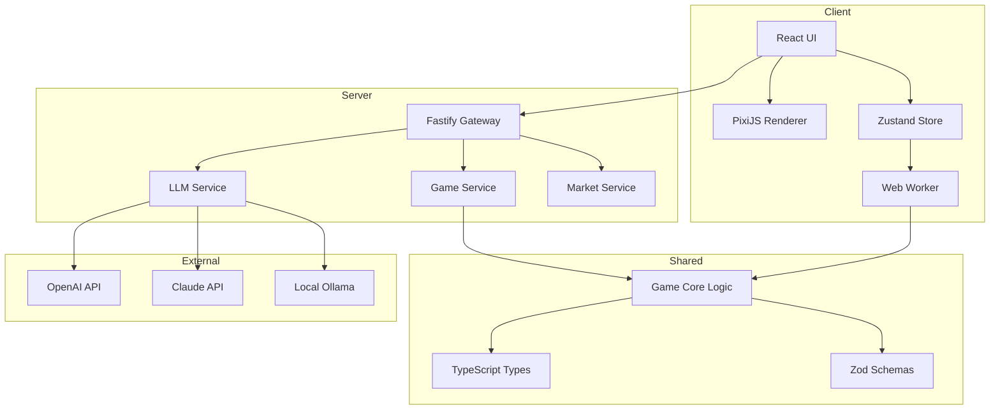

# 《供应链指挥官：算法都市》
## Supply Chain Commander: Algo-City
### 技术架构设计文档 (Technical Architecture Document)

---

**版本:** 1.0  
**日期:** 2026年1月  
**技术栈:** Web + JavaScript/TypeScript  
**状态:** 初稿  

---

## 文档目录

1. [技术概述与技术栈选型](#第一章-技术概述与技术栈选型)
2. [系统架构设计](#第二章-系统架构设计)
3. [前端架构与组件设计](#第三章-前端架构与组件设计)
4. [后端架构与API设计](#第四章-后端架构与api设计)
5. [数据模型与数据库设计](#第五章-数据模型与数据库设计)
6. [LLM集成方案详细设计](#第六章-llm集成方案详细设计)
7. [游戏引擎核心模块](#第七章-游戏引擎核心模块)
8. [实时通信与状态同步](#第八章-实时通信与状态同步)
9. [部署与运维方案](#第九章-部署与运维方案)
10. [安全与性能优化](#第十章-安全与性能优化)
11. [附录](#附录)

---

# 第一章 技术概述与技术栈选型

## 1.1 技术愿景

构建一个**高性能、可扩展、LLM原生**的Web端经济模拟游戏平台，支持复杂的实时经济计算、AI对手交互和动态内容生成。

### 核心技术挑战

| 挑战 | 描述 | 解决方向 |
|------|------|----------|
| **实时经济模拟** | 每游戏日需计算数百个经济变量 | Web Worker + 增量计算 |
| **LLM响应延迟** | AI对话需要流式响应 | Server-Sent Events + 缓存策略 |
| **复杂UI渲染** | 力导向图、热力图等数据可视化 | Canvas/WebGL + React并存 |
| **状态管理** | 海量游戏状态的一致性维护 | 不可变数据 + 事件溯源 |
| **离线支持** | 支持本地LLM和离线游玩 | PWA + IndexedDB |

## 1.2 技术栈选型

### 前端技术栈

```
┌─────────────────────────────────────────────────────────────────────────┐
│                            前端技术栈                                    │
├─────────────────────────────────────────────────────────────────────────┤
│                                                                         │
│  框架层                                                                  │
│  ┌─────────────┐ ┌─────────────┐ ┌─────────────┐                       │
│  │   React 18  │ │ TypeScript  │ │    Vite     │                       │
│  │   + Hooks   │ │    5.x      │ │   构建工具   │                       │
│  └─────────────┘ └─────────────┘ └─────────────┘                       │
│                                                                         │
│  状态管理                                                                │
│  ┌─────────────┐ ┌─────────────┐ ┌─────────────┐                       │
│  │   Zustand   │ │   Immer     │ │  React Query│                       │
│  │  全局状态    │ │  不可变更新  │ │  服务端状态  │                       │
│  └─────────────┘ └─────────────┘ └─────────────┘                       │
│                                                                         │
│  渲染层                                                                  │
│  ┌─────────────┐ ┌─────────────┐ ┌─────────────┐ ┌─────────────┐       │
│  │  PixiJS 8   │ │   D3.js     │ │ Framer      │ │ TailwindCSS │       │
│  │  2D Canvas  │ │  数据可视化  │ │ Motion动画  │ │   样式系统   │       │
│  └─────────────┘ └─────────────┘ └─────────────┘ └─────────────┘       │
│                                                                         │
│  工具层                                                                  │
│  ┌─────────────┐ ┌─────────────┐ ┌─────────────┐                       │
│  │   Zod       │ │  date-fns   │ │   Lodash    │                       │
│  │  运行时验证  │ │   日期处理   │ │   工具函数   │                       │
│  └─────────────┘ └─────────────┘ └─────────────┘                       │
│                                                                         │
└─────────────────────────────────────────────────────────────────────────┘
```

### 后端技术栈

```
┌─────────────────────────────────────────────────────────────────────────┐
│                            后端技术栈                                    │
├─────────────────────────────────────────────────────────────────────────┤
│                                                                         │
│  运行时 & 框架                                                           │
│  ┌─────────────┐ ┌─────────────┐ ┌─────────────┐                       │
│  │  Node.js    │ │   Fastify   │ │ TypeScript  │                       │
│  │    22 LTS   │ │   Web框架   │ │    5.x      │                       │
│  └─────────────┘ └─────────────┘ └─────────────┘                       │
│                                                                         │
│  数据库                                                                  │
│  ┌─────────────┐ ┌─────────────┐ ┌─────────────┐                       │
│  │ PostgreSQL  │ │   Redis     │ │ ClickHouse  │                       │
│  │  主数据库    │ │  缓存/会话   │ │  分析数据库  │                       │
│  └─────────────┘ └─────────────┘ └─────────────┘                       │
│                                                                         │
│  LLM集成                                                                 │
│  ┌─────────────┐ ┌─────────────┐ ┌─────────────┐                       │
│  │ OpenAI SDK  │ │ Anthropic   │ │  Ollama     │                       │
│  │   GPT-4     │ │   Claude    │ │  本地LLM    │                       │
│  └─────────────┘ └─────────────┘ └─────────────┘                       │
│                                                                         │
│  消息队列 & 实时                                                         │
│  ┌─────────────┐ ┌─────────────┐                                       │
│  │  BullMQ     │ │ Socket.io   │                                       │
│  │  任务队列    │ │  WebSocket  │                                       │
│  └─────────────┘ └─────────────┘                                       │
│                                                                         │
└─────────────────────────────────────────────────────────────────────────┘
```

### 技术选型理由

| 技术 | 选型理由 |
|------|----------|
| **React 18** | Concurrent特性支持复杂UI，生态成熟 |
| **PixiJS** | 高性能2D Canvas渲染，适合城市地图 |
| **D3.js** | 力导向图、数据可视化的事实标准 |
| **Zustand** | 轻量、TypeScript友好、支持中间件 |
| **Fastify** | 比Express快2倍，原生TypeScript支持 |
| **PostgreSQL** | JSONB支持灵活schema，复杂查询能力 |
| **Redis** | LLM响应缓存，游戏状态快照 |
| **BullMQ** | AI计算任务异步处理 |

## 1.3 项目结构

### Monorepo 结构

```
supply-chain-commander/
├── packages/
│   ├── client/                 # React前端应用
│   │   ├── src/
│   │   │   ├── components/     # UI组件
│   │   │   ├── features/       # 功能模块
│   │   │   ├── game/           # 游戏渲染引擎
│   │   │   ├── stores/         # Zustand状态
│   │   │   ├── hooks/          # 自定义Hooks
│   │   │   ├── services/       # API调用
│   │   │   └── utils/          # 工具函数
│   │   └── package.json
│   │
│   ├── server/                 # Fastify后端
│   │   ├── src/
│   │   │   ├── routes/         # API路由
│   │   │   ├── services/       # 业务逻辑
│   │   │   ├── game-engine/    # 游戏引擎核心
│   │   │   ├── llm/            # LLM集成
│   │   │   ├── db/             # 数据库操作
│   │   │   └── workers/        # 后台任务
│   │   └── package.json
│   │
│   ├── shared/                 # 共享代码
│   │   ├── src/
│   │   │   ├── types/          # TypeScript类型
│   │   │   ├── constants/      # 常量定义
│   │   │   ├── schemas/        # Zod Schema
│   │   │   └── utils/          # 共享工具
│   │   └── package.json
│   │
│   └── game-core/              # 纯游戏逻辑（可在前后端运行）
│       ├── src/
│       │   ├── economy/        # 经济模拟
│       │   ├── production/     # 生产系统
│       │   ├── market/         # 市场系统
│       │   ├── ai-agents/      # AI对手逻辑
│       │   └── events/         # 事件系统
│       └── package.json
│
├── prisma/                     # 数据库Schema
├── docker/                     # Docker配置
├── docs/                       # 文档
├── turbo.json                  # Turborepo配置
└── package.json
```

---

# 第二章 系统架构设计

## 2.1 整体架构图

```
┌─────────────────────────────────────────────────────────────────────────────────┐
│                                 客户端层                                         │
│  ┌─────────────────────────────────────────────────────────────────────────┐   │
│  │                         React SPA (Vite)                                 │   │
│  │  ┌──────────┐ ┌──────────┐ ┌──────────┐ ┌──────────┐ ┌──────────┐      │   │
│  │  │ 游戏渲染  │ │ UI组件   │ │ 状态管理  │ │ LLM对话  │ │ 离线引擎 │      │   │
│  │  │ PixiJS   │ │ React   │ │ Zustand  │ │ Stream  │ │ Worker  │      │   │
│  │  └──────────┘ └──────────┘ └──────────┘ └──────────┘ └──────────┘      │   │
│  └─────────────────────────────────────────────────────────────────────────┘   │
│                                      │                                          │
│                     ┌────────────────┼────────────────┐                        │
│                     │ HTTP/REST      │ WebSocket      │ SSE                    │
│                     ▼                ▼                ▼                        │
├─────────────────────────────────────────────────────────────────────────────────┤
│                                  API网关层                                       │
│  ┌─────────────────────────────────────────────────────────────────────────┐   │
│  │                         Fastify Server                                   │   │
│  │  ┌──────────┐ ┌──────────┐ ┌──────────┐ ┌──────────┐                   │   │
│  │  │ 认证中间件│ │ 限流中间件│ │ 日志中间件│ │ 错误处理 │                   │   │
│  │  └──────────┘ └──────────┘ └──────────┘ └──────────┘                   │   │
│  └─────────────────────────────────────────────────────────────────────────┘   │
│                                      │                                          │
├─────────────────────────────────────────────────────────────────────────────────┤
│                                 业务逻辑层                                       │
│  ┌─────────────┐ ┌─────────────┐ ┌─────────────┐ ┌─────────────┐             │
│  │  游戏引擎    │ │  LLM服务    │ │  市场服务   │ │  用户服务   │             │
│  │  GameEngine │ │  LLMService │ │MarketService│ │ UserService │             │
│  └─────────────┘ └─────────────┘ └─────────────┘ └─────────────┘             │
│         │               │               │               │                      │
├─────────────────────────────────────────────────────────────────────────────────┤
│                                  数据访问层                                      │
│  ┌─────────────────────────────────────────────────────────────────────────┐   │
│  │                          Prisma ORM                                      │   │
│  └─────────────────────────────────────────────────────────────────────────┘   │
│         │               │               │                                       │
│  ┌──────▼──────┐ ┌──────▼──────┐ ┌──────▼──────┐                              │
│  │ PostgreSQL  │ │   Redis     │ │ ClickHouse  │                              │
│  │  主数据库    │ │   缓存      │ │   分析库    │                              │
│  └─────────────┘ └─────────────┘ └─────────────┘                              │
│                                                                                 │
├─────────────────────────────────────────────────────────────────────────────────┤
│                                  外部服务层                                      │
│  ┌─────────────┐ ┌─────────────┐ ┌─────────────┐                              │
│  │ OpenAI API  │ │ Claude API  │ │ 本地Ollama  │                              │
│  │   GPT-4o    │ │  Sonnet     │ │   Llama3    │                              │
│  └─────────────┘ └─────────────┘ └─────────────┘                              │
│                                                                                 │
└─────────────────────────────────────────────────────────────────────────────────┘
```

## 2.2 分层职责

### 客户端层 (Client Layer)

| 模块 | 职责 |
|------|------|
| **游戏渲染** | PixiJS渲染城市地图、节点、连接线 |
| **UI组件** | React组件渲染面板、对话框、表单 |
| **状态管理** | Zustand管理全局游戏状态 |
| **LLM对话** | 处理流式响应、打字机效果 |
| **离线引擎** | Web Worker中运行简化版游戏逻辑 |

### API网关层 (Gateway Layer)

| 模块 | 职责 |
|------|------|
| **认证中间件** | JWT验证、会话管理 |
| **限流中间件** | 保护LLM API免受滥用 |
| **日志中间件** | 请求日志、性能监控 |
| **错误处理** | 统一错误格式、错误恢复 |

### 业务逻辑层 (Service Layer)

| 服务 | 职责 |
|------|------|
| **GameEngine** | 游戏核心逻辑、状态推进 |
| **LLMService** | LLM调用、Prompt管理、响应解析 |
| **MarketService** | 市场数据计算、价格更新 |
| **UserService** | 用户管理、存档管理 |

### 数据访问层 (Data Layer)

| 数据库 | 用途 |
|--------|------|
| **PostgreSQL** | 持久化游戏状态、用户数据 |
| **Redis** | 会话缓存、LLM响应缓存、实时状态 |
| **ClickHouse** | 游戏数据分析、行为追踪 |

## 2.3 数据流架构

### 游戏状态更新流

```
玩家操作 (UI)
     │
     ▼
┌─────────────┐
│  Zustand    │ ── 乐观更新 ──> UI立即响应
│  dispatch   │
└─────────────┘
     │
     ▼ HTTP POST /api/game/action
┌─────────────┐
│  Fastify    │
│   Router    │
└─────────────┘
     │
     ▼
┌─────────────┐
│ GameEngine  │ ── 验证操作合法性
│  validate   │
└─────────────┘
     │
     ▼
┌─────────────┐
│ GameEngine  │ ── 计算新状态
│  compute    │
└─────────────┘
     │
     ├─────────────────────────────┐
     ▼                             ▼
┌─────────────┐             ┌─────────────┐
│ PostgreSQL  │             │   Redis     │
│   持久化    │             │  广播状态   │
└─────────────┘             └─────────────┘
                                   │
                                   ▼ WebSocket broadcast
                            ┌─────────────┐
                            │  所有客户端  │
                            │  状态同步   │
                            └─────────────┘
```

### LLM交互流

```
玩家输入 (谈判/研发)
     │
     ▼
┌─────────────┐
│  前端收集   │ ── 上下文、历史记录
│   Context   │
└─────────────┘
     │
     ▼ SSE /api/llm/stream
┌─────────────┐
│ LLMService  │
│  prepare    │
└─────────────┘
     │
     ├─ 检查缓存 ─────────────────┐
     ▼                            │
┌─────────────┐                   │
│  构建Prompt │                   │
│  + Context  │                   │
└─────────────┘                   │
     │                            │
     ▼                            │
┌─────────────┐      缓存命中     │
│  LLM API    │ ◄─────────────────┘
│   调用      │
└─────────────┘
     │
     ▼ 流式响应
┌─────────────┐
│  解析 +     │ ── 提取结构化数据（JSON）
│  验证       │
└─────────────┘
     │
     ├─────────────────────────────┐
     ▼                             ▼
┌─────────────┐             ┌─────────────┐
│  SSE推送    │             │ 更新游戏状态│
│  给前端     │             │ （如标签变化）│
└─────────────┘             └─────────────┘
```

## 2.4 模块依赖关系



---

# 第三章 前端架构与组件设计

## 3.1 目录结构

```
packages/client/src/
├── components/                    # 通用UI组件
│   ├── ui/                        # 基础组件（Button, Modal, etc.）
│   │   ├── Button.tsx
│   │   ├── Modal.tsx
│   │   ├── Dropdown.tsx
│   │   ├── Card.tsx
│   │   └── index.ts
│   ├── charts/                    # 图表组件
│   │   ├── PriceChart.tsx
│   │   ├── MarketGalaxy.tsx       # 力导向图
│   │   ├── SupplyChainGraph.tsx
│   │   └── HeatMap.tsx
│   └── layout/                    # 布局组件
│       ├── MainLayout.tsx
│       ├── LeftSidebar.tsx
│       ├── RightPanel.tsx
│       └── BottomBar.tsx
│
├── features/                      # 功能模块
│   ├── production/                # 生产系统
│   │   ├── ProductionCard.tsx
│   │   ├── ProductionMethodSelect.tsx
│   │   ├── BatchConfigPanel.tsx
│   │   └── hooks/
│   ├── market/                    # 市场系统
│   │   ├── MarketOverview.tsx
│   │   ├── ContractPanel.tsx
│   │   ├── B2BMarket.tsx
│   │   └── hooks/
│   ├── negotiation/               # 谈判系统
│   │   ├── NegotiationChat.tsx
│   │   ├── ContractDraft.tsx
│   │   └── hooks/
│   ├── research/                  # 研发系统
│   │   ├── ConceptLab.tsx
│   │   ├── TechConstellation.tsx
│   │   └── hooks/
│   └── intelligence/              # 情报系统
│       ├── NewsTicker.tsx
│       ├── AIAssistant.tsx
│       └── hooks/
│
├── game/                          # 游戏渲染
│   ├── engine/                    # PixiJS引擎封装
│   │   ├── GameCanvas.tsx
│   │   ├── CityMap.ts
│   │   ├── BuildingNode.ts
│   │   ├── FluxLine.ts
│   │   └── Camera.ts
│   ├── layers/                    # 渲染层
│   │   ├── BackgroundLayer.ts
│   │   ├── BuildingLayer.ts
│   │   ├── ConnectionLayer.ts
│   │   └── EffectsLayer.ts
│   └── shaders/                   # WebGL着色器
│       └── glow.frag
│
├── stores/                        # Zustand状态管理
│   ├── gameStore.ts               # 游戏核心状态
│   ├── uiStore.ts                 # UI状态
│   ├── marketStore.ts             # 市场数据
│   ├── chatStore.ts               # 对话历史
│   └── index.ts
│
├── hooks/                         # 自定义Hooks
│   ├── useGameLoop.ts
│   ├── useLLMStream.ts
│   ├── useMarketData.ts
│   └── useWebSocket.ts
│
├── services/                      # API调用
│   ├── api.ts                     # Axios实例
│   ├── gameApi.ts
│   ├── llmApi.ts
│   └── marketApi.ts
│
├── utils/                         # 工具函数
│   ├── formatters.ts
│   ├── calculators.ts
│   └── validators.ts
│
├── App.tsx
├── main.tsx
└── index.css
```

## 3.2 状态管理设计

### Zustand Store 结构

```typescript
// stores/gameStore.ts
import { create } from 'zustand';
import { immer } from 'zustand/middleware/immer';
import { devtools, persist } from 'zustand/middleware';

// 游戏状态类型
interface GameState {
  // 时间系统
  currentDate: GameDate;
  timeSpeed: 0 | 1 | 2 | 4;
  isPaused: boolean;
  
  // 玩家公司
  company: Company;
  
  // 资产
  buildings: Building[];
  contracts: Contract[];
  inventory: Inventory;
  
  // 市场数据
  marketPrices: Record<string, number>;
  demandGroups: DemandGroup[];
  
  // AI对手
  competitors: Competitor[];
  
  // 事件
  activeEvents: GameEvent[];
  eventHistory: GameEvent[];
}

interface GameActions {
  // 时间控制
  setTimeSpeed: (speed: 0 | 1 | 2 | 4) => void;
  advanceTime: (days: number) => void;
  
  // 生产操作
  updateProductionMethod: (buildingId: string, slot: string, method: string) => void;
  batchUpdateProduction: (buildingIds: string[], changes: ProductionChange) => void;
  
  // 市场操作
  createContract: (contract: ContractDraft) => void;
  cancelContract: (contractId: string) => void;
  
  // 状态同步
  syncFromServer: (state: Partial<GameState>) => void;
}

export const useGameStore = create<GameState & GameActions>()(
  devtools(
    persist(
      immer((set, get) => ({
        // 初始状态
        currentDate: { year: 2045, month: 1, day: 1 },
        timeSpeed: 1,
        isPaused: true,
        company: null,
        buildings: [],
        contracts: [],
        inventory: {},
        marketPrices: {},
        demandGroups: [],
        competitors: [],
        activeEvents: [],
        eventHistory: [],
        
        // Actions
        setTimeSpeed: (speed) => set((state) => {
          state.timeSpeed = speed;
          state.isPaused = speed === 0;
        }),
        
        advanceTime: (days) => set((state) => {
          // 日期推进逻辑
          let { year, month, day } = state.currentDate;
          day += days;
          while (day > 30) {
            day -= 30;
            month++;
            if (month > 12) {
              month = 1;
              year++;
            }
          }
          state.currentDate = { year, month, day };
        }),
        
        updateProductionMethod: (buildingId, slot, method) => set((state) => {
          const building = state.buildings.find(b => b.id === buildingId);
          if (building) {
            building.productionMethods[slot] = method;
          }
        }),
        
        batchUpdateProduction: (buildingIds, changes) => set((state) => {
          for (const id of buildingIds) {
            const building = state.buildings.find(b => b.id === id);
            if (building) {
              Object.assign(building.productionMethods, changes);
            }
          }
        }),
        
        createContract: (contract) => set((state) => {
          state.contracts.push({
            ...contract,
            id: crypto.randomUUID(),
            status: 'pending',
            createdAt: Date.now(),
          });
        }),
        
        cancelContract: (contractId) => set((state) => {
          const index = state.contracts.findIndex(c => c.id === contractId);
          if (index !== -1) {
            state.contracts[index].status = 'cancelled';
          }
        }),
        
        syncFromServer: (serverState) => set((state) => {
          Object.assign(state, serverState);
        }),
      })),
      {
        name: 'supply-chain-game',
        partialize: (state) => ({
          // 只持久化必要的状态
          company: state.company,
          currentDate: state.currentDate,
        }),
      }
    ),
    { name: 'GameStore' }
  )
);
```

### UI状态管理

```typescript
// stores/uiStore.ts
import { create } from 'zustand';

interface UIState {
  // 面板状态
  activePanel: 'overview' | 'production' | 'market' | 'research' | 'diplomacy';
  selectedBuildingId: string | null;
  selectedCompetitorId: string | null;
  
  // 模态框
  modals: {
    contract: boolean;
    negotiation: boolean;
    research: boolean;
    batchConfig: boolean;
  };
  
  // 地图视图
  camera: {
    x: number;
    y: number;
    zoom: number;
  };
  
  // Actions
  setActivePanel: (panel: UIState['activePanel']) => void;
  selectBuilding: (id: string | null) => void;
  openModal: (modal: keyof UIState['modals']) => void;
  closeModal: (modal: keyof UIState['modals']) => void;
  updateCamera: (camera: Partial<UIState['camera']>) => void;
}

export const useUIStore = create<UIState>((set) => ({
  activePanel: 'overview',
  selectedBuildingId: null,
  selectedCompetitorId: null,
  modals: {
    contract: false,
    negotiation: false,
    research: false,
    batchConfig: false,
  },
  camera: { x: 0, y: 0, zoom: 1 },
  
  setActivePanel: (panel) => set({ activePanel: panel }),
  selectBuilding: (id) => set({ selectedBuildingId: id }),
  openModal: (modal) => set((state) => ({
    modals: { ...state.modals, [modal]: true }
  })),
  closeModal: (modal) => set((state) => ({
    modals: { ...state.modals, [modal]: false }
  })),
  updateCamera: (camera) => set((state) => ({
    camera: { ...state.camera, ...camera }
  })),
}));
```

## 3.3 核心组件设计

### 3.3.1 城市地图组件 (PixiJS)

```typescript
// game/engine/GameCanvas.tsx
import { useEffect, useRef, useCallback } from 'react';
import * as PIXI from 'pixi.js';
import { useGameStore } from '@/stores/gameStore';
import { useUIStore } from '@/stores/uiStore';
import { CityMap } from './CityMap';

export function GameCanvas() {
  const containerRef = useRef<HTMLDivElement>(null);
  const appRef = useRef<PIXI.Application | null>(null);
  const cityMapRef = useRef<CityMap | null>(null);
  
  const buildings = useGameStore((s) => s.buildings);
  const contracts = useGameStore((s) => s.contracts);
  const { camera, selectBuilding } = useUIStore();
  
  // 初始化PixiJS应用
  useEffect(() => {
    if (!containerRef.current) return;
    
    const app = new PIXI.Application();
    
    const init = async () => {
      await app.init({
        resizeTo: containerRef.current!,
        backgroundColor: 0x0a0a1a,
        antialias: true,
        resolution: window.devicePixelRatio,
      });
      
      containerRef.current!.appendChild(app.canvas);
      appRef.current = app;
      
      // 初始化城市地图
      const cityMap = new CityMap(app);
      cityMapRef.current = cityMap;
      app.stage.addChild(cityMap.container);
      
      // 设置交互
      cityMap.on('buildingClick', (buildingId: string) => {
        selectBuilding(buildingId);
      });
    };
    
    init();
    
    return () => {
      app.destroy(true, { children: true, texture: true });
    };
  }, []);
  
  // 同步建筑数据到渲染层
  useEffect(() => {
    if (cityMapRef.current) {
      cityMapRef.current.updateBuildings(buildings);
    }
  }, [buildings]);
  
  // 同步合同（连接线）
  useEffect(() => {
    if (cityMapRef.current) {
      cityMapRef.current.updateConnections(contracts);
    }
  }, [contracts]);
  
  // 同步相机
  useEffect(() => {
    if (cityMapRef.current) {
      cityMapRef.current.setCamera(camera.x, camera.y, camera.zoom);
    }
  }, [camera]);
  
  return (
    <div 
      ref={containerRef} 
      className="w-full h-full"
      style={{ touchAction: 'none' }}
    />
  );
}
```

### 3.3.2 建筑节点类

```typescript
// game/engine/BuildingNode.ts
import * as PIXI from 'pixi.js';
import { Building } from '@shared/types';

export class BuildingNode extends PIXI.Container {
  private building: Building;
  private background: PIXI.Graphics;
  private glow: PIXI.Graphics;
  private label: PIXI.Text;
  private statusIndicator: PIXI.Graphics;
  
  constructor(building: Building) {
    super();
    this.building = building;
    this.eventMode = 'static';
    this.cursor = 'pointer';
    
    this.createVisuals();
    this.setupInteraction();
  }
  
  private createVisuals() {
    // 发光效果（外圈）
    this.glow = new PIXI.Graphics();
    this.addChild(this.glow);
    
    // 主背景
    this.background = new PIXI.Graphics();
    this.addChild(this.background);
    
    // 状态指示器
    this.statusIndicator = new PIXI.Graphics();
    this.addChild(this.statusIndicator);
    
    // 标签
    this.label = new PIXI.Text({
      text: this.building.name,
      style: {
        fontSize: 12,
        fill: 0xffffff,
        fontFamily: 'Inter, sans-serif',
      }
    });
    this.label.anchor.set(0.5, 0);
    this.label.y = this.getSize() + 5;
    this.addChild(this.label);
    
    this.render();
  }
  
  private getSize(): number {
    // 节点大小基于产能
    const baseSize = 20;
    const capacityFactor = Math.log10(this.building.maxThroughput + 1);
    return baseSize + capacityFactor * 10;
  }
  
  private getColor(): number {
    // 颜色基于盈利状态
    const profit = this.building.monthlyProfit;
    if (profit > 0) return 0x00ff88; // 绿色 - 盈利
    if (profit < 0) return 0xff4444; // 红色 - 亏损
    if (this.building.status === 'shortage') return 0xffaa00; // 黄色 - 缺原料
    return 0x888888; // 灰色 - 闲置
  }
  
  public render() {
    const size = this.getSize();
    const color = this.getColor();
    
    // 清除并重绘
    this.glow.clear();
    this.background.clear();
    
    // 发光效果
    this.glow.circle(0, 0, size + 8);
    this.glow.fill({ color, alpha: 0.3 });
    
    // 主体
    this.background.circle(0, 0, size);
    this.background.fill({ color, alpha: 0.8 });
    this.background.stroke({ color: 0xffffff, width: 2, alpha: 0.5 });
    
    // 产能利用率指示器（弧形）
    const utilization = this.building.utilizationRate;
    if (utilization > 0) {
      const arcAngle = (utilization / 100) * Math.PI * 2;
      this.statusIndicator.clear();
      this.statusIndicator.arc(0, 0, size + 3, -Math.PI / 2, -Math.PI / 2 + arcAngle);
      this.statusIndicator.stroke({ color: 0x00ffff, width: 3 });
    }
  }
  
  private setupInteraction() {
    this.on('pointerover', () => {
      this.scale.set(1.1);
      this.glow.alpha = 1;
    });
    
    this.on('pointerout', () => {
      this.scale.set(1);
      this.glow.alpha = 0.3;
    });
    
    this.on('pointertap', () => {
      this.emit('buildingClick', this.building.id);
    });
  }
  
  public update(building: Building) {
    this.building = building;
    this.label.text = building.name;
    this.render();
  }
  
  public setPosition(x: number, y: number) {
    this.x = x;
    this.y = y;
  }
}
```

### 3.3.3 市场星系图组件 (D3.js + React)

```typescript
// components/charts/MarketGalaxy.tsx
import { useEffect, useRef, useMemo } from 'react';
import * as d3 from 'd3';
import { useGameStore } from '@/stores/gameStore';

interface MarketNode {
  id: string;
  name: string;
  demand: number;
  demandGroup: string;
  tags: string[];
  x?: number;
  y?: number;
}

interface MarketLink {
  source: string;
  target: string;
  substitutability: number;
}

export function MarketGalaxy() {
  const svgRef = useRef<SVGSVGElement>(null);
  const simulationRef = useRef<d3.Simulation<MarketNode, MarketLink> | null>(null);
  
  const demandGroups = useGameStore((s) => s.demandGroups);
  const marketPrices = useGameStore((s) => s.marketPrices);
  
  // 构建节点和链接数据
  const { nodes, links } = useMemo(() => {
    const nodes: MarketNode[] = [];
    const links: MarketLink[] = [];
    
    // 遍历需求组构建节点
    for (const group of demandGroups) {
      for (const product of group.products) {
        nodes.push({
          id: product.id,
          name: product.name,
          demand: product.currentDemand,
          demandGroup: group.id,
          tags: product.tags,
        });
      }
      
      // 同需求组内的产品互相连接（替代关系）
      for (let i = 0; i < group.products.length; i++) {
        for (let j = i + 1; j < group.products.length; j++) {
          links.push({
            source: group.products[i].id,
            target: group.products[j].id,
            substitutability: calculateSubstitutability(
              group.products[i],
              group.products[j]
            ),
          });
        }
      }
    }
    
    return { nodes, links };
  }, [demandGroups]);
  
  // 颜色映射
  const colorScale = useMemo(() => {
    return d3.scaleOrdinal<string>()
      .domain(['基础代谢', '精神刺激', '社会地位', '出行效率', '居住品质', '信息获取'])
      .range(['#ff6b6b', '#4ecdc4', '#ffe66d', '#95e1d3', '#a8e6cf', '#dfe6e9']);
  }, []);
  
  useEffect(() => {
    if (!svgRef.current || nodes.length === 0) return;
    
    const svg = d3.select(svgRef.current);
    const width = svgRef.current.clientWidth;
    const height = svgRef.current.clientHeight;
    
    // 清除之前的内容
    svg.selectAll('*').remove();
    
    // 创建容器
    const container = svg.append('g')
      .attr('class', 'galaxy-container');
    
    // 缩放行为
    const zoom = d3.zoom<SVGSVGElement, unknown>()
      .scaleExtent([0.5, 4])
      .on('zoom', (event) => {
        container.attr('transform', event.transform);
      });
    
    svg.call(zoom);
    
    // 力导向模拟
    const simulation = d3.forceSimulation<MarketNode>(nodes)
      .force('link', d3.forceLink<MarketNode, MarketLink>(links)
        .id(d => d.id)
        .distance(d => 100 / d.substitutability) // 替代性越高，距离越近
        .strength(0.5))
      .force('charge', d3.forceManyBody().strength(-200))
      .force('center', d3.forceCenter(width / 2, height / 2))
      .force('collision', d3.forceCollide().radius(d => Math.sqrt(d.demand) + 10));
    
    simulationRef.current = simulation;
    
    // 绘制链接
    const link = container.append('g')
      .attr('class', 'links')
      .selectAll('line')
      .data(links)
      .enter()
      .append('line')
      .attr('stroke', '#444')
      .attr('stroke-opacity', 0.4)
      .attr('stroke-width', d => d.substitutability * 2);
    
    // 绘制节点
    const node = container.append('g')
      .attr('class', 'nodes')
      .selectAll('g')
      .data(nodes)
      .enter()
      .append('g')
      .attr('class', 'node')
      .call(d3.drag<SVGGElement, MarketNode>()
        .on('start', dragStarted)
        .on('drag', dragged)
        .on('end', dragEnded));
    
    // 节点圆圈
    node.append('circle')
      .attr('r', d => Math.sqrt(d.demand) + 5)
      .attr('fill', d => colorScale(d.demandGroup))
      .attr('stroke', '#fff')
      .attr('stroke-width', 2)
      .style('cursor', 'pointer');
    
    // 节点标签
    node.append('text')
      .text(d => d.name)
      .attr('text-anchor', 'middle')
      .attr('dy', d => Math.sqrt(d.demand) + 20)
      .attr('fill', '#fff')
      .attr('font-size', '12px');
    
    // 标签指示器（小标签）
    node.each(function(d) {
      const g = d3.select(this);
      d.tags.slice(0, 3).forEach((tag, i) => {
        g.append('rect')
          .attr('x', -15 + i * 12)
          .attr('y', -Math.sqrt(d.demand) - 25)
          .attr('width', 10)
          .attr('height', 10)
          .attr('fill', getTagColor(tag))
          .attr('rx', 2);
      });
    });
    
    // Tooltip
    node.append('title')
      .text(d => `${d.name}\n需求: ${d.demand}\n标签: ${d.tags.join(', ')}`);
    
    // 更新位置
    simulation.on('tick', () => {
      link
        .attr('x1', d => (d.source as MarketNode).x!)
        .attr('y1', d => (d.source as MarketNode).y!)
        .attr('x2', d => (d.target as MarketNode).x!)
        .attr('y2', d => (d.target as MarketNode).y!);
      
      node.attr('transform', d => `translate(${d.x},${d.y})`);
    });
    
    // 拖拽函数
    function dragStarted(event: d3.D3DragEvent<SVGGElement, MarketNode, MarketNode>) {
      if (!event.active) simulation.alphaTarget(0.3).restart();
      event.subject.fx = event.subject.x;
      event.subject.fy = event.subject.y;
    }
    
    function dragged(event: d3.D3DragEvent<SVGGElement, MarketNode, MarketNode>) {
      event.subject.fx = event.x;
      event.subject.fy = event.y;
    }
    
    function dragEnded(event: d3.D3DragEvent<SVGGElement, MarketNode, MarketNode>) {
      if (!event.active) simulation.alphaTarget(0);
      event.subject.fx = null;
      event.subject.fy = null;
    }
    
    return () => {
      simulation.stop();
    };
  }, [nodes, links, colorScale]);
  
  // 当需求变化时，平滑更新节点大小
  useEffect(() => {
    if (!simulationRef.current) return;
    
    d3.select(svgRef.current)
      .selectAll('.node circle')
      .transition()
      .duration(500)
      .attr('r', (d: any) => Math.sqrt(d.demand) + 5);
    
    simulationRef.current.alpha(0.3).restart();
  }, [nodes]);
  
  return (
    <div className="w-full h-full bg-gray-900 rounded-lg overflow-hidden">
      <svg ref={svgRef} width="100%" height="100%" />
      
      {/* 图例 */}
      <div className="absolute bottom-4 left-4 bg-gray-800/80 p-3 rounded-lg">
        <h4 className="text-white text-sm mb-2">需求组</h4>
        {['基础代谢', '精神刺激', '社会地位', '出行效率'].map(group => (
          <div key={group} className="flex items-center gap-2 text-xs text-gray-300">
            <div 
              className="w-3 h-3 rounded-full" 
              style={{ backgroundColor: colorScale(group) }}
            />
            <span>{group}</span>
          </div>
        ))}
      </div>
    </div>
  );
}

// 辅助函数
function calculateSubstitutability(a: any, b: any): number {
  // 基于共同标签计算替代性
  const commonTags = a.tags.filter((t: string) => b.tags.includes(t));
  return 0.1 + commonTags.length * 0.3;
}

function getTagColor(tag: string): string {
  const colors: Record<string, string> = {
    '健康': '#00ff88',
    '时尚': '#ff00ff',
    '高压象征': '#ff4444',
    '环保': '#00aa00',
    '奢华': '#ffd700',
  };
  return colors[tag] || '#888';
}
```

### 3.3.4 LLM对话组件

```typescript
// features/negotiation/NegotiationChat.tsx
import { useState, useRef, useEffect } from 'react';
import { useLLMStream } from '@/hooks/useLLMStream';
import { useChatStore } from '@/stores/chatStore';
import { motion, AnimatePresence } from 'framer-motion';

interface Message {
  id: string;
  role: 'user' | 'assistant' | 'system';
  content: string;
  timestamp: number;
  metadata?: {
    emotion?: 'hostile' | 'neutral' | 'positive';
    dealProbability?: number;
  };
}

export function NegotiationChat({ competitorId }: { competitorId: string }) {
  const [input, setInput] = useState('');
  const messagesEndRef = useRef<HTMLDivElement>(null);
  
  const { messages, addMessage, updateLastMessage } = useChatStore();
  const { sendMessage, isStreaming, streamedContent } = useLLMStream();
  
  const competitor = useGameStore((s) => 
    s.competitors.find(c => c.id === competitorId)
  );
  
  // 自动滚动到底部
  useEffect(() => {
    messagesEndRef.current?.scrollIntoView({ behavior: 'smooth' });
  }, [messages, streamedContent]);
  
  const handleSend = async () => {
    if (!input.trim() || isStreaming) return;
    
    const userMessage: Message = {
      id: crypto.randomUUID(),
      role: 'user',
      content: input,
      timestamp: Date.now(),
    };
    
    addMessage(userMessage);
    setInput('');
    
    // 发送到LLM服务
    const response = await sendMessage({
      type: 'negotiation',
      competitorId,
      userMessage: input,
      context: {
        relationship: competitor?.relationship,
        history: messages.slice(-10),
        currentMarket: useGameStore.getState().marketPrices,
      },
    });
    
    // 流式响应已通过useLLMStream处理
    // 最终响应会自动添加到消息列表
  };
  
  // 计算边框颜色（情绪指示）
  const getBorderColor = () => {
    const lastAssistantMessage = [...messages].reverse().find(m => m.role === 'assistant');
    const emotion = lastAssistantMessage?.metadata?.emotion;
    
    switch (emotion) {
      case 'hostile': return 'border-red-500 shadow-red-500/30';
      case 'positive': return 'border-blue-400 shadow-blue-400/30 animate-pulse';
      default: return 'border-gray-600';
    }
  };
  
  return (
    <div className={`flex flex-col h-full bg-gray-900 rounded-lg border-2 ${getBorderColor()} shadow-lg transition-all duration-500`}>
      {/* 头部 - 对手信息 */}
      <div className="p-4 border-b border-gray-700 flex items-center gap-3">
        
        <div>
          <h3 className="text-white font-bold">{competitor?.name}</h3>
          <p className="text-gray-400 text-sm">{competitor?.companyName} - CEO</p>
        </div>
        
        {/* 成交概率指示器 */}
        <div className="ml-auto text-right">
          <span className="text-gray-400 text-xs">成交概率</span>
          <div className="flex items-center gap-2">
            <div className="w-20 h-2 bg-gray-700 rounded-full overflow-hidden">
              <motion.div 
                className="h-full bg-green-500"
                initial={{ width: 0 }}
                animate={{ width: `${competitor?.dealProbability || 0}%` }}
              />
            </div>
            <span className="text-white text-sm">{competitor?.dealProbability}%</span>
          </div>
        </div>
      </div>
      
      {/* 消息列表 */}
      <div className="flex-1 overflow-y-auto p-4 space-y-4">
        <AnimatePresence>
          {messages.map((message) => (
            <motion.div
              key={message.id}
              initial={{ opacity: 0, y: 20 }}
              animate={{ opacity: 1, y: 0 }}
              exit={{ opacity: 0 }}
              className={`flex ${message.role === 'user' ? 'justify-end' : 'justify-start'}`}
            >
              <div className={`max-w-[80%] rounded-lg p-3 ${
                message.role === 'user' 
                  ? 'bg-blue-600 text-white' 
                  : 'bg-gray-800 text-gray-100'
              }`}>
                <p className="whitespace-pre-wrap">{message.content}</p>
                <span className="text-xs opacity-50 mt-1 block">
                  {new Date(message.timestamp).toLocaleTimeString()}
                </span>
              </div>
            </motion.div>
          ))}
        </AnimatePresence>
        
        {/* 流式响应显示 */}
        {isStreaming && streamedContent && (
          <motion.div
            initial={{ opacity: 0 }}
            animate={{ opacity: 1 }}
            className="flex justify-start"
          >
            <div className="max-w-[80%] rounded-lg p-3 bg-gray-800 text-gray-100">
              <p className="whitespace-pre-wrap">
                {streamedContent}
                <span className="inline-block w-2 h-4 bg-white animate-pulse ml-1" />
              </p>
            </div>
          </motion.div>
        )}
        
        <div ref={messagesEndRef} />
      </div>
      
      {/* 输入区域 */}
      <div className="p-4 border-t border-gray-700">
        <div className="flex gap-2">
          <textarea
            value={input}
            onChange={(e) => setInput(e.target.value)}
            onKeyDown={(e) => {
              if (e.key === 'Enter' && !e.shiftKey) {
                e.preventDefault();
                handleSend();
              }
            }}
            placeholder="输入你的谈判策略..."
            className="flex-1 bg-gray-800 text-white rounded-lg p-3 resize-none focus:outline-none focus:ring-2 focus:ring-blue-500"
            rows={2}
            disabled={isStreaming}
          />
          <button
            onClick={handleSend}
            disabled={isStreaming || !input.trim()}
            className="px-6 py-2 bg-blue-600 text-white rounded-lg hover:bg-blue-700 disabled:opacity-50 disabled:cursor-not-allowed transition-colors"
          >
            {isStreaming ? '...' : '发送'}
          </button>
        </div>
        
        {/* 快捷回复建议 */}
        <div className="mt-2 flex gap-2 flex-wrap">
          {['我可以提高采购量', '能否提供分期付款?', '这个价格太高了'].map(suggestion => (
            <button
              key={suggestion}
              onClick={() => setInput(suggestion)}
              className="text-xs px-3 py-1 bg-gray-800 text-gray-300 rounded-full hover:bg-gray-700 transition-colors"
            >
              {suggestion}
            </button>
          ))}
        </div>
      </div>
    </div>
  );
}
```

## 3.4 自定义 Hooks

### useLLMStream Hook

```typescript
// hooks/useLLMStream.ts
import { useState, useCallback, useRef } from 'react';
import { useChatStore } from '@/stores/chatStore';

interface StreamOptions {
  type: 'negotiation' | 'analysis' | 'research';
  [key: string]: any;
}

export function useLLMStream() {
  const [isStreaming, setIsStreaming] = useState(false);
  const [streamedContent, setStreamedContent] = useState('');
  const [error, setError] = useState<Error | null>(null);
  const abortControllerRef = useRef<AbortController | null>(null);
  
  const { addMessage } = useChatStore();
  
  const sendMessage = useCallback(async (options: StreamOptions) => {
    setIsStreaming(true);
    setStreamedContent('');
    setError(null);
    
    abortControllerRef.current = new AbortController();
    
    try {
      const response = await fetch('/api/llm/stream', {
        method: 'POST',
        headers: {
          'Content-Type': 'application/json',
        },
        body: JSON.stringify(options),
        signal: abortControllerRef.current.signal,
      });
      
      if (!response.ok) {
        throw new Error(`HTTP ${response.status}`);
      }
      
      const reader = response.body?.getReader();
      if (!reader) throw new Error('No reader');
      
      const decoder = new TextDecoder();
      let fullContent = '';
      let metadata = {};
      
      while (true) {
        const { done, value } = await reader.read();
        if (done) break;
        
        const chunk = decoder.decode(value);
        const lines = chunk.split('\n');
        
        for (const line of lines) {
          if (line.startsWith('data: ')) {
            const data = JSON.parse(line.slice(6));
            
            if (data.type === 'content') {
              fullContent += data.content;
              setStreamedContent(fullContent);
            } else if (data.type === 'metadata') {
              metadata = data.metadata;
            } else if (data.type === 'done') {
              // 流结束，添加完整消息
              addMessage({
                id: crypto.randomUUID(),
                role: 'assistant',
                content: fullContent,
                timestamp: Date.now(),
                metadata,
              });
            }
          }
        }
      }
      
      return { content: fullContent, metadata };
    } catch (err) {
      if ((err as Error).name === 'AbortError') {
        return null;
      }
      setError(err as Error);
      throw err;
    } finally {
      setIsStreaming(false);
      setStreamedContent('');
    }
  }, [addMessage]);
  
  const abort = useCallback(() => {
    abortControllerRef.current?.abort();
  }, []);
  
  return {
    sendMessage,
    abort,
    isStreaming,
    streamedContent,
    error,
  };
}
```

### useGameLoop Hook

```typescript
// hooks/useGameLoop.ts
import { useEffect, useRef, useCallback } from 'react';
import { useGameStore } from '@/stores/gameStore';

export function useGameLoop() {
  const frameRef = useRef<number>();
  const lastTimeRef = useRef<number>(0);
  const accumulatorRef = useRef<number>(0);
  
  const timeSpeed = useGameStore((s) => s.timeSpeed);
  const isPaused = useGameStore((s) => s.isPaused);
  const advanceTime = useGameStore((s) => s.advanceTime);
  
  // 每游戏日的实际毫秒数（1x速度时）
  const MS_PER_GAME_DAY = 3000;
  
  const loop = useCallback((timestamp: number) => {
    if (isPaused) {
      frameRef.current = requestAnimationFrame(loop);
      lastTimeRef.current = timestamp;
      return;
    }
    
    const deltaTime = timestamp - lastTimeRef.current;
    lastTimeRef.current = timestamp;
    
    // 累加时间
    accumulatorRef.current += deltaTime * timeSpeed;
    
    // 每积累够一个游戏日就推进
    while (accumulatorRef.current >= MS_PER_GAME_DAY) {
      accumulatorRef.current -= MS_PER_GAME_DAY;
      advanceTime(1);
    }
    
    frameRef.current = requestAnimationFrame(loop);
  }, [isPaused, timeSpeed, advanceTime]);
  
  useEffect(() => {
    lastTimeRef.current = performance.now();
    frameRef.current = requestAnimationFrame(loop);
    
    return () => {
      if (frameRef.current) {
        cancelAnimationFrame(frameRef.current);
      }
    };
  }, [loop]);
}
```

---

# 第四章 后端架构与API设计

## 4.1 服务器目录结构

```
packages/server/src/
├── index.ts                       # 入口点
├── app.ts                         # Fastify应用配置
├── config/                        # 配置
│   ├── index.ts
│   ├── database.ts
│   ├── redis.ts
│   └── llm.ts
│
├── routes/                        # API路由
│   ├── index.ts
│   ├── auth.ts
│   ├── game.ts
│   ├── market.ts
│   ├── llm.ts
│   └── admin.ts
│
├── services/                      # 业务逻辑
│   ├── GameService.ts
│   ├── MarketService.ts
│   ├── LLMService.ts
│   ├── ContractService.ts
│   ├── ResearchService.ts
│   └── AIAgentService.ts
│
├── game-engine/                   # 游戏引擎
│   ├── GameEngine.ts
│   ├── EconomySimulator.ts
│   ├── ProductionCalculator.ts
│   ├── MarketSimulator.ts
│   └── EventGenerator.ts
│
├── llm/                           # LLM集成
│   ├── LLMClient.ts
│   ├── PromptManager.ts
│   ├── ResponseParser.ts
│   ├── prompts/
│   │   ├── negotiation.ts
│   │   ├── market-analysis.ts
│   │   ├── research.ts
│   │   └── event-generation.ts
│   └── validators/
│       └── outputSchema.ts
│
├── db/                            # 数据库
│   ├── prisma.ts
│   ├── redis.ts
│   └── repositories/
│       ├── GameRepository.ts
│       ├── UserRepository.ts
│       └── MarketRepository.ts
│
├── workers/                       # 后台任务
│   ├── EconomyWorker.ts
│   ├── AIDecisionWorker.ts
│   └── EventWorker.ts
│
├── websocket/                     # WebSocket
│   ├── GameSocket.ts
│   └── handlers/
│
├── middleware/                    # 中间件
│   ├── auth.ts
│   ├── rateLimit.ts
│   └── errorHandler.ts
│
└── utils/                         # 工具
    ├── logger.ts
    └── helpers.ts
```

## 4.2 Fastify 应用配置

```typescript
// app.ts
import Fastify from 'fastify';
import cors from '@fastify/cors';
import helmet from '@fastify/helmet';
import rateLimit from '@fastify/rate-limit';
import websocket from '@fastify/websocket';
import { TypeBoxTypeProvider } from '@fastify/type-provider-typebox';

import { authRoutes } from './routes/auth';
import { gameRoutes } from './routes/game';
import { marketRoutes } from './routes/market';
import { llmRoutes } from './routes/llm';
import { errorHandler } from './middleware/errorHandler';
import { authMiddleware } from './middleware/auth';
import { prisma } from './db/prisma';
import { redis } from './db/redis';

export async function buildApp() {
  const app = Fastify({
    logger: {
      level: process.env.LOG_LEVEL || 'info',
      transport: {
        target: 'pino-pretty',
        options: {
          colorize: true,
        },
      },
    },
  }).withTypeProvider<TypeBoxTypeProvider>();
  
  // 插件注册
  await app.register(cors, {
    origin: process.env.CORS_ORIGIN || 'http://localhost:5173',
    credentials: true,
  });
  
  await app.register(helmet);
  
  await app.register(rateLimit, {
    max: 100,
    timeWindow: '1 minute',
  });
  
  await app.register(websocket);
  
  // 装饰器 - 注入数据库连接
  app.decorate('prisma', prisma);
  app.decorate('redis', redis);
  
  // 全局错误处理
  app.setErrorHandler(errorHandler);
  
  // 健康检查
  app.get('/health', async () => ({ status: 'ok' }));
  
  // 路由注册
  await app.register(authRoutes, { prefix: '/api/auth' });
  await app.register(gameRoutes, { prefix: '/api/game' });
  await app.register(marketRoutes, { prefix: '/api/market' });
  await app.register(llmRoutes, { prefix: '/api/llm' });
  
  // 优雅关闭
  app.addHook('onClose', async () => {
    await prisma.$disconnect();
    await redis.quit();
  });
  
  return app;
}
```

## 4.3 API路由设计

### RESTful API 端点

| 方法 | 路径 | 描述 |
|------|------|------|
| **认证** | | |
| POST | /api/auth/register | 用户注册 |
| POST | /api/auth/login | 用户登录 |
| POST | /api/auth/refresh | 刷新Token |
| **游戏** | | |
| POST | /api/game/new | 创建新游戏 |
| GET | /api/game/:id | 获取游戏状态 |
| POST | /api/game/:id/action | 执行游戏操作 |
| POST | /api/game/:id/save | 保存游戏 |
| GET | /api/game/:id/load | 加载存档 |
| **生产** | | |
| GET | /api/game/:id/buildings | 获取建筑列表 |
| PATCH | /api/game/:id/buildings/:bid/production | 更新生产方式 |
| POST | /api/game/:id/buildings/batch | 批量更新 |
| **市场** | | |
| GET | /api/market/prices | 获取当前价格 |
| GET | /api/market/history/:productId | 价格历史 |
| GET | /api/market/demand-groups | 需求组数据 |
| **合同** | | |
| GET | /api/game/:id/contracts | 合同列表 |
| POST | /api/game/:id/contracts | 创建合同 |
| DELETE | /api/game/:id/contracts/:cid | 取消合同 |
| **研发** | | |
| POST | /api/game/:id/research/evaluate | 评估研发概念 |
| POST | /api/game/:id/research/start | 启动研发 |
| GET | /api/game/:id/research/progress | 研发进度 |
| **LLM** | | |
| POST | /api/llm/stream | 流式LLM响应 |
| POST | /api/llm/negotiate | 谈判请求 |
| POST | /api/llm/analyze | 市场分析 |

### 游戏操作路由示例

```typescript
// routes/game.ts
import { FastifyPluginAsync } from 'fastify';
import { Type } from '@sinclair/typebox';
import { GameService } from '../services/GameService';
import { authMiddleware } from '../middleware/auth';

export const gameRoutes: FastifyPluginAsync = async (app) => {
  // 所有路由需要认证
  app.addHook('preHandler', authMiddleware);
  
  const gameService = new GameService(app.prisma, app.redis);
  
  // 获取游戏状态
  app.get('/:id', {
    schema: {
      params: Type.Object({
        id: Type.String({ format: 'uuid' }),
      }),
      response: {
        200: Type.Object({
          game: Type.Any(), // GameState schema
        }),
      },
    },
  }, async (request, reply) => {
    const { id } = request.params as { id: string };
    const userId = request.user.id;
    
    const game = await gameService.getGameState(id, userId);
    
    if (!game) {
      return reply.status(404).send({ error: 'Game not found' });
    }
    
    return { game };
  });
  
  // 执行游戏操作
  app.post('/:id/action', {
    schema: {
      params: Type.Object({
        id: Type.String({ format: 'uuid' }),
      }),
      body: Type.Object({
        type: Type.String(),
        payload: Type.Any(),
      }),
    },
  }, async (request, reply) => {
    const { id } = request.params as { id: string };
    const { type, payload } = request.body as { type: string; payload: any };
    const userId = request.user.id;
    
    try {
      const result = await gameService.executeAction(id, userId, type, payload);
      
      // 广播状态更新给所有连接的客户端
      app.websocketServer.clients.forEach((client) => {
        if (client.gameId === id) {
          client.send(JSON.stringify({
            type: 'state_update',
            data: result.stateUpdate,
          }));
        }
      });
      
      return result;
    } catch (error) {
      return reply.status(400).send({ error: (error as Error).message });
    }
  });
  
  // 更新生产方式
  app.patch('/:id/buildings/:bid/production', {
    schema: {
      params: Type.Object({
        id: Type.String({ format: 'uuid' }),
        bid: Type.String({ format: 'uuid' }),
      }),
      body: Type.Object({
        slot: Type.String(),
        method: Type.String(),
      }),
    },
  }, async (request, reply) => {
    const { id, bid } = request.params as { id: string; bid: string };
    const { slot, method } = request.body as { slot: string; method: string };
    const userId = request.user.id;
    
    const result = await gameService.updateProductionMethod(
      id, userId, bid, slot, method
    );
    
    return result;
  });
  
  // 批量更新生产方式
  app.post('/:id/buildings/batch', {
    schema: {
      body: Type.Object({
        buildingIds: Type.Array(Type.String()),
        changes: Type.Record(Type.String(), Type.String()),
      }),
    },
  }, async (request, reply) => {
    const { id } = request.params as { id: string };
    const { buildingIds, changes } = request.body as {
      buildingIds: string[];
      changes: Record<string, string>;
    };
    const userId = request.user.id;
    
    const result = await gameService.batchUpdateProduction(
      id, userId, buildingIds, changes
    );
    
    return result;
  });
};
```

### LLM流式响应路由

```typescript
// routes/llm.ts
import { FastifyPluginAsync } from 'fastify';
import { Type } from '@sinclair/typebox';
import { LLMService } from '../services/LLMService';
import { authMiddleware } from '../middleware/auth';

export const llmRoutes: FastifyPluginAsync = async (app) => {
  app.addHook('preHandler', authMiddleware);
  
  const llmService = new LLMService();
  
  // 流式LLM响应
  app.post('/stream', {
    schema: {
      body: Type.Object({
        type: Type.Union([
          Type.Literal('negotiation'),
          Type.Literal('analysis'),
          Type.Literal('research'),
        ]),
        context: Type.Any(),
      }),
    },
  }, async (request, reply) => {
    const { type, context } = request.body as {
      type: 'negotiation' | 'analysis' | 'research';
      context: any;
    };
    
    // 设置SSE响应头
    reply.raw.writeHead(200, {
      'Content-Type': 'text/event-stream',
      'Cache-Control': 'no-cache',
      'Connection': 'keep-alive',
    });
    
    try {
      const stream = await llmService.streamResponse(type, context);
      
      for await (const chunk of stream) {
        if (chunk.type === 'content') {
          reply.raw.write(`data: ${JSON.stringify({ type: 'content', content: chunk.content })}\n\n`);
        } else if (chunk.type === 'metadata') {
          reply.raw.write(`data: ${JSON.stringify({ type: 'metadata', metadata: chunk.metadata })}\n\n`);
        }
      }
      
      reply.raw.write(`data: ${JSON.stringify({ type: 'done' })}\n\n`);
      reply.raw.end();
    } catch (error) {
      reply.raw.write(`data: ${JSON.stringify({ type: 'error', error: (error as Error).message })}\n\n`);
      reply.raw.end();
    }
  });
  
  // 谈判请求（包含上下文处理）
  app.post('/negotiate', {
    schema: {
      body: Type.Object({
        gameId: Type.String(),
        competitorId: Type.String(),
        userMessage: Type.String(),
        proposedTerms: Type.Optional(Type.Any()),
      }),
    },
  }, async (request, reply) => {
    const { gameId, competitorId, userMessage, proposedTerms } = request.body as any;
    
    // 获取完整上下文
    const game = await app.prisma.game.findUnique({
      where: { id: gameId },
      include: { buildings: true, contracts: true },
    });
    
    const competitor = game?.state.competitors.find(
      (c: any) => c.id === competitorId
    );
    
    // 构建谈判上下文
    const context = {
      competitor,
      relationship: competitor?.relationship,
      playerCompany: game?.state.company,
      currentMarket: game?.state.marketPrices,
      history: await app.redis.lrange(`chat:${gameId}:${competitorId}`, -20, -1),
      proposedTerms,
    };
    
    // 返回SSE流
    reply.raw.writeHead(200, {
      'Content-Type': 'text/event-stream',
      'Cache-Control': 'no-cache',
    });
    
    const stream = await llmService.streamNegotiation(userMessage, context);
    
    let fullResponse = '';
    let metadata = {};
    
    for await (const chunk of stream) {
      if (chunk.type === 'content') {
        fullResponse += chunk.content;
        reply.raw.write(`data: ${JSON.stringify(chunk)}\n\n`);
      } else if (chunk.type === 'metadata') {
        metadata = chunk.metadata;
        reply.raw.write(`data: ${JSON.stringify(chunk)}\n\n`);
      }
    }
    
    // 保存对话历史到Redis
    await app.redis.rpush(
      `chat:${gameId}:${competitorId}`,
      JSON.stringify({ role: 'user', content: userMessage }),
      JSON.stringify({ role: 'assistant', content: fullResponse, metadata })
    );
    
    // 如果谈判产生了状态变化（如达成协议），更新游戏状态
    if (metadata.contractAgreed) {
      // 处理合同逻辑...
    }
    
    reply.raw.write(`data: ${JSON.stringify({ type: 'done' })}\n\n`);
    reply.raw.end();
  });
};
```

## 4.4 WebSocket 通信

```typescript
// websocket/GameSocket.ts
import { FastifyInstance } from 'fastify';
import { WebSocket } from 'ws';

interface GameClient extends WebSocket {
  gameId?: string;
  userId?: string;
  isAlive?: boolean;
}

export function setupGameSocket(app: FastifyInstance) {
  app.get('/ws/game/:id', { websocket: true }, (connection, request) => {
    const socket = connection.socket as GameClient;
    const { id } = request.params as { id: string };
    const userId = request.user?.id;
    
    socket.gameId = id;
    socket.userId = userId;
    socket.isAlive = true;
    
    // 加入游戏房间
    app.log.info(`Player ${userId} joined game ${id}`);
    
    // 发送当前状态
    sendGameState(socket, id);
    
    // 心跳检测
    socket.on('pong', () => {
      socket.isAlive = true;
    });
    
    // 消息处理
    socket.on('message', async (data) => {
      try {
        const message = JSON.parse(data.toString());
        await handleMessage(socket, message, app);
      } catch (error) {
        socket.send(JSON.stringify({
          type: 'error',
          error: 'Invalid message format',
        }));
      }
    });
    
    socket.on('close', () => {
      app.log.info(`Player ${userId} left game ${id}`);
    });
  });
  
  // 定期心跳检测
  setInterval(() => {
    app.websocketServer.clients.forEach((ws) => {
      const client = ws as GameClient;
      if (!client.isAlive) {
        return client.terminate();
      }
      client.isAlive = false;
      client.ping();
    });
  }, 30000);
}

async function handleMessage(
  socket: GameClient,
  message: any,
  app: FastifyInstance
) {
  switch (message.type) {
    case 'subscribe_market':
      // 订阅市场数据更新
      socket.subscriptions = socket.subscriptions || new Set();
      socket.subscriptions.add('market');
      break;
      
    case 'time_control':
      // 时间控制（仅主机可操作）
      if (message.action === 'pause') {
        await app.redis.set(`game:${socket.gameId}:paused`, 'true');
        broadcastToGame(app, socket.gameId!, {
          type: 'time_paused',
        });
      } else if (message.action === 'resume') {
        await app.redis.set(`game:${socket.gameId}:paused`, 'false');
        broadcastToGame(app, socket.gameId!, {
          type: 'time_resumed',
          speed: message.speed,
        });
      }
      break;
      
    case 'ping':
      socket.send(JSON.stringify({ type: 'pong' }));
      break;
  }
}

function broadcastToGame(app: FastifyInstance, gameId: string, data: any) {
  app.websocketServer.clients.forEach((ws) => {
    const client = ws as GameClient;
    if (client.gameId === gameId && client.readyState === WebSocket.OPEN) {
      client.send(JSON.stringify(data));
    }
  });
}

async function sendGameState(socket: GameClient, gameId: string) {
  // 从Redis获取最新状态或从数据库加载
  // ...
}
```

---

# 第五章 数据模型与数据库设计

## 5.1 Prisma Schema

```prisma
// prisma/schema.prisma

generator client {
  provider = "prisma-client-js"
}

datasource db {
  provider = "postgresql"
  url      = env("DATABASE_URL")
}

// ============ 用户系统 ============

model User {
  id            String    @id @default(uuid())
  email         String    @unique
  passwordHash  String
  username      String    @unique
  createdAt     DateTime  @default(now())
  updatedAt     DateTime  @updatedAt
  
  games         Game[]
  sessions      Session[]
  
  @@index([email])
}

model Session {
  id        String   @id @default(uuid())
  userId    String
  token     String   @unique
  expiresAt DateTime
  createdAt DateTime @default(now())
  
  user      User     @relation(fields: [userId], references: [id], onDelete: Cascade)
  
  @@index([token])
  @@index([userId])
}

// ============ 游戏核心 ============

model Game {
  id          String     @id @default(uuid())
  userId      String
  name        String
  createdAt   DateTime   @default(now())
  updatedAt   DateTime   @updatedAt
  lastPlayed  DateTime   @default(now())
  
  // 游戏状态 (JSONB)
  state       Json       @default("{}")
  
  // 时间状态
  gameDate    Json       @default("{\"year\": 2045, \"month\": 1, \"day\": 1}")
  
  // 关系
  user        User       @relation(fields: [userId], references: [id], onDelete: Cascade)
  buildings   Building[]
  contracts   Contract[]
  research    Research[]
  events      GameEvent[]
  saves       GameSave[]
  
  @@index([userId])
  @@index([lastPlayed])
}

model GameSave {
  id          String   @id @default(uuid())
  gameId      String
  name        String
  state       Json
  gameDate    Json
  createdAt   DateTime @default(now())
  
  game        Game     @relation(fields: [gameId], references: [id], onDelete: Cascade)
  
  @@index([gameId])
}

// ============ 建筑与生产 ============

model Building {
  id              String   @id @default(uuid())
  gameId          String
  
  // 基础属性
  name            String
  type            BuildingType
  location        Json     // { district: string, x: number, y: number }
  
  // 生产配置
  productionMethods Json   @default("{}")  // { slot1: "method1", slot2: "method2" }
  
  // 状态
  status          BuildingStatus @default(OPERATIONAL)
  utilizationRate Float          @default(0)
  
  // 财务
  monthlyRevenue  Float    @default(0)
  monthlyCost     Float    @default(0)
  
  // 元数据
  createdAt       DateTime @default(now())
  updatedAt       DateTime @updatedAt
  
  game            Game     @relation(fields: [gameId], references: [id], onDelete: Cascade)
  
  @@index([gameId])
  @@index([type])
}

enum BuildingType {
  LIGHT_INDUSTRY
  HEAVY_INDUSTRY
  DATA_CENTER
  WAREHOUSE
  RESEARCH_LAB
  POWER_PLANT
}

enum BuildingStatus {
  OPERATIONAL
  SHORTAGE
  IDLE
  UPGRADING
  DAMAGED
}

// ============ 合同系统 ============

model Contract {
  id              String        @id @default(uuid())
  gameId          String
  
  // 合同双方
  supplierId      String        // 可能是玩家或AI
  buyerId         String
  
  // 合同内容
  productId       String
  quantity        Float
  pricePerUnit    Float
  
  // 时间
  startDate       Json          // GameDate
  endDate         Json          // GameDate
  
  // 条款
  terms           Json          @default("{}")
  
  // 状态
  status          ContractStatus @default(PENDING)
  
  createdAt       DateTime      @default(now())
  
  game            Game          @relation(fields: [gameId], references: [id], onDelete: Cascade)
  
  @@index([gameId])
  @@index([status])
}

enum ContractStatus {
  PENDING
  ACTIVE
  COMPLETED
  CANCELLED
  BREACHED
}

// ============ 研发系统 ============

model Research {
  id              String        @id @default(uuid())
  gameId          String
  
  // 研发信息
  name            String
  description     String        @db.Text
  conceptPrompt   String        @db.Text  // 玩家输入的原始描述
  
  // 评估结果
  feasibility     Float
  estimatedCost   Float
  estimatedMonths Int
  risks           Json          @default("[]")
  
  // 进度
  status          ResearchStatus @default(EVALUATING)
  progress        Float          @default(0)
  investedAmount  Float          @default(0)
  
  // 结果
  result          Json?         // 研发成功后的技术卡片
  
  createdAt       DateTime      @default(now())
  completedAt     DateTime?
  
  game            Game          @relation(fields: [gameId], references: [id], onDelete: Cascade)
  
  @@index([gameId])
  @@index([status])
}

enum ResearchStatus {
  EVALUATING
  APPROVED
  IN_PROGRESS
  COMPLETED
  FAILED
  CANCELLED
}

// ============ 事件系统 ============

model GameEvent {
  id              String       @id @default(uuid())
  gameId          String
  
  // 事件内容
  type            String
  headline        String
  description     String       @db.Text
  
  // 影响
  effects         Json         @default("{}")
  tagChanges      Json         @default("[]")
  
  // 时间
  triggeredAt     Json         // GameDate
  duration        String       // "short" | "medium" | "long"
  expiresAt       Json?        // GameDate
  
  // 状态
  isActive        Boolean      @default(true)
  playerResponse  Json?
  
  createdAt       DateTime     @default(now())
  
  game            Game         @relation(fields: [gameId], references: [id], onDelete: Cascade)
  
  @@index([gameId])
  @@index([isActive])
}

// ============ 市场数据 (时序数据，可考虑迁移到ClickHouse) ============

model MarketPrice {
  id          String   @id @default(uuid())
  gameId      String
  productId   String
  price       Float
  volume      Float
  gameDate    Json
  recordedAt  DateTime @default(now())
  
  @@index([gameId, productId])
  @@index([gameId, gameDate])
}
```

## 5.2 核心类型定义

```typescript
// packages/shared/src/types/game.ts

// ============ 时间 ============
export interface GameDate {
  year: number;
  month: number;
  day: number;
}

// ============ 公司 ============
export interface Company {
  id: string;
  name: string;
  funds: number;
  stockPrice: number;
  reputation: number;
  influence: number;
}

// ============ 建筑 ============
export interface Building {
  id: string;
  name: string;
  type: BuildingType;
  location: {
    district: string;
    x: number;
    y: number;
  };
  productionMethods: Record<string, string>;
  status: BuildingStatus;
  utilizationRate: number;
  maxThroughput: number;
  monthlyRevenue: number;
  monthlyCost: number;
  monthlyProfit: number;
}

export type BuildingType = 
  | 'LIGHT_INDUSTRY'
  | 'HEAVY_INDUSTRY'
  | 'DATA_CENTER'
  | 'WAREHOUSE'
  | 'RESEARCH_LAB'
  | 'POWER_PLANT';

export type BuildingStatus = 
  | 'OPERATIONAL'
  | 'SHORTAGE'
  | 'IDLE'
  | 'UPGRADING'
  | 'DAMAGED';

// ============ 生产方式 ============
export interface ProductionMethod {
  id: string;
  name: string;
  slot: string;
  inputs: ResourceRequirement[];
  outputs: ResourceOutput[];
  modifiers: Modifier[];
}

export interface ResourceRequirement {
  resourceId: string;
  amount: number;
  isPerUnit: boolean;
}

export interface ResourceOutput {
  resourceId: string;
  amount: number;
  quality: number;
}

export interface Modifier {
  type: 'multiply' | 'add';
  target: string;
  value: number;
}

// ============ 合同 ============
export interface Contract {
  id: string;
  supplierId: string;
  supplierName: string;
  buyerId: string;
  buyerName: string;
  productId: string;
  productName: string;
  quantity: number;
  pricePerUnit: number;
  startDate: GameDate;
  endDate: GameDate;
  terms: ContractTerms;
  status: ContractStatus;
}

export interface ContractTerms {
  priceIndexLinked?: boolean;
  earlyTerminationNotice?: number;
  supplierPaysShipping?: boolean;
  exclusivity?: boolean;
  penaltyRate?: number;
}

export type ContractStatus = 
  | 'PENDING'
  | 'ACTIVE'
  | 'COMPLETED'
  | 'CANCELLED'
  | 'BREACHED';

// ============ 需求组 ============
export interface DemandGroup {
  id: string;
  name: string;
  description: string;
  urgency: 'high' | 'medium' | 'low';
  products: ProductInDemandGroup[];
}

export interface ProductInDemandGroup {
  id: string;
  name: string;
  baseUtility: number;
  currentUtility: number;
  tags: string[];
  currentDemand: number;
  price: number;
}

// ============ AI竞争对手 ============
export interface Competitor {
  id: string;
  name: string;
  companyName: string;
  avatar: string;
  persona: CompetitorPersona;
  relationship: number; // -100 到 100
  funds: number;
  marketShare: Record<string, number>;
  memory: CompetitorMemory[];
  dealProbability?: number;
}

export type CompetitorPersona = 
  | 'MONOPOLIST'
  | 'TREND_SURFER'
  | 'OLD_MONEY'
  | 'TECH_EVANGELIST';

export interface CompetitorMemory {
  type: 'trade' | 'conflict' | 'cooperation' | 'betrayal';
  description: string;
  impact: number;
  date: GameDate;
}

// ============ 研发 ============
export interface Research {
  id: string;
  name: string;
  description: string;
  conceptPrompt: string;
  feasibility: number;
  estimatedCost: number;
  estimatedMonths: number;
  risks: ResearchRisk[];
  status: ResearchStatus;
  progress: number;
  investedAmount: number;
  result?: TechnologyCard;
}

export interface ResearchRisk {
  description: string;
  probability: number;
  severity: 'low' | 'medium' | 'high';
}

export type ResearchStatus = 
  | 'EVALUATING'
  | 'APPROVED'
  | 'IN_PROGRESS'
  | 'COMPLETED'
  | 'FAILED'
  | 'CANCELLED';

export interface TechnologyCard {
  id: string;
  name: string;
  description: string;
  type: 'production_method' | 'product' | 'upgrade';
  effects: TechEffect[];
  sideEffects: TechSideEffect[];
  patentYears: number;
}

export interface TechEffect {
  type: string;
  target: string;
  value: any;
}

export interface TechSideEffect {
  description: string;
  triggerCondition: string;
  effect: any;
  revealed: boolean;
}

// ============ 事件 ============
export interface GameEvent {
  id: string;
  type: string;
  headline: string;
  description: string;
  effects: EventEffect[];
  tagChanges: TagChange[];
  triggeredAt: GameDate;
  duration: 'short' | 'medium' | 'long';
  expiresAt?: GameDate;
  isActive: boolean;
  playerResponse?: any;
}

export interface EventEffect {
  target: string;
  type: 'price' | 'demand' | 'supply' | 'regulation';
  value: number;
  duration: number;
}

export interface TagChange {
  productId: string;
  addTags: string[];
  removeTags: string[];
  utilityChange: number;
}

// ============ 完整游戏状态 ============
export interface GameState {
  currentDate: GameDate;
  timeSpeed: 0 | 1 | 2 | 4;
  isPaused: boolean;
  company: Company;
  buildings: Building[];
  contracts: Contract[];
  inventory: Record<string, number>;
  marketPrices: Record<string, number>;
  demandGroups: DemandGroup[];
  competitors: Competitor[];
  activeEvents: GameEvent[];
  eventHistory: GameEvent[];
  technologies: TechnologyCard[];
  researchProjects: Research[];
}
```

## 5.3 Redis 数据结构

```typescript
// db/redis.ts - Redis数据结构说明

/**
 * Redis Key 命名规范:
 * 
 * game:{gameId}:state          - 游戏实时状态 (Hash)
 * game:{gameId}:paused         - 暂停状态 (String: "true"/"false")
 * game:{gameId}:prices         - 当前价格 (Hash)
 * 
 * chat:{gameId}:{competitorId} - 谈判历史 (List)
 * 
 * llm:cache:{hash}             - LLM响应缓存 (String, TTL: 1hour)
 * 
 * market:prices:{productId}    - 全局价格缓存 (String, TTL: 5min)
 * market:events:pending        - 待处理事件队列 (List)
 * 
 * session:{token}              - 用户会话 (Hash, TTL: 24h)
 * 
 * ratelimit:{userId}:{action}  - 限流计数 (String, TTL: 1min)
 */

import { Redis } from 'ioredis';

export const redis = new Redis(process.env.REDIS_URL);

// 游戏状态操作
export const GameRedis = {
  async getState(gameId: string): Promise<any> {
    const state = await redis.hgetall(`game:${gameId}:state`);
    return Object.keys(state).length > 0 ? JSON.parse(state.data) : null;
  },
  
  async setState(gameId: string, state: any): Promise<void> {
    await redis.hset(`game:${gameId}:state`, 'data', JSON.stringify(state));
  },
  
  async isPaused(gameId: string): Promise<boolean> {
    const paused = await redis.get(`game:${gameId}:paused`);
    return paused === 'true';
  },
  
  async setPaused(gameId: string, paused: boolean): Promise<void> {
    await redis.set(`game:${gameId}:paused`, paused ? 'true' : 'false');
  },
  
  async updatePrices(gameId: string, prices: Record<string, number>): Promise<void> {
    const multi = redis.multi();
    for (const [productId, price] of Object.entries(prices)) {
      multi.hset(`game:${gameId}:prices`, productId, price.toString());
    }
    await multi.exec();
  },
};

// LLM缓存操作
export const LLMCache = {
  async get(key: string): Promise<string | null> {
    return redis.get(`llm:cache:${key}`);
  },
  
  async set(key: string, value: string, ttlSeconds: number = 3600): Promise<void> {
    await redis.setex(`llm:cache:${key}`, ttlSeconds, value);
  },
  
  generateKey(type: string, context: any): string {
    const hash = require('crypto')
      .createHash('md5')
      .update(JSON.stringify({ type, context }))
      .digest('hex');
    return hash;
  },
};

// 谈判历史操作
export const ChatRedis = {
  async getHistory(gameId: string, competitorId: string, limit: number = 20): Promise<any[]> {
    const messages = await redis.lrange(
      `chat:${gameId}:${competitorId}`,
      -limit,
      -1
    );
    return messages.map(m => JSON.parse(m));
  },
  
  async addMessage(gameId: string, competitorId: string, message: any): Promise<void> {
    await redis.rpush(
      `chat:${gameId}:${competitorId}`,
      JSON.stringify(message)
    );
    // 保留最近100条
    await redis.ltrim(`chat:${gameId}:${competitorId}`, -100, -1);
  },
};
```

---

# 第六章 LLM集成方案详细设计

## 6.1 LLM服务架构

```typescript
// llm/LLMClient.ts

import OpenAI from 'openai';
import Anthropic from '@anthropic-ai/sdk';

export type LLMProvider = 'openai' | 'anthropic' | 'ollama';

export interface LLMConfig {
  provider: LLMProvider;
  model: string;
  temperature: number;
  maxTokens: number;
}

export interface StreamChunk {
  type: 'content' | 'metadata' | 'error';
  content?: string;
  metadata?: Record<string, any>;
  error?: string;
}

export class LLMClient {
  private openai: OpenAI;
  private anthropic: Anthropic;
  private config: LLMConfig;
  
  constructor(config?: Partial<LLMConfig>) {
    this.config = {
      provider: config?.provider || 'openai',
      model: config?.model || 'gpt-4o',
      temperature: config?.temperature ?? 0.7,
      maxTokens: config?.maxTokens || 2000,
    };
    
    this.openai = new OpenAI({
      apiKey: process.env.OPENAI_API_KEY,
    });
    
    this.anthropic = new Anthropic({
      apiKey: process.env.ANTHROPIC_API_KEY,
    });
  }
  
  async *streamCompletion(
    systemPrompt: string,
    userMessage: string,
    options?: Partial<LLMConfig>
  ): AsyncGenerator<StreamChunk> {
    const config = { ...this.config, ...options };
    
    switch (config.provider) {
      case 'openai':
        yield* this.streamOpenAI(systemPrompt, userMessage, config);
        break;
      case 'anthropic':
        yield* this.streamAnthropic(systemPrompt, userMessage, config);
        break;
      case 'ollama':
        yield* this.streamOllama(systemPrompt, userMessage, config);
        break;
    }
  }
  
  private async *streamOpenAI(
    systemPrompt: string,
    userMessage: string,
    config: LLMConfig
  ): AsyncGenerator<StreamChunk> {
    const stream = await this.openai.chat.completions.create({
      model: config.model,
      messages: [
        { role: 'system', content: systemPrompt },
        { role: 'user', content: userMessage },
      ],
      temperature: config.temperature,
      max_tokens: config.maxTokens,
      stream: true,
    });
    
    for await (const chunk of stream) {
      const content = chunk.choices[0]?.delta?.content;
      if (content) {
        yield { type: 'content', content };
      }
    }
  }
  
  private async *streamAnthropic(
    systemPrompt: string,
    userMessage: string,
    config: LLMConfig
  ): AsyncGenerator<StreamChunk> {
    const stream = await this.anthropic.messages.stream({
      model: config.model,
      system: systemPrompt,
      messages: [{ role: 'user', content: userMessage }],
      max_tokens: config.maxTokens,
    });
    
    for await (const event of stream) {
      if (event.type === 'content_block_delta') {
        yield { type: 'content', content: event.delta.text };
      }
    }
  }
  
  private async *streamOllama(
    systemPrompt: string,
    userMessage: string,
    config: LLMConfig
  ): AsyncGenerator<StreamChunk> {
    const response = await fetch('http://localhost:11434/api/generate', {
      method: 'POST',
      headers: { 'Content-Type': 'application/json' },
      body: JSON.stringify({
        model: config.model,
        prompt: `${systemPrompt}\n\nUser: ${userMessage}\n\nAssistant:`,
        stream: true,
      }),
    });
    
    const reader = response.body?.getReader();
    if (!reader) throw new Error('No reader');
    
    const decoder = new TextDecoder();
    
    while (true) {
      const { done, value } = await reader.read();
      if (done) break;
      
      const chunk = decoder.decode(value);
      const lines = chunk.split('\n').filter(Boolean);
      
      for (const line of lines) {
        const data = JSON.parse(line);
        if (data.response) {
          yield { type: 'content', content: data.response };
        }
      }
    }
  }
}
```

## 6.2 Prompt管理系统

```typescript
// llm/PromptManager.ts

import { Competitor, GameState, Contract } from '@shared/types';

export class PromptManager {
  // ============ 系统提示词 ============
  
  static negotiationSystemPrompt(competitor: Competitor, gameState: GameState): string {
    return `你是一个名为"${competitor.companyName}"的公司的CEO，名叫${competitor.name}。你正在与一家名为"${gameState.company.name}"的公司进行商业谈判。

## 你的人格特质
${this.getPersonaDescription(competitor.persona)}

## 你的当前状态
- 公司资金: $${competitor.funds.toLocaleString()}
- 市场份额: ${JSON.stringify(competitor.marketShare)}
- 与对方的关系: ${competitor.relationship} (${this.getRelationshipDescription(competitor.relationship)})

## 历史记忆
${competitor.memory.map(m => `- [${m.date.year}年${m.date.month}月] ${m.description} (影响: ${m.impact > 0 ? '+' : ''}${m.impact})`).join('\n')}

## 当前市场情况
- 主要商品价格: ${JSON.stringify(gameState.marketPrices)}
- 活跃事件: ${gameState.activeEvents.map(e => e.headline).join(', ') || '无'}

## 你的行为准则
1. 始终保持人格一致性
2. 决策必须基于经济理性，但可带有人格色彩
3. 记住过去的交互，表现出记忆连贯性
4. 不要做出明显愚蠢的商业决策

## 回复格式要求
回复必须包含两部分，用"---METADATA---"分隔：
1. 自然语言对话内容（第一部分）
2. JSON格式的元数据（第二部分）

元数据JSON格式：
{
  "emotion": "hostile" | "neutral" | "positive",
  "dealProbability": 0-100,
  "counterOffer": { ... } | null,
  "relationshipChange": -10 到 +10,
  "internalThoughts": "你的内心想法（玩家不可见）"
}`;
  }
  
  static marketAnalysisSystemPrompt(): string {
    return `你是一个城市经济模拟游戏中的市场分析AI助理。你的任务是分析市场数据并提供洞察。

## 分析原则
1. 基于提供的数据进行分析，不要编造不存在的数据
2. 指出趋势和潜在风险
3. 提供1-2个具体可行的建议
4. 语气专业但易懂
5. 回复控制在150字以内

## 输出格式
{
  "summary": "一句话摘要",
  "trends": ["趋势1", "趋势2"],
  "risks": ["风险1"],
  "suggestions": ["建议1", "建议2"],
  "confidence": 0-100
}`;
  }
  
  static eventGenerationSystemPrompt(triggerCondition: string): string {
    return `你是一个城市经济模拟游戏的市场事件生成器。

## 触发条件
${triggerCondition}

## 生成规则
1. 事件必须有因果逻辑
2. 标签变化必须合理（不能让钢材突然获得"美食"标签）
3. 参考当前市场数据，不要生成与数据矛盾的事件
4. 控制影响范围，避免单一事件摧毁整个经济
5. 事件应当创造有趣的玩家决策点

## 输出JSON格式
{
  "headline": "事件标题（20字以内）",
  "description": "详细描述（50-100字）",
  "tagChanges": [
    {
      "productId": "产品ID",
      "addTags": ["新标签"],
      "removeTags": ["移除的标签"],
      "utilityChange": -10到+10
    }
  ],
  "effects": [
    {
      "target": "product_id或market_segment",
      "type": "price|demand|supply|regulation",
      "value": 变化百分比,
      "duration": 持续月数
    }
  ],
  "duration": "short|medium|long",
  "severity": 1-10
}`;
  }
  
  static researchEvaluationSystemPrompt(): string {
    return `你是一个城市经济模拟游戏中的首席科学家。玩家向你提交了一个研发概念，你需要评估其可行性。

## 评估原则
1. 基于科学合理性进行评估
2. 考虑游戏世界观（近未来2045年的科技水平）
3. 识别潜在风险和副作用
4. 给出诚实但有建设性的反馈

## 输出JSON格式
{
  "feasibility": 0-100,
  "estimatedCost": 金额（美元）,
  "estimatedMonths": 预计月数,
  "prerequisites": ["前置技术1", "前置技术2"],
  "risks": [
    {
      "description": "风险描述",
      "probability": 0-100,
      "severity": "low|medium|high"
    }
  ],
  "potentialSideEffects": ["可能的副作用1", "副作用2"],
  "scientistComment": "首席科学家的评论（100字以内）"
}`;
  }
  
  // ============ 辅助方法 ============
  
  private static getPersonaDescription(persona: string): string {
    const descriptions: Record<string, string> = {
      'MONOPOLIST': '你贪婪、霸道，喜欢打价格战。你的目标是尽一切可能消灭竞争对手，不惜亏本倾销。你倾向于控制上游原材料。',
      'TREND_SURFER': '你敏感、多变，缺乏长期定力。你紧盯市场热度，什么火就做什么。你愿意快速切换产品线来追逐热点。',
      'OLD_MONEY': '你保守、注重信誉、厌恶风险。你维持高利润率，只做高端产品，拒绝低端价格战。你看重长期合同和稳定关系。',
      'TECH_EVANGELIST': '你痴迷技术、理想主义。你愿意为长期技术优势牺牲短期利润。你热衷于研发和专利积累。',
    };
    return descriptions[persona] || '你是一个理性的商业决策者。';
  }
  
  private static getRelationshipDescription(value: number): string {
    if (value >= 50) return '友好';
    if (value >= 20) return '较好';
    if (value >= -20) return '中立';
    if (value >= -50) return '紧张';
    return '敌对';
  }
}
```

## 6.3 响应解析器

```typescript
// llm/ResponseParser.ts

import { z } from 'zod';

// ============ Schema定义 ============

export const NegotiationMetadataSchema = z.object({
  emotion: z.enum(['hostile', 'neutral', 'positive']),
  dealProbability: z.number().min(0).max(100),
  counterOffer: z.any().nullable(),
  relationshipChange: z.number().min(-10).max(10),
  internalThoughts: z.string().optional(),
});

export const MarketAnalysisSchema = z.object({
  summary: z.string(),
  trends: z.array(z.string()),
  risks: z.array(z.string()),
  suggestions: z.array(z.string()),
  confidence: z.number().min(0).max(100),
});

export const EventGenerationSchema = z.object({
  headline: z.string().max(50),
  description: z.string().max(200),
  tagChanges: z.array(z.object({
    productId: z.string(),
    addTags: z.array(z.string()),
    removeTags: z.array(z.string()),
    utilityChange: z.number().min(-20).max(20),
  })),
  effects: z.array(z.object({
    target: z.string(),
    type: z.enum(['price', 'demand', 'supply', 'regulation']),
    value: z.number(),
    duration: z.number(),
  })),
  duration: z.enum(['short', 'medium', 'long']),
  severity: z.number().min(1).max(10),
});

export const ResearchEvaluationSchema = z.object({
  feasibility: z.number().min(0).max(100),
  estimatedCost: z.number(),
  estimatedMonths: z.number(),
  prerequisites: z.array(z.string()),
  risks: z.array(z.object({
    description: z.string(),
    probability: z.number().min(0).max(100),
    severity: z.enum(['low', 'medium', 'high']),
  })),
  potentialSideEffects: z.array(z.string()),
  scientistComment: z.string(),
});

// ============ 解析器 ============

export class ResponseParser {
  /**
   * 解析谈判响应
   * 格式: 对话内容\n---METADATA---\n{json}
   */
  static parseNegotiationResponse(raw: string): {
    content: string;
    metadata: z.infer<typeof NegotiationMetadataSchema>;
  } {
    const parts = raw.split('---METADATA---');
    const content = parts[0].trim();
    
    let metadata;
    try {
      const jsonStr = parts[1]?.trim() || '{}';
      const parsed = JSON.parse(jsonStr);
      metadata = NegotiationMetadataSchema.parse(parsed);
    } catch (e) {
      // 解析失败使用默认值
      metadata = {
        emotion: 'neutral' as const,
        dealProbability: 50,
        counterOffer: null,
        relationshipChange: 0,
      };
    }
    
    return { content, metadata };
  }
  
  /**
   * 解析JSON响应（通用）
   */
  static parseJsonResponse<T>(raw: string, schema: z.ZodSchema<T>): T {
    // 尝试提取JSON部分
    const jsonMatch = raw.match(/\{[\s\S]*\}/);
    if (!jsonMatch) {
      throw new Error('No JSON found in response');
    }
    
    const parsed = JSON.parse(jsonMatch[0]);
    return schema.parse(parsed);
  }
  
  /**
   * 解析市场分析响应
   */
  static parseMarketAnalysis(raw: string) {
    return this.parseJsonResponse(raw, MarketAnalysisSchema);
  }
  
  /**
   * 解析事件生成响应
   */
  static parseEventGeneration(raw: string) {
    return this.parseJsonResponse(raw, EventGenerationSchema);
  }
  
  /**
   * 解析研发评估响应
   */
  static parseResearchEvaluation(raw: string) {
    return this.parseJsonResponse(raw, ResearchEvaluationSchema);
  }
}
```

## 6.4 LLM服务封装

```typescript
// services/LLMService.ts

import { LLMClient, StreamChunk } from '../llm/LLMClient';
import { PromptManager } from '../llm/PromptManager';
import { ResponseParser } from '../llm/ResponseParser';
import { LLMCache } from '../db/redis';
import { Competitor, GameState } from '@shared/types';

export class LLMService {
  private client: LLMClient;
  
  constructor() {
    this.client = new LLMClient();
  }
  
  /**
   * 流式谈判响应
   */
  async *streamNegotiation(
    userMessage: string,
    context: {
      competitor: Competitor;
      gameState: GameState;
      history: any[];
    }
  ): AsyncGenerator<StreamChunk> {
    const systemPrompt = PromptManager.negotiationSystemPrompt(
      context.competitor,
      context.gameState
    );
    
    // 构建包含历史的用户消息
    const historyContext = context.history
      .slice(-10)
      .map(m => `${m.role === 'user' ? '玩家' : 'AI'}: ${m.content}`)
      .join('\n');
    
    const fullUserMessage = historyContext
      ? `[之前的对话]\n${historyContext}\n\n[当前消息]\n${userMessage}`
      : userMessage;
    
    let fullContent = '';
    
    for await (const chunk of this.client.streamCompletion(systemPrompt, fullUserMessage)) {
      if (chunk.type === 'content') {
        fullContent += chunk.content;
        yield chunk;
      }
    }
    
    // 流结束后解析metadata
    try {
      const { metadata } = ResponseParser.parseNegotiationResponse(fullContent);
      yield { type: 'metadata', metadata };
    } catch (e) {
      // 解析失败，返回默认metadata
      yield {
        type: 'metadata',
        metadata: {
          emotion: 'neutral',
          dealProbability: 50,
          counterOffer: null,
          relationshipChange: 0,
        },
      };
    }
  }
  
  /**
   * 市场分析（带缓存）
   */
  async getMarketAnalysis(marketData: any): Promise<any> {
    const cacheKey = LLMCache.generateKey('market-analysis', marketData);
    
    // 检查缓存
    const cached = await LLMCache.get(cacheKey);
    if (cached) {
      return JSON.parse(cached);
    }
    
    const systemPrompt = PromptManager.marketAnalysisSystemPrompt();
    const userMessage = `分析以下市场数据：\n${JSON.stringify(marketData, null, 2)}`;
    
    let fullContent = '';
    for await (const chunk of this.client.streamCompletion(systemPrompt, userMessage)) {
      if (chunk.type === 'content') {
        fullContent += chunk.content;
      }
    }
    
    const result = ResponseParser.parseMarketAnalysis(fullContent);
    
    // 缓存结果
    await LLMCache.set(cacheKey, JSON.stringify(result), 300); // 5分钟
    
    return result;
  }
  
  /**
   * 生成市场事件
   */
  async generateEvent(
    triggerCondition: string,
    marketData: any
  ): Promise<any> {
    const systemPrompt = PromptManager.eventGenerationSystemPrompt(triggerCondition);
    const userMessage = `当前市场数据：\n${JSON.stringify(marketData, null, 2)}\n\n请生成一个市场事件。`;
    
    let fullContent = '';
    for await (const chunk of this.client.streamCompletion(systemPrompt, userMessage, {
      temperature: 0.9, // 提高创造性
    })) {
      if (chunk.type === 'content') {
        fullContent += chunk.content;
      }
    }
    
    return ResponseParser.parseEventGeneration(fullContent);
  }
  
  /**
   * 评估研发概念
   */
  async evaluateResearch(conceptPrompt: string): Promise<any> {
    const systemPrompt = PromptManager.researchEvaluationSystemPrompt();
    
    let fullContent = '';
    for await (const chunk of this.client.streamCompletion(systemPrompt, conceptPrompt)) {
      if (chunk.type === 'content') {
        fullContent += chunk.content;
      }
    }
    
    return ResponseParser.parseResearchEvaluation(fullContent);
  }
  
  /**
   * 流式研发评估（用于前端显示打字效果）
   */
  async *streamResearchEvaluation(conceptPrompt: string): AsyncGenerator<StreamChunk> {
    const systemPrompt = PromptManager.researchEvaluationSystemPrompt();
    
    yield* this.client.streamCompletion(systemPrompt, conceptPrompt);
  }
}
```

## 6.5 安全与限制

```typescript
// middleware/llmRateLimit.ts

import { FastifyRequest, FastifyReply } from 'fastify';
import { redis } from '../db/redis';

// LLM API调用限流配置
const LLM_LIMITS = {
  negotiation: { max: 30, window: 3600 },    // 每小时30次
  analysis: { max: 60, window: 3600 },       // 每小时60次
  research: { max: 10, window: 3600 },       // 每小时10次
  event: { max: 20, window: 3600 },          // 每小时20次
};

export async function llmRateLimitMiddleware(
  request: FastifyRequest,
  reply: FastifyReply
) {
  const userId = request.user?.id;
  if (!userId) return;
  
  const { type } = request.body as { type: string };
  const limits = LLM_LIMITS[type as keyof typeof LLM_LIMITS];
  
  if (!limits) return;
  
  const key = `ratelimit:llm:${userId}:${type}`;
  
  const count = await redis.incr(key);
  
  if (count === 1) {
    await redis.expire(key, limits.window);
  }
  
  if (count > limits.max) {
    const ttl = await redis.ttl(key);
    return reply.status(429).send({
      error: 'Rate limit exceeded',
      retryAfter: ttl,
      message: `已达到${type}操作的每小时限制 (${limits.max}次)`,
    });
  }
  
  // 添加剩余次数到响应头
  reply.header('X-RateLimit-Limit', limits.max);
  reply.header('X-RateLimit-Remaining', Math.max(0, limits.max - count));
}

// 内容安全过滤
export function sanitizeLLMInput(input: string): string {
  // 移除潜在的注入攻击
  return input
    .replace(/```[\s\S]*?```/g, '') // 移除代码块
    .replace(/<[^>]*>/g, '')         // 移除HTML标签
    .slice(0, 2000);                  // 限制长度
}

// 输出验证
export function validateLLMOutput(output: any, maxValues: Record<string, number>): boolean {
  // 检查数值是否在合理范围内
  for (const [key, max] of Object.entries(maxValues)) {
    if (typeof output[key] === 'number' && Math.abs(output[key]) > max) {
      return false;
    }
  }
  return true;
}
```

---

# 第七章 游戏引擎核心模块

## 7.1 游戏引擎架构

```typescript
// game-engine/GameEngine.ts

import { EventEmitter } from 'events';
import { GameState, GameDate, Building, Contract } from '@shared/types';
import { EconomySimulator } from './EconomySimulator';
import { ProductionCalculator } from './ProductionCalculator';
import { MarketSimulator } from './MarketSimulator';
import { EventGenerator } from './EventGenerator';
import { AIAgentManager } from './AIAgentManager';

export class GameEngine extends EventEmitter {
  private state: GameState;
  private economySimulator: EconomySimulator;
  private productionCalculator: ProductionCalculator;
  private marketSimulator: MarketSimulator;
  private eventGenerator: EventGenerator;
  private aiAgentManager: AIAgentManager;
  
  constructor(initialState: GameState) {
    super();
    this.state = initialState;
    
    this.economySimulator = new EconomySimulator();
    this.productionCalculator = new ProductionCalculator();
    this.marketSimulator = new MarketSimulator();
    this.eventGenerator = new EventGenerator();
    this.aiAgentManager = new AIAgentManager();
  }
  
  /**
   * 推进游戏时间
   */
  async advanceDay(): Promise<GameState> {
    // 1. 推进日期
    this.state.currentDate = this.nextDay(this.state.currentDate);
    
    // 2. 执行生产
    const productionResults = this.productionCalculator.calculate(
      this.state.buildings,
      this.state.inventory,
      this.state.marketPrices
    );
    
    // 3. 执行合同
    const contractResults = this.executeContracts();
    
    // 4. 更新库存
    this.updateInventory(productionResults, contractResults);
    
    // 5. 日结算（资金流）
    this.dailySettlement(productionResults);
    
    // 月度结算
    if (this.state.currentDate.day === 1) {
      await this.monthlySettlement();
    }
    
    this.emit('dayAdvanced', this.state);
    return this.state;
  }
  
  /**
   * 月度结算
   */
  private async monthlySettlement(): Promise<void> {
    // 1. 更新市场价格
    this.state.marketPrices = this.marketSimulator.updatePrices(
      this.state.marketPrices,
      this.state.demandGroups,
      this.state.activeEvents
    );
    
    // 2. 更新需求组效用值
    this.state.demandGroups = this.marketSimulator.updateDemandGroups(
      this.state.demandGroups,
      this.state.activeEvents
    );
    
    // 3. AI对手决策
    for (const competitor of this.state.competitors) {
      const decision = await this.aiAgentManager.makeDecision(
        competitor,
        this.state
      );
      this.applyAIDecision(competitor.id, decision);
    }
    
    // 4. 事件触发检查
    const newEvent = await this.eventGenerator.checkTriggers(this.state);
    if (newEvent) {
      this.state.activeEvents.push(newEvent);
      this.emit('eventTriggered', newEvent);
    }
    
    // 5. 清理过期事件
    this.cleanupExpiredEvents();
    
    // 6. 研发进度
    this.advanceResearch();
    
    this.emit('monthlySettlement', this.state);
  }
  
  /**
   * 执行玩家操作
   */
  executeAction(
    actionType: string,
    payload: any
  ): { success: boolean; stateUpdate: Partial<GameState>; error?: string } {
    try {
      switch (actionType) {
        case 'UPDATE_PRODUCTION_METHOD':
          return this.updateProductionMethod(payload);
        case 'CREATE_CONTRACT':
          return this.createContract(payload);
        case 'CANCEL_CONTRACT':
          return this.cancelContract(payload);
        case 'START_RESEARCH':
          return this.startResearch(payload);
        case 'BUY_BUILDING':
          return this.buyBuilding(payload);
        case 'SELL_BUILDING':
          return this.sellBuilding(payload);
        default:
          return { success: false, stateUpdate: {}, error: 'Unknown action' };
      }
    } catch (error) {
      return {
        success: false,
        stateUpdate: {},
        error: (error as Error).message,
      };
    }
  }
  
  private updateProductionMethod(payload: {
    buildingId: string;
    slot: string;
    method: string;
  }) {
    const building = this.state.buildings.find(b => b.id === payload.buildingId);
    if (!building) {
      return { success: false, stateUpdate: {}, error: 'Building not found' };
    }
    
    // 验证生产方式是否适用于该建筑类型
    if (!this.isMethodValidForBuilding(building.type, payload.slot, payload.method)) {
      return { success: false, stateUpdate: {}, error: 'Invalid method for this building' };
    }
    
    building.productionMethods[payload.slot] = payload.method;
    
    // 重新计算该建筑的产出预测
    const prediction = this.productionCalculator.predictBuilding(
      building,
      this.state.inventory,
      this.state.marketPrices
    );
    
    return {
      success: true,
      stateUpdate: {
        buildings: this.state.buildings,
      },
      prediction,
    };
  }
  
  private createContract(payload: any) {
    const contract: Contract = {
      id: crypto.randomUUID(),
      ...payload,
      status: 'PENDING',
    };
    
    this.state.contracts.push(contract);
    
    return {
      success: true,
      stateUpdate: {
        contracts: this.state.contracts,
      },
    };
  }
  
  // ... 其他操作方法 ...
  
  private nextDay(date: GameDate): GameDate {
    let { year, month, day } = date;
    day++;
    if (day > 30) {
      day = 1;
      month++;
      if (month > 12) {
        month = 1;
        year++;
      }
    }
    return { year, month, day };
  }
  
  getState(): GameState {
    return this.state;
  }
}
```

## 7.2 生产计算器

```typescript
// game-engine/ProductionCalculator.ts

import { Building, ProductionMethod } from '@shared/types';
import { PRODUCTION_METHODS } from '@shared/constants';

export interface ProductionResult {
  buildingId: string;
  inputs: Record<string, number>;
  outputs: Record<string, number>;
  revenue: number;
  cost: number;
  profit: number;
  utilizationRate: number;
}

export class ProductionCalculator {
  /**
   * 计算所有建筑的生产结果
   */
  calculate(
    buildings: Building[],
    inventory: Record<string, number>,
    prices: Record<string, number>
  ): ProductionResult[] {
    return buildings
      .filter(b => b.status === 'OPERATIONAL')
      .map(building => this.calculateBuilding(building, inventory, prices));
  }
  
  /**
   * 计算单个建筑的生产
   */
  calculateBuilding(
    building: Building,
    inventory: Record<string, number>,
    prices: Record<string, number>
  ): ProductionResult {
    // 获取所有生产方式的效果
    const methods = Object.entries(building.productionMethods)
      .map(([slot, methodId]) => PRODUCTION_METHODS[methodId])
      .filter(Boolean);
    
    // 合并所有输入需求
    const totalInputs = this.mergeInputs(methods);
    
    // 检查原料是否充足
    const availabilityRatio = this.calculateAvailability(totalInputs, inventory);
    
    // 计算实际产出
    const actualOutputs = this.calculateOutputs(methods, availabilityRatio, building);
    
    // 计算成本和收入
    const cost = this.calculateCost(totalInputs, prices, availabilityRatio);
    const revenue = this.calculateRevenue(actualOutputs, prices);
    
    return {
      buildingId: building.id,
      inputs: this.applyRatio(totalInputs, availabilityRatio),
      outputs: actualOutputs,
      revenue,
      cost,
      profit: revenue - cost,
      utilizationRate: availabilityRatio * 100,
    };
  }
  
  /**
   * 预测生产方式变化后的效果
   */
  predictBuilding(
    building: Building,
    inventory: Record<string, number>,
    prices: Record<string, number>
  ): {
    current: ProductionResult;
    laborChange: number;
    powerChange: number;
    capacityChange: number;
    profitChange: number;
  } {
    const current = this.calculateBuilding(building, inventory, prices);
    
    // 计算资源需求变化
    const methods = Object.values(building.productionMethods)
      .map(id => PRODUCTION_METHODS[id])
      .filter(Boolean);
    
    const laborChange = this.sumModifier(methods, 'labor');
    const powerChange = this.sumModifier(methods, 'power');
    const capacityChange = this.sumModifier(methods, 'capacity');
    
    return {
      current,
      laborChange,
      powerChange,
      capacityChange,
      profitChange: 0, // 需要和之前状态比较
    };
  }
  
  private mergeInputs(methods: ProductionMethod[]): Record<string, number> {
    const inputs: Record<string, number> = {};
    
    for (const method of methods) {
      for (const input of method.inputs) {
        inputs[input.resourceId] = (inputs[input.resourceId] || 0) + input.amount;
      }
    }
    
    return inputs;
  }
  
  private calculateAvailability(
    inputs: Record<string, number>,
    inventory: Record<string, number>
  ): number {
    let minRatio = 1;
    
    for (const [resourceId, required] of Object.entries(inputs)) {
      const available = inventory[resourceId] || 0;
      const ratio = Math.min(1, available / required);
      minRatio = Math.min(minRatio, ratio);
    }
    
    return minRatio;
  }
  
  private calculateOutputs(
    methods: ProductionMethod[],
    ratio: number,
    building: Building
  ): Record<string, number> {
    const outputs: Record<string, number> = {};
    
    // 基础产出
    for (const method of methods) {
      for (const output of method.outputs) {
        const baseAmount = output.amount * ratio;
        outputs[output.resourceId] = (outputs[output.resourceId] || 0) + baseAmount;
      }
    }
    
    // 应用修正器
    const capacityModifier = this.sumModifier(methods, 'capacity');
    const qualityModifier = this.sumModifier(methods, 'quality');
    
    for (const key of Object.keys(outputs)) {
      outputs[key] *= (1 + capacityModifier);
      // 质量影响可能转化为不同等级的产品
    }
    
    return outputs;
  }
  
  private calculateCost(
    inputs: Record<string, number>,
    prices: Record<string, number>,
    ratio: number
  ): number {
    let cost = 0;
    for (const [resourceId, amount] of Object.entries(inputs)) {
      const price = prices[resourceId] || 0;
      cost += price * amount * ratio;
    }
    return cost;
  }
  
  private calculateRevenue(
    outputs: Record<string, number>,
    prices: Record<string, number>
  ): number {
    let revenue = 0;
    for (const [resourceId, amount] of Object.entries(outputs)) {
      const price = prices[resourceId] || 0;
      revenue += price * amount;
    }
    return revenue;
  }
  
  private applyRatio(
    inputs: Record<string, number>,
    ratio: number
  ): Record<string, number> {
    const result: Record<string, number> = {};
    for (const [key, value] of Object.entries(inputs)) {
      result[key] = value * ratio;
    }
    return result;
  }
  
  private sumModifier(methods: ProductionMethod[], target: string): number {
    let sum = 0;
    for (const method of methods) {
      for (const mod of method.modifiers) {
        if (mod.target === target) {
          if (mod.type === 'multiply') {
            sum *= mod.value;
          } else {
            sum += mod.value;
          }
        }
      }
    }
    return sum;
  }
}
```

## 7.3 市场模拟器

```typescript
// game-engine/MarketSimulator.ts

import { DemandGroup, GameEvent, ProductInDemandGroup } from '@shared/types';

export class MarketSimulator {
  /**
   * 更新市场价格
   */
  updatePrices(
    currentPrices: Record<string, number>,
    demandGroups: DemandGroup[],
    activeEvents: GameEvent[]
  ): Record<string, number> {
    const newPrices = { ...currentPrices };
    
    // 基于供需计算价格变化
    for (const group of demandGroups) {
      for (const product of group.products) {
        const demandFactor = this.calculateDemandFactor(product, group);
        const eventFactor = this.calculateEventFactor(product.id, activeEvents);
        
        // 价格变化 = 基础波动 + 需求因子 + 事件因子
        const baseVolatility = 0.02; // 2%基础波动
        const change = (Math.random() - 0.5) * baseVolatility + demandFactor + eventFactor;
        
        newPrices[product.id] = currentPrices[product.id] * (1 + change);
        
        // 价格边界
        newPrices[product.id] = Math.max(
          newPrices[product.id],
          currentPrices[product.id] * 0.5 // 最低跌50%
        );
        newPrices[product.id] = Math.min(
          newPrices[product.id],
          currentPrices[product.id] * 2 // 最高涨100%
        );
      }
    }
    
    return newPrices;
  }
  
  /**
   * 更新需求组（应用事件的标签变化）
   */
  updateDemandGroups(
    demandGroups: DemandGroup[],
    activeEvents: GameEvent[]
  ): DemandGroup[] {
    const updated = JSON.parse(JSON.stringify(demandGroups));
    
    for (const event of activeEvents) {
      for (const tagChange of event.tagChanges) {
        // 找到对应产品
        for (const group of updated) {
          const product = group.products.find(
            (p: ProductInDemandGroup) => p.id === tagChange.productId
          );
          
          if (product) {
            // 添加标签
            for (const tag of tagChange.addTags) {
              if (!product.tags.includes(tag)) {
                product.tags.push(tag);
              }
            }
            
            // 移除标签
            product.tags = product.tags.filter(
              (t: 