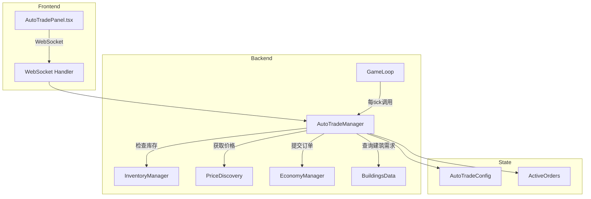

# 自动交易系统设计方案

## 1. 需求概述

用户希望实现"全自动经营"功能，类似挂机游戏，自动管理整个供应链的采购和销售，可以随时开关。

### 核心功能
- **自动采购**：当生产原料库存不足时，自动向市场提交买单
- **自动销售**：当产品库存超过阈值时，自动向市场提交卖单
- **全局开关**：玩家可以一键开启/关闭自动交易
- **商品级控制**：可以针对每种商品单独配置自动交易策略
- **价格保护**：设置最高买价/最低卖价，避免亏损交易

## 2. 系统架构



## 3. 数据结构设计

### 3.1 自动交易配置

```typescript
// packages/shared/src/types/auto-trade.ts

/** 单个商品的自动交易配置 */
interface GoodsAutoTradeConfig {
  goodsId: string;
  
  // 自动采购配置
  autoBuy: {
    enabled: boolean;
    /** 当库存低于此值时触发采购 */
    triggerThreshold: number;
    /** 每次采购的目标库存量 */
    targetStock: number;
    /** 最高接受价格倍数（相对市场价） */
    maxPriceMultiplier: number; // 默认 1.1
  };
  
  // 自动销售配置
  autoSell: {
    enabled: boolean;
    /** 当库存超过此值时触发销售 */
    triggerThreshold: number;
    /** 销售后保留的库存量 */
    reserveStock: number;
    /** 最低接受价格倍数（相对市场价） */
    minPriceMultiplier: number; // 默认 0.9
  };
}

/** 全局自动交易配置 */
interface AutoTradeConfig {
  /** 全局开关 */
  enabled: boolean;
  
  /** 每种商品的配置 */
  goodsConfigs: Map<string, GoodsAutoTradeConfig>;
  
  /** 自动根据建筑需求生成配置 */
  autoConfigureFromBuildings: boolean;
  
  /** 最大同时活跃订单数 */
  maxActiveOrders: number; // 默认 50
  
  /** 订单刷新间隔（ticks） */
  orderRefreshInterval: number; // 默认 10
}
```

### 3.2 活跃订单追踪

```typescript
interface AutoTradeOrder {
  orderId: string;
  goodsId: string;
  orderType: 'buy' | 'sell';
  quantity: number;
  price: number;
  createdTick: number;
  /** 用于判断是否需要刷新 */
  originalMarketPrice: number;
}
```

## 4. 核心服务实现

### 4.1 AutoTradeManager 服务

```typescript
// packages/server/src/services/autoTradeManager.ts

class AutoTradeManager {
  private config: AutoTradeConfig;
  private activeOrders: Map<string, AutoTradeOrder[]>; // companyId -> orders
  private lastProcessTick: Map<string, number>;
  
  /** 初始化玩家的自动交易配置 */
  initialize(companyId: string): void;
  
  /** 设置全局开关 */
  setEnabled(companyId: string, enabled: boolean): void;
  
  /** 更新商品配置 */
  updateGoodsConfig(
    companyId: string, 
    goodsId: string, 
    config: Partial<GoodsAutoTradeConfig>
  ): void;
  
  /** 根据建筑自动生成配置 */
  autoConfigureFromBuildings(
    companyId: string, 
    buildings: BuildingInstance[]
  ): void;
  
  /** 每tick处理 - 核心逻辑 */
  processTick(
    companyId: string,
    currentTick: number,
    buildings: BuildingInstance[]
  ): AutoTradeResult;
  
  /** 获取当前状态摘要 */
  getStatus(companyId: string): AutoTradeStatus;
}
```

### 4.2 核心处理逻辑

```typescript
processTick(companyId, currentTick, buildings): AutoTradeResult {
  if (!this.config.enabled) return { actions: [] };
  
  const actions: AutoTradeAction[] = [];
  const inventory = inventoryManager.getInventory(companyId);
  
  // 1. 分析建筑需求 - 计算每种原料的消耗速率
  const consumption = this.calculateConsumptionRate(buildings);
  const production = this.calculateProductionRate(buildings);
  
  // 2. 检查并执行自动采购
  for (const [goodsId, config] of this.config.goodsConfigs) {
    if (!config.autoBuy.enabled) continue;
    
    const currentStock = inventory.stocks[goodsId]?.quantity ?? 0;
    const consumeRate = consumption.get(goodsId) ?? 0;
    
    // 计算动态阈值：考虑消耗速率
    const effectiveThreshold = Math.max(
      config.autoBuy.triggerThreshold,
      consumeRate * 10 // 至少保持10个tick的库存
    );
    
    if (currentStock < effectiveThreshold) {
      const buyAmount = config.autoBuy.targetStock - currentStock;
      const marketPrice = priceDiscoveryService.getPrice(goodsId);
      const maxPrice = marketPrice * config.autoBuy.maxPriceMultiplier;
      
      // 检查是否已有该商品的买单
      if (!this.hasActiveBuyOrder(companyId, goodsId)) {
        const result = economyManager.playerSubmitBuyOrder(
          companyId, goodsId, buyAmount, maxPrice
        );
        if (result.success) {
          actions.push({ type: 'buy', goodsId, quantity: buyAmount, price: maxPrice });
        }
      }
    }
  }
  
  // 3. 检查并执行自动销售
  for (const [goodsId, config] of this.config.goodsConfigs) {
    if (!config.autoSell.enabled) continue;
    
    const currentStock = inventory.stocks[goodsId]?.quantity ?? 0;
    const reservedForProduction = inventory.stocks[goodsId]?.reservedForProduction ?? 0;
    const availableToSell = currentStock - reservedForProduction;
    
    if (availableToSell > config.autoSell.triggerThreshold) {
      const sellAmount = availableToSell - config.autoSell.reserveStock;
      if (sellAmount > 0) {
        const marketPrice = priceDiscoveryService.getPrice(goodsId);
        const minPrice = marketPrice * config.autoSell.minPriceMultiplier;
        
        if (!this.hasActiveSellOrder(companyId, goodsId)) {
          const result = economyManager.playerSubmitSellOrder(
            companyId, goodsId, sellAmount, minPrice
          );
          if (result.success) {
            actions.push({ type: 'sell', goodsId, quantity: sellAmount, price: minPrice });
          }
        }
      }
    }
  }
  
  // 4. 清理过期或价格偏离的订单
  this.cleanupStaleOrders(companyId, currentTick);
  
  return { actions };
}
```

## 5. 智能配置生成

### 5.1 根据建筑自动分析需求

```typescript
autoConfigureFromBuildings(companyId, buildings): void {
  const configs = new Map<string, GoodsAutoTradeConfig>();
  
  for (const building of buildings) {
    const def = BUILDINGS_DATA.find(b => b.id === building.definitionId);
    if (!def) continue;
    
    const method = def.productionSlots[0]?.methods.find(
      m => m.id === building.currentMethodId
    );
    if (!method) continue;
    
    // 分析输入需求 -> 自动采购
    for (const input of method.recipe.inputs) {
      let config = configs.get(input.goodsId);
      if (!config) {
        config = this.createDefaultConfig(input.goodsId);
        configs.set(input.goodsId, config);
      }
      
      // 累加消耗量来计算阈值
      const dailyConsumption = input.amount * (720 / method.recipe.ticksRequired);
      config.autoBuy.triggerThreshold = Math.max(
        config.autoBuy.triggerThreshold,
        dailyConsumption * 2 // 2天的库存作为触发阈值
      );
      config.autoBuy.targetStock = Math.max(
        config.autoBuy.targetStock,
        dailyConsumption * 5 // 5天的库存作为目标
      );
      config.autoBuy.enabled = true;
    }
    
    // 分析产出 -> 自动销售
    for (const output of method.recipe.outputs) {
      let config = configs.get(output.goodsId);
      if (!config) {
        config = this.createDefaultConfig(output.goodsId);
        configs.set(output.goodsId, config);
      }
      
      const dailyProduction = output.amount * (720 / method.recipe.ticksRequired);
      config.autoSell.triggerThreshold = dailyProduction * 3; // 3天产量触发
      config.autoSell.reserveStock = dailyProduction * 1; // 保留1天产量
      config.autoSell.enabled = true;
    }
  }
  
  this.config.goodsConfigs = configs;
}
```

## 6. 前端组件设计

### 6.1 AutoTradePanel.tsx

```tsx
// 主控制面板位置：右侧信息流上方
interface AutoTradePanelProps {
  enabled: boolean;
  onToggle: (enabled: boolean) => void;
}

// UI 结构
<div className="auto-trade-panel">
  {/* 全局开关 */}
  <div className="header">
    <span className="title">🤖 自动交易</span>
    <Toggle checked={enabled} onChange={onToggle} />
  </div>
  
  {/* 快速状态 */}
  <div className="status-bar">
    <span>📥 活跃买单: {activeBuyOrders}</span>
    <span>📤 活跃卖单: {activeSellOrders}</span>
  </div>
  
  {/* 展开查看详情 */}
  <Collapsible title="交易配置">
    <GoodsConfigList configs={goodsConfigs} onChange={updateConfig} />
  </Collapsible>
  
  {/* 操作按钮 */}
  <div className="actions">
    <Button onClick={autoConfigureFromBuildings}>
      🔄 从建筑自动配置
    </Button>
  </div>
</div>
```

### 6.2 商品配置列表

```tsx
// 每个商品一行，显示关键信息
<GoodsConfigRow>
  <GoodsIcon id={goodsId} />
  <span>{goodsName}</span>
  
  {/* 买入配置 */}
  <div className="buy-config">
    <Checkbox checked={autoBuy.enabled} />
    <span>库存 &lt; {triggerThreshold} 时买入</span>
  </div>
  
  {/* 卖出配置 */}
  <div className="sell-config">
    <Checkbox checked={autoSell.enabled} />
    <span>库存 &gt; {triggerThreshold} 时卖出</span>
  </div>
  
  {/* 当前状态 */}
  <StockIndicator current={currentStock} threshold={threshold} />
</GoodsConfigRow>
```

## 7. WebSocket 通信

### 7.1 新增消息类型

```typescript
// 客户端 -> 服务端
type AutoTradeClientMessage =
  | { type: 'auto_trade_toggle'; enabled: boolean }
  | { type: 'auto_trade_config_update'; goodsId: string; config: Partial<GoodsAutoTradeConfig> }
  | { type: 'auto_trade_auto_configure' }
  | { type: 'auto_trade_get_status' };

// 服务端 -> 客户端
type AutoTradeServerMessage =
  | { type: 'auto_trade_status'; status: AutoTradeStatus }
  | { type: 'auto_trade_action'; action: AutoTradeAction }
  | { type: 'auto_trade_error'; error: string };
```

### 7.2 状态同步

```typescript
// 每次状态变化时推送给客户端
interface AutoTradeStatus {
  enabled: boolean;
  goodsConfigs: GoodsAutoTradeConfig[];
  activeOrders: {
    buyOrders: number;
    sellOrders: number;
    totalValue: number;
  };
  lastActions: AutoTradeAction[];
}
```

## 8. 集成到 GameLoop

### 8.1 修改 processTick

```typescript
// packages/server/src/services/gameLoop.ts

private processTick(gameId: string): void {
  const game = this.games.get(gameId);
  if (!game) return;
  
  game.currentTick++;
  
  // ... 现有逻辑 ...
  
  // ===== 新增：自动交易处理 =====
  const autoTradeResult = autoTradeManager.processTick(
    game.playerCompanyId,
    game.currentTick,
    game.buildings
  );
  
  // 将自动交易动作添加到事件流
  if (autoTradeResult.actions.length > 0) {
    for (const action of autoTradeResult.actions) {
      events.push({
        id: `auto-trade-${Date.now()}`,
        type: 'auto_trade',
        message: `自动${action.type === 'buy' ? '采购' : '销售'}: ${action.quantity} ${action.goodsId}`,
      });
    }
  }
  
  // ... 其他逻辑 ...
}
```

## 9. 实现步骤

### Phase 1: 核心服务
1. 创建 `packages/shared/src/types/auto-trade.ts` - 类型定义
2. 创建 `packages/server/src/services/autoTradeManager.ts` - 核心服务
3. 实现 `processTick` 自动采购逻辑
4. 实现 `processTick` 自动销售逻辑
5. 实现 `autoConfigureFromBuildings` 智能配置

### Phase 2: 集成与通信
6. 修改 `gameLoop.ts` 集成自动交易
7. 添加 WebSocket 消息处理
8. 实现状态同步推送

### Phase 3: 前端界面
9. 创建 `AutoTradePanel.tsx` 组件
10. 集成到游戏主界面
11. 实现配置持久化

## 10. 与现有系统的关系

| 现有系统 | 关系 | 说明 |
|---------|------|------|
| `autoPurchaseMaterials` | 替代 | 新系统更全面，可以关闭旧的 |
| `economyManager` | 使用 | 调用其买卖单 API |
| `inventoryManager` | 使用 | 查询库存状态 |
| `priceDiscoveryService` | 使用 | 获取市场价格 |
| `NPC Companies` | 无关 | NPC 有自己的交易逻辑 |

## 11. 配置默认值

```typescript
const DEFAULT_CONFIG: AutoTradeConfig = {
  enabled: false, // 默认关闭，需要玩家主动开启
  goodsConfigs: new Map(),
  autoConfigureFromBuildings: true,
  maxActiveOrders: 50,
  orderRefreshInterval: 10,
};

const DEFAULT_GOODS_CONFIG: GoodsAutoTradeConfig = {
  autoBuy: {
    enabled: false,
    triggerThreshold: 100,
    targetStock: 500,
    maxPriceMultiplier: 1.1,
  },
  autoSell: {
    enabled: false,
    triggerThreshold: 1000,
    reserveStock: 100,
    minPriceMultiplier: 0.9,
  },
};