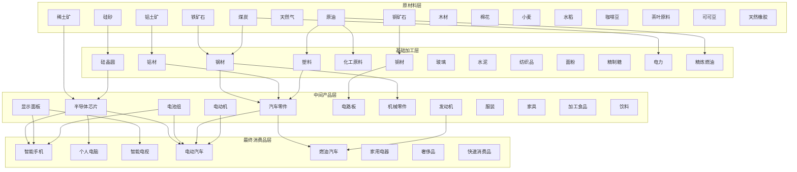

# 《供应链指挥官：算法都市》内容扩展计划

## 一、完整产业链设计

### 产业链架构图



## 二、建筑类型扩展（25种）

### 1. 资源开采类（6种）
| ID | 名称 | 描述 | 产出 |
|---|------|------|------|
| mine-iron | 铁矿场 | 开采铁矿石 | 铁矿石 |
| mine-copper | 铜矿场 | 开采铜矿石 | 铜矿石 |
| mine-rare-earth | 稀土矿场 | 开采稀土矿物 | 稀土 |
| oil-field | 油田 | 开采原油 | 原油 |
| farm | 农场 | 种植农作物 | 小麦/棉花/咖啡豆 |
| logging-camp | 伐木场 | 采伐木材 | 木材 |

### 2. 基础加工类（6种）
| ID | 名称 | 输入 | 输出 |
|---|------|------|------|
| steel-mill | 钢铁厂 | 铁矿石+煤炭+电力 | 钢材 |
| refinery | 炼油厂 | 原油+电力 | 燃油+塑料+化工品 |
| smelter | 冶炼厂 | 铜矿/铝土+电力 | 铜材/铝材 |
| chemical-plant | 化工厂 | 化工品+电力 | 各类化学制品 |
| textile-mill | 纺织厂 | 棉花+电力 | 纺织品 |
| food-processor | 食品加工厂 | 农产品+电力 | 加工食品 |

### 3. 高端制造类（7种）
| ID | 名称 | 输入 | 输出 |
|---|------|------|------|
| chip-fab | 芯片工厂 | 硅片+稀土+化工品+电力 | 芯片 |
| battery-factory | 电池工厂 | 锂+化工品+电力 | 电池组 |
| display-factory | 显示屏工厂 | 玻璃+化工品+电力 | 显示面板 |
| pcb-factory | 电路板厂 | 铜材+化工品+电力 | PCB电路板 |
| auto-plant | 汽车工厂 | 零件+电池/发动机+电力 | 汽车 |
| electronics-factory | 电子厂 | 芯片+PCB+显示屏+电力 | 电子产品 |
| aerospace-factory | 航空航天厂 | 高端材料+电子+电力 | 飞机/卫星 |

### 4. 服务与物流类（6种）
| ID | 名称 | 功能 |
|---|------|------|
| power-plant | 发电站 | 生产电力（可选煤电/气电/核电/光伏） |
| warehouse | 物流仓库 | 存储货物，降低运输成本 |
| port | 港口 | 进出口贸易，连接外部市场 |
| research-center | 研发中心 | 研发新技术 |
| data-center | 数据中心 | 提供算力服务 |
| retail-store | 零售店 | 销售消费品给居民 |

## 三、商品种类扩展（60种）

### 原材料（15种）
铁矿石、铜矿石、铝土矿、煤炭、原油、天然气、稀土、硅砂、锂矿、木材、棉花、小麦、水稻、咖啡豆、茶叶原料

### 基础加工品（15种）
钢材、铜材、铝材、塑料、玻璃、水泥、化工原料、硅晶圆、纺织品、面粉、精制糖、精炼燃油、电力、算力、洁净水

### 中间产品（15种）
半导体芯片、电池组、发动机、电动机、显示面板、PCB电路板、机械零件、汽车零件、船舶零件、飞机零件、电子元件、服装面料、食品半成品、药品原料、建材

### 最终消费品（15种）
智能手机、个人电脑、智能电视、电动汽车、燃油汽车、家用电器、服装成衣、家具、加工食品、饮料、药品、奢侈品、娱乐设备、教育用品、医疗设备

## 四、需求组系统扩展

### 基础需求
- **食物**: 粮食、加工食品、饮料
- **住房**: 建材、家具、家电
- **能源**: 电力、燃油、天然气

### 发展需求
- **出行**: 汽车、公共交通
- **通讯**: 手机、电脑、网络服务
- **娱乐**: 电视、游戏、VR设备

### 高级需求
- **教育**: 教育用品、算力服务
- **医疗**: 药品、医疗设备
- **社会地位**: 奢侈品、高端消费

## 五、城市布局设计

```
┌──────────────────────────────────────────────────────┐
│                    港口区                              │
│   [港口1] [港口2] [港口3]                              │
├──────────────────────────────────────────────────────┤
│        重工业区              │       高新科技区        │
│  [钢铁厂] [炼油厂] [化工厂]  │  [芯片厂] [电子厂]      │
│  [冶炼厂] [发电站1]         │  [电池厂] [数据中心]    │
├─────────────────────────────┼────────────────────────┤
│        轻工业区              │       商业区            │
│  [纺织厂] [食品厂] [家具厂]  │  [零售店] [办公楼]      │
│  [服装厂] [饮料厂]          │  [购物中心] [酒店]      │
├─────────────────────────────┼────────────────────────┤
│        物流区                │       居民区            │
│  [仓库1] [仓库2] [仓库3]     │  [住宅区] [学校]        │
│  [配送中心1] [配送中心2]     │  [医院] [公园]          │
├──────────────────────────────────────────────────────┤
│                    资源区（城市外围）                   │
│  [铁矿] [铜矿] [油田] [农场] [伐木场] [光伏电站]       │
└──────────────────────────────────────────────────────┘
```

## 六、实现优先级

### 第一批（核心产业链）
1. 原材料: 铁矿石、煤炭、原油、硅砂
2. 基础加工: 钢材、燃油、硅片、电力
3. 高端制造: 芯片、电池、汽车零件
4. 消费品: 智能手机、电动汽车
5. 建筑: 矿场、钢铁厂、炼油厂、芯片厂、汽车厂、发电站

### 第二批（扩展产业链）
1. 原材料: 铜矿、稀土、棉花、农作物
2. 基础加工: 铜材、纺织品、食品加工
3. 高端制造: 显示屏、电子产品
4. 消费品: 电脑、电视、服装
5. 建筑: 更多工厂类型

### 第三批（完善生态）
1. 物流系统: 仓库、港口
2. 服务设施: 零售、研发中心
3. 外贸系统: 进出口机制