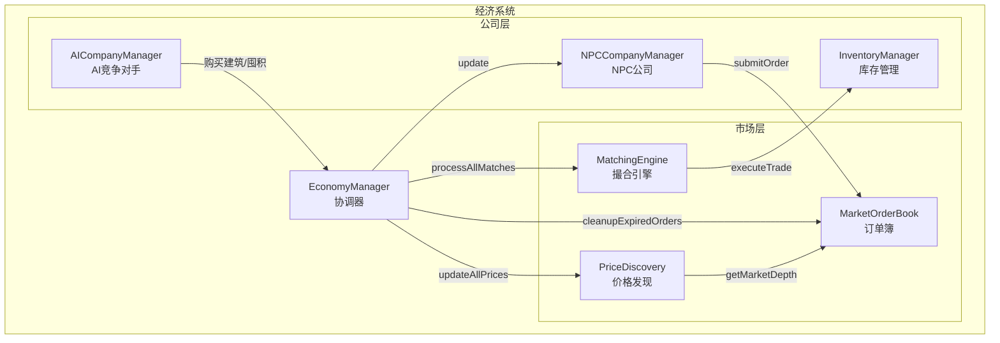

# 经济系统优化方案

## 一、当前系统问题分析

### 1.1 从终端日志观察到的问题

```
[MarketOrderBook] Order cancelled: order-xxx-1851
[MarketOrderBook] Sell order submitted: 500 iron-ore @ 1093.88
[MarketOrderBook] Order cancelled: order-xxx-1852
[MarketOrderBook] Sell order submitted: 500 coal @ 1864.77
...
```

**问题1: 订单过度流转**
- 每个tick有大量 `Order cancelled` 和 `Sell order submitted` 日志
- NPC公司每24 tick更新时会取消所有旧订单再重新提交
- 造成不必要的计算开销和日志噪音

**问题2: 价格持续单向下跌**
- 煤炭价格从2000+降到1300+
- iron-ore、copper-ore等价格持续走低
- 供过于求导致市场失衡

**问题3: AI公司行为重复**
- "铁拳重工"和"星辰科技"反复执行 `stockpile` 囤积操作
- "华兴电子"、"东方汽车"因预算不足无可执行动作
- 缺乏策略多样性

---

## 二、系统架构分析



### 2.1 当前数据流

每个Tick的处理顺序：
1. `npcCompanyManager.update()` - NPC生产+发布订单
2. `marketOrderBook.cleanupExpiredOrders()` - 清理过期订单
3. `matchingEngine.processAllMatches()` - 撮合交易
4. `priceDiscoveryService.updateAllPrices()` - 更新价格

---

## 三、优化方案详细设计

### 3.1 减少订单流转频率

**问题根源**: [`npcCompanies.ts:processOrders()`](packages/server/src/services/npcCompanies.ts:290-354)

```typescript
// 当前实现 - 每次都取消所有旧订单
for (const orderId of state.activeOrderIds) {
  marketOrderBook.cancelOrder(orderId, currentTick);
}
state.activeOrderIds = [];
```

**优化方案**:

1. **增量更新订单** - 只在需要时调整订单价格/数量
2. **价格容忍阈值** - 只有价格变化超过5%时才更新订单
3. **订单有效期延长** - 从48 tick延长到96 tick

```typescript
// 优化后的逻辑
private processOrdersOptimized(state: NPCCompanyState, currentTick: number): void {
  const PRICE_TOLERANCE = 0.05; // 5%价格容忍度
  
  // 检查现有订单是否需要更新
  const ordersToKeep: string[] = [];
  
  for (const orderId of state.activeOrderIds) {
    const order = marketOrderBook.getOrder(orderId);
    if (!order || order.status === 'filled') continue;
    
    const currentPrice = priceDiscoveryService.getPrice(order.goodsId);
    const priceChange = Math.abs(order.pricePerUnit - currentPrice) / currentPrice;
    
    // 如果价格变化小于阈值，保留订单
    if (priceChange < PRICE_TOLERANCE) {
      ordersToKeep.push(orderId);
    } else {
      marketOrderBook.cancelOrder(orderId, currentTick);
    }
  }
  
  state.activeOrderIds = ordersToKeep;
  // ... 只补充缺失的订单
}
```

### 3.2 平衡供需关系

**问题根源**: [`npcCompanies.ts:generateNPCCompanyConfigs()`](packages/server/src/services/npcCompanies.ts:124-212)

当前配置：
- 14个原材料供应商，每个每天产能1000单位
- 50个消费者群体，每个每天消费5-15单位
- 每种建筑类型3个NPC加工商

**供需失衡计算**:
- 总供给: 14种 × 1000单位/天 = 14000单位/天
- 消费者需求: 50群体 × 10种商品 × 10单位 = 5000单位/天
- 严重供过于求

**优化方案**:

```typescript
// 调整后的配置
const SUPPLY_CONFIG = {
  rawMaterialCapacity: 300,      // 原300/天 → 减少到300
  consumerDemandMultiplier: 2.0, // 消费需求 ×2
  processorCount: 5,             // 每类建筑5个加工商（增加中游需求）
};
```

**动态供给调节**:
```typescript
// 根据库存水平动态调整产能
private getEffectiveProduction(state: NPCCompanyState, prod: ProductionConfig): number {
  const inventory = inventoryManager.getInventory(state.config.id);
  const currentStock = inventory?.stocks[prod.goodsId]?.quantity ?? 0;
  const targetStock = prod.dailyCapacity * 7; // 7天库存
  
  // 库存过多时减产
  if (currentStock > targetStock * 2) {
    return prod.dailyCapacity * 0.3; // 30%产能
  } else if (currentStock > targetStock) {
    return prod.dailyCapacity * 0.7; // 70%产能
  }
  return prod.dailyCapacity;
}
```

### 3.3 改进价格发现机制

**问题根源**: [`priceDiscovery.ts:calculatePrice()`](packages/server/src/services/priceDiscovery.ts:116-153)

当前权重：
- 最近成交价: 0.5
- 买卖中间价: 0.3
- 供需压力: 0.1
- 价格惯性: 0.1

**问题**: 成交价权重太高，一次低价成交会迅速拉低市场价

**优化方案**:

```typescript
// 调整后的权重配置
const PRICE_WEIGHTS = {
  lastTradePrice: 0.3,    // 降低成交价权重
  midPrice: 0.2,          // 买卖中间价
  supplyPressure: 0.1,    // 供需压力
  priceInertia: 0.3,      // 增加价格惯性
  fundamentalValue: 0.1,  // 新增：基于成本的基础价值
};

// 新增基础价值计算
private calculateFundamentalValue(goodsId: string): number {
  const goods = GOODS_DATA.find(g => g.id === goodsId);
  return goods?.basePrice ?? 1000;
}

// 限制单次价格变动幅度
private readonly MAX_PRICE_CHANGE = 0.03; // 3%（原10%）
```

**增加市场maker机制**:
```typescript
// 市场maker在价差过大时提供流动性
private marketMakerIntervene(goodsId: string, currentTick: number): void {
  const depth = marketOrderBook.getMarketDepth(goodsId);
  const basePrice = this.getPrice(goodsId);
  
  // 如果没有买单或卖单，注入流动性
  if (!depth.bestBid || !depth.bestAsk) {
    // 提交做市商订单
    marketOrderBook.submitBuyOrder('market-maker', goodsId, 100, basePrice * 0.95, currentTick);
    marketOrderBook.submitSellOrder('market-maker', goodsId, 100, basePrice * 1.05, currentTick);
  }
}
```

### 3.4 AI公司行为优化

**问题根源**: [`aiCompanyManager.ts:selectAction()`](packages/server/src/services/aiCompanyManager.ts:514-562)

当前问题：
- 囤积动作消耗5000万但没有实际效果
- 预算不足时无任何动作
- 行为过于单一

**优化方案**:

```typescript
// 1. 降低行动门槛
private selectExpansionAction(company: AICompanyState, context: GameContext, budget: number): AIActionRecord | null {
  // 允许分期购买（支付首付）
  const affordableBuildings = BUILDINGS_DATA.filter(b => {
    const downPayment = b.baseCost * 0.3; // 30%首付
    return downPayment <= budget;
  });
  // ...
}

// 2. 增加低成本行动
const LOW_COST_ACTIONS = [
  { type: 'optimize_production', cost: 100000, description: '优化生产效率' },
  { type: 'market_research', cost: 500000, description: '市场调研' },
  { type: 'price_adjustment', cost: 0, description: '调整产品定价' },
];

// 3. 囤积动作实际生效
private executeStockpile(company: AICompanyState, action: AIActionRecord, context: GameContext): void {
  if (!action.targetId || !action.cost || company.cash < action.cost) return;
  
  company.cash -= action.cost;
  
  // 实际在市场上下买单
  const quantity = action.cost / priceDiscoveryService.getPrice(action.targetId);
  economyManager.playerSubmitBuyOrder(company.id, action.targetId, quantity, price * 1.2);
  
  // 更新市场供需数据
  // ...
}
```

### 3.5 减少日志噪音

**优化方案**: 添加日志级别控制

```typescript
// 新增日志配置
const LOG_CONFIG = {
  orderSubmit: false,   // 关闭订单提交日志
  orderCancel: false,   // 关闭订单取消日志
  tradeExecute: true,   // 保留成交日志
  aiDecision: true,     // 保留AI决策日志
  priceUpdate: false,   // 关闭价格更新日志
};

// 条件日志
if (LOG_CONFIG.orderSubmit) {
  console.log(`[MarketOrderBook] Buy order submitted: ...`);
}
```

---

## 四、实施优先级

### Phase 1: 核心问题修复（高优先级）

| 任务 | 文件 | 说明 |
|------|------|------|
| 减少订单流转 | npcCompanies.ts | 增量更新而非全量重建 |
| 平衡供需 | npcCompanies.ts | 调整供应商产能和消费者需求 |
| 价格稳定 | priceDiscovery.ts | 调整权重，增加惯性 |

### Phase 2: 行为优化（中优先级）

| 任务 | 文件 | 说明 |
|------|------|------|
| AI行动多样化 | aiCompanyManager.ts | 增加低成本行动选项 |
| 囤积生效 | aiCompanyManager.ts | 实际下单购买商品 |
| 日志优化 | 各服务文件 | 添加日志级别控制 |

### Phase 3: 高级优化（低优先级）

| 任务 | 文件 | 说明 |
|------|------|------|
| 市场maker | priceDiscovery.ts | 提供流动性保障 |
| 动态供给 | npcCompanies.ts | 根据库存调整产能 |
| 分期购买 | aiCompanyManager.ts | 支持首付购买建筑 |

---

## 五、预期效果

1. **减少日志噪音**: 订单操作日志减少80%以上
2. **价格稳定**: 价格波动幅度控制在±30%以内
3. **供需平衡**: 建立合理的供需曲线
4. **AI活跃**: 所有AI公司都有可执行的动作
5. **性能提升**: 减少不必要的订单操作带来的计算开销

---

## 六、关键指标监控

```typescript
interface EconomyHealthMetrics {
  // 市场健康度
  priceVolatilityAvg: number;      // 平均价格波动率 < 0.1
  bidAskSpreadAvg: number;         // 平均买卖价差 < 0.2
  orderBookDepth: number;          // 订单簿深度 > 100
  
  // 供需平衡
  supplyDemandRatio: number;       // 供需比 0.8-1.2
  inventoryTurnover: number;       // 库存周转率 > 0.5
  
  // AI活跃度
  aiActionSuccessRate: number;     // AI行动成功率 > 0.5
  aiDecisionDiversity: number;     // AI决策多样性指数
}