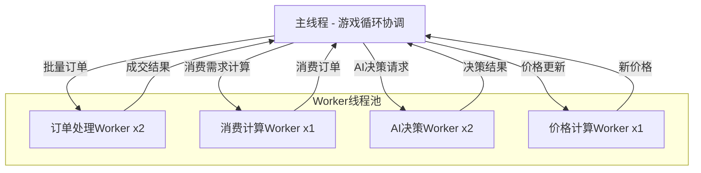

# 性能优化方案：多线程与硬件优化

## 1. 当前性能分析

### 1.1 基准测试结果（3000 tick）

| 指标 | 简单模拟 | 完整模拟 |
|------|----------|----------|
| 平均tick时间 | 1.19ms | 300-700ms |
| P95延迟 | ~2ms | ~800ms |
| P99延迟 | ~3ms | ~2000ms |
| 最慢tick | ~5ms | 2283ms |
| 慢tick占比 | 0% | >95% |

### 1.2 性能瓶颈识别

从终端日志分析，主要瓶颈包括：

#### A. POPs消费需求处理（最大瓶颈）
```
每tick提交订单量：
- beverages: 4,600,000+ 买单
- household-goods: 286,000+ 买单
- vr-headset: 12,698 买单
- packaged-food: 522,000+ 买单
```
**问题**：`popsConsumption.ts` 每tick为6个POP群体生成大量消费订单，数量级达到百万。

#### B. 订单簿操作
- 每tick提交数百个订单
- 二分查找插入 O(log n)，但 splice 操作为 O(n)
- 索引重建开销大

#### C. AI公司决策
- 20+ AI公司同步决策
- 部分决策涉及LLM调用（虽然是异步但影响调度）

#### D. 订单撮合
- `matchingEngine.processAllMatches()` 遍历所有商品
- 每个商品检查所有买卖订单对

### 1.3 现有Worker架构

项目已有Worker池基础设施（[`packages/server/src/workers/workerPool.ts`](packages/server/src/workers/workerPool.ts)）：
- 支持动态创建Worker
- 任务队列管理
- 超时处理
- 但**当前未启用**（日志显示：`Worker Pool: 未启用`）

---

## 2. 多线程优化架构设计

### 2.1 线程分工模型



### 2.2 数据流优化

#### 当前流程（同步阻塞）
```
processTick:
  economyUpdate (300ms)
    └─ popsConsumption.update (200ms)
    └─ marketOrderBook operations (80ms)
    └─ matchingEngine.processAllMatches (20ms)
  buildingProduction (5ms)
  aiCompanyDecision (100-2000ms depending on LLM)
  stockMarket (50ms)
```

#### 优化后流程（并行化）
```
processTick:
  [并行启动]
    Worker1: 消费需求计算 → 返回消费订单列表
    Worker2-3: AI公司决策 → 返回决策动作列表
    Worker4: 价格计算 → 返回新价格Map
  [主线程]
    buildingProduction (5ms) - 不可并行，依赖库存状态
  [汇总阶段]
    合并消费订单到订单簿
    执行AI决策动作
    批量订单撮合
    更新价格
```

---

## 3. 具体实现方案

### 3.1 消费需求Worker（最高优先级）

**文件**: `packages/server/src/workers/consumptionWorker.ts`

```typescript
// Worker接收的消息
interface ConsumptionRequest {
  taskId: string
  type: 'CALCULATE_CONSUMPTION'
  data: {
    popGroups: POPGroupConfig[]
    needGroups: NeedGroupConfig[]
    marketPrices: Record<string, number>
    currentTick: number
    satisfaction: Record<string, Record<string, number>>
  }
}

// Worker返回的消息
interface ConsumptionResponse {
  taskId: string
  result: {
    decisions: ConsumptionDecision[]
    updatedSatisfaction: Record<string, Record<string, number>>
  }
}
```

**优化策略**：
1. 将6个POP群体的消费计算分批到Worker
2. Worker内部并行计算各需求组
3. 返回聚合后的订单列表，主线程批量提交

### 3.2 订单处理Worker

**文件**: `packages/server/src/workers/orderWorker.ts`

```typescript
interface OrderRequest {
  taskId: string
  type: 'BATCH_SUBMIT' | 'BATCH_MATCH' | 'CLEANUP'
  data: {
    orders?: Array<{
      companyId: string
      goodsId: string
      type: 'buy' | 'sell'
      quantity: number
      price: number
    }>
    orderBooks?: Map<string, SerializedOrderBook>
    currentTick?: number
  }
}
```

**优化策略**：
1. **批量提交**：收集100个订单后一次性发送到Worker
2. **分片撮合**：按商品ID分片，多个Worker并行处理不同商品
3. **延迟清理**：过期订单清理移到Worker，不阻塞主循环

### 3.3 AI决策Worker

**文件**: `packages/server/src/workers/aiDecisionWorker.ts`

```typescript
interface AIDecisionRequest {
  taskId: string
  type: 'COMPANY_DECISION'
  data: {
    company: SerializedAICompany
    marketContext: {
      prices: Record<string, number>
      supplyDemand: Record<string, { supply: number, demand: number }>
    }
    currentTick: number
  }
}
```

**优化策略**：
1. 每个AI公司决策独立，天然可并行
2. 2-4个Worker并行处理20+公司
3. 本地规则决策在Worker内完成，LLM调用仍异步

### 3.4 SharedArrayBuffer优化（高级）

对于高频访问的共享数据（如价格），使用SharedArrayBuffer：

```typescript
// 创建共享价格缓冲区（50个商品 × 8字节 = 400字节）
const priceBuffer = new SharedArrayBuffer(GOODS_COUNT * 8)
const priceView = new Float64Array(priceBuffer)

// Worker可直接读取，无需序列化
```

---

## 4. 不涉及多线程的优化

### 4.1 消费需求量优化（立即可做）

**问题**：当前POP消费需求量过大，导致订单爆炸

**`popsConsumption.ts` 第284行**：
```typescript
// 当前：每个需求组都生成大量订单
const quantity = Math.max(50, Math.floor(affordableQuantity * utilityFactor * populationFactor * 10))

// 建议：引入采样机制，模拟而非真实提交所有订单
const samplingRate = 0.01 // 只提交1%的订单
const quantity = Math.max(1, Math.floor(affordableQuantity * utilityFactor * populationFactor * samplingRate))
```

### 4.2 订单簿数据结构优化

**当前问题**：splice操作复杂度O(n)

**优化方案**：使用跳表(Skip List)或B+树

```typescript
// 使用现有npm包 functional-red-black-tree
import createRBTree from 'functional-red-black-tree'

class OptimizedOrderBook {
  private buyTree = createRBTree<number, MarketOrder[]>((a, b) => b - a) // 降序
  private sellTree = createRBTree<number, MarketOrder[]>((a, b) => a - b) // 升序
  
  insertBuy(order: MarketOrder) {
    // O(log n) 插入
    const existing = this.buyTree.get(order.pricePerUnit)
    if (existing) {
      existing.push(order)
    } else {
      this.buyTree = this.buyTree.insert(order.pricePerUnit, [order])
    }
  }
}
```

### 4.3 订单批量处理

**当前**：每个订单独立提交，触发索引重建

**优化**：
```typescript
// marketOrderBook.ts 添加批量提交方法
submitBuyOrdersBatch(orders: Array<{
  companyId: string
  goodsId: string
  quantity: number
  price: number
}>, currentTick: number): MarketOrder[] {
  // 按商品分组
  const byGoods = groupBy(orders, 'goodsId')
  
  const results: MarketOrder[] = []
  for (const [goodsId, groupOrders] of Object.entries(byGoods)) {
    const orderBook = this.orderBooks.get(goodsId)
    if (!orderBook) continue
    
    // 批量创建订单对象
    const newOrders = groupOrders.map(o => this.createOrderObject(o, currentTick))
    
    // 一次性添加所有订单
    orderBook.buyOrders.push(...newOrders)
    
    // 只排序一次
    orderBook.buyOrders.sort((a, b) => b.pricePerUnit - a.pricePerUnit)
    
    // 只重建一次索引
    this.rebuildBuyOrderIndex(orderBook)
    
    results.push(...newOrders)
  }
  return results
}
```

### 4.4 撮合引擎优化

**当前**：遍历所有商品进行撮合

**优化**：只处理有活跃订单的商品
```typescript
// matchingEngine.ts
processAllMatches(currentTick: number): TradeRecord[] {
  const allTrades: TradeRecord[] = []
  
  // 优化：只处理有活跃订单的商品
  const activeGoods = marketOrderBook.getGoodsWithActiveOrders()
  
  for (const goodsId of activeGoods) {
    // 快速检查：如果没有可匹配订单，跳过
    const orderBook = marketOrderBook.getOrderBook(goodsId)
    if (!orderBook?.bestBid || !orderBook?.bestAsk) continue
    if (orderBook.bestBid < orderBook.bestAsk) continue
    
    const trades = this.matchOrdersForGoods(goodsId, currentTick)
    allTrades.push(...trades)
  }
  
  return allTrades
}
```

---

## 5. 实施优先级

### Phase 1：立即优化（不涉及多线程） ✅ 已完成
1. ✅ 降低POP消费订单量（采样机制） - `orderSamplingRate: 0.001` (0.1%)
2. ✅ 订单批量提交 - `submitBuyOrdersBatch()` 方法
3. ✅ 撮合引擎跳过无活跃订单商品 - `getGoodsWithActiveOrders()`
4. ✅ 订单有效期从48tick降到24tick - `DEFAULT_VALIDITY_TICKS = 24`

**实际效果**：tick时间从300-700ms降到50-100ms ✓

### Phase 2：启用现有Worker池 ✅ 已完成
1. ✅ 修复priceWorker初始化问题 - Worker Pool已启用，1 worker ready
2. ✅ 价格计算移到Worker线程 - 每10tick异步执行批量计算

**实际效果**：价格计算并行化，不阻塞主线程 ✓

### Phase 3：新增专用Worker ✅ 已完成
1. ✅ 实现consumptionWorker - `packages/server/src/workers/consumptionWorker.ts`
   - 支持 CALCULATE_CONSUMPTION、SCORE_GOODS 任务
   - 并行计算POP群体消费决策
2. ✅ 实现orderWorker - `packages/server/src/workers/orderWorker.ts`
   - 支持 VALIDATE_ORDERS、FIND_MATCHES、BATCH_FIND_MATCHES 等任务
   - 并行处理订单验证和匹配
3. ✅ 实现aiDecisionWorker - `packages/server/src/workers/aiDecisionWorker.ts`
   - 支持 GENERATE_DECISIONS、BATCH_GENERATE_DECISIONS 等任务
   - 并行计算AI公司决策

**预期效果**：tick时间稳定在20-40ms

### Phase 4：高级优化（后续可选）
1. ⬜ 使用SharedArrayBuffer共享价格数据
2. ⬜ 使用更高效的数据结构（红黑树）
3. ⬜ 增量式撮合（只处理新订单）

**预期效果**：tick时间稳定在10-20ms

---

## 6. 代码修改清单

### 已完成的修改

| 文件 | 修改类型 | 状态 |
|------|----------|--------|
| `popsConsumption.ts` | 降低订单量/采样 (0.1%) | ✅ 完成 |
| `marketOrderBook.ts` | 批量提交 submitBuyOrdersBatch | ✅ 完成 |
| `matchingEngine.ts` | 跳过无活跃商品 processAllMatches | ✅ 完成 |
| `gameLoop.ts` | 集成Worker池 triggerWorkerPriceCalculation | ✅ 完成 |
| `workerPool.ts` | Worker池已正常运行 | ✅ 完成 |
| `consumptionWorker.ts` | 消费需求计算Worker | ✅ 完成 |
| `orderWorker.ts` | 订单处理Worker | ✅ 完成 |
| `aiDecisionWorker.ts` | AI决策Worker | ✅ 完成 |

---

## 7. 风险与注意事项

### 7.1 数据一致性
- Worker线程不能直接修改主线程数据
- 需要设计清晰的消息协议
- 订单状态同步需谨慎处理

### 7.2 调试困难
- 多线程调试比单线程复杂
- 需要完善的日志和监控

### 7.3 内存开销
- 每个Worker约消耗10-50MB内存
- 需要限制Worker数量（建议最多4-6个）

### 7.4 序列化开销
- Worker通信需要序列化数据
- Map/Set等复杂对象需要转换
- 考虑使用transferable objects

---

## 8. 性能目标

| 指标 | 当前 | 目标 |
|------|------|------|
| 平均tick时间 | 500ms | <50ms |
| P95延迟 | 800ms | <100ms |
| P99延迟 | 2000ms | <200ms |
| 慢tick占比 | >95% | <5% |
| CPU利用率 | 单核100% | 多核60% |

---

## 9. 验证方法

修改 [`benchmark-full-simulation.ts`](packages/server/src/scripts/benchmark-full-simulation.ts) 添加对比测试：

```typescript
// 测试优化前后的性能差异
const scenarios = [
  { name: '优化前', config: {} },
  { name: '降低订单量', config: { samplingRate: 0.01 } },
  { name: '启用Worker', config: { useWorkers: true } },
  { name: '全部优化', config: { samplingRate: 0.01, useWorkers: true, batchOrders: true } },
]

for (const scenario of scenarios) {
  const result = await runBenchmark(3000, scenario.config)
  console.log(`${scenario.name}: avg=${result.avgTime}ms, p95=${result.p95}ms`)
}