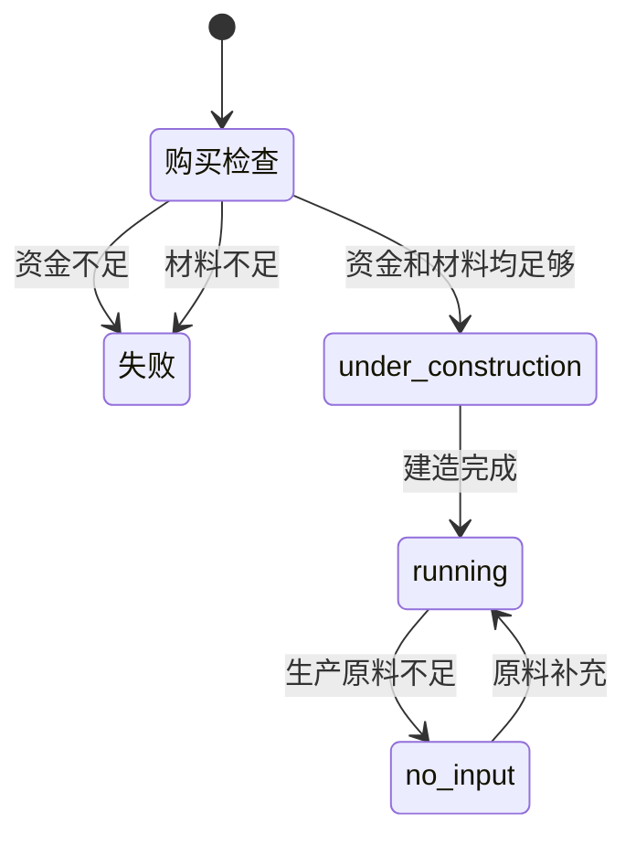
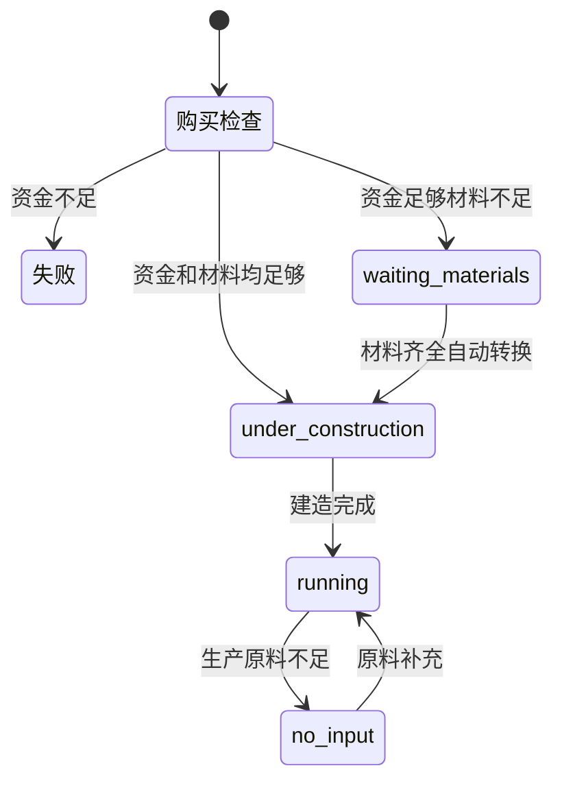

# 建筑系统优化 - 延迟材料消耗

## 概述

优化建筑购买流程，允许玩家先支付资金购买建筑，稍后再囤积建造材料。建筑会进入"等待材料"状态，材料齐全后自动开始建造。

## 当前系统分析

### 现有状态流程



### 问题所在

代码位置: [`packages/server/src/services/gameLoop.ts:530-690`](packages/server/src/services/gameLoop.ts:530)

```typescript
// 第554-575行：购买时检查材料
const constructionMaterials = getConstructionMaterials(buildingDef);
// ...
if (missingMaterials.length > 0) {
  return { success: false, error: `建造材料不足: ${missingList}` };
}
```

材料检查和消耗都发生在购买时（第589-603行），用户如果材料不足就无法购买。

## 优化方案

### 新状态流程



### 关键变更

#### 1. 扩展 BuildingInstance 状态枚举

文件: [`packages/server/src/services/gameLoop.ts:68`](packages/server/src/services/gameLoop.ts:68)

```typescript
// 修改前
status: 'running' | 'paused' | 'no_input' | 'no_power' | 'under_construction';

// 修改后
status: 'running' | 'paused' | 'no_input' | 'no_power' | 'under_construction' | 'waiting_materials';
```

#### 2. 添加建造材料追踪字段

```typescript
export interface BuildingInstance {
  // ... 现有字段 ...
  
  /** 建造所需材料清单（等待材料状态时使用） */
  requiredConstructionMaterials?: Array<{ goodsId: string; amount: number }>;
}
```

#### 3. 修改 purchaseBuilding 方法

将材料检查改为可选，材料不足时进入 waiting_materials 状态：

```typescript
purchaseBuilding(gameId: string, buildingDefId: string): {
  success: boolean;
  building?: BuildingInstance;
  error?: string;
  newCash?: number;
  materialsConsumed?: Array<{ goodsId: string; amount: number }>;
  missingMaterials?: Array<{ goodsId: string; needed: number; available: number }>;
} {
  // ... 资金检查（保留）
  
  // 检查材料（不再阻止购买）
  const constructionMaterials = getConstructionMaterials(buildingDef);
  const missingMaterials: Array<{ goodsId: string; needed: number; available: number }> = [];
  
  for (const material of constructionMaterials) {
    const available = inventoryManager.getAvailableQuantity(game.playerCompanyId, material.goodsId);
    if (available < material.amount) {
      missingMaterials.push({
        goodsId: material.goodsId,
        needed: material.amount,
        available,
      });
    }
  }
  
  // 扣除资金（无论材料是否充足）
  inventoryManager.deductCash(...);
  
  // 根据材料状态决定初始状态
  let initialStatus: 'under_construction' | 'waiting_materials';
  let materialsConsumed: Array<{ goodsId: string; amount: number }> = [];
  
  if (missingMaterials.length > 0) {
    // 材料不足，进入等待状态
    initialStatus = 'waiting_materials';
    // 不消耗材料
  } else {
    // 材料充足，直接开始建造
    initialStatus = 'under_construction';
    // 消耗材料
    for (const material of constructionMaterials) {
      inventoryManager.consumeGoods(...);
      materialsConsumed.push({ goodsId: material.goodsId, amount: material.amount });
    }
  }
  
  const building: BuildingInstance = {
    // ... 现有属性 ...
    status: initialStatus,
    requiredConstructionMaterials: missingMaterials.length > 0 ? constructionMaterials : undefined,
  };
  
  return {
    success: true,
    building,
    newCash: game.playerCash,
    materialsConsumed,
    missingMaterials: missingMaterials.length > 0 ? missingMaterials : undefined,
  };
}
```

#### 4. 添加材料检查和状态转换逻辑

在 `processBuildingProduction` 方法中添加对 waiting_materials 状态的处理：

```typescript
// 在处理 under_construction 之前添加
if (building.status === 'waiting_materials') {
  // 检查材料是否齐全
  const materials = building.requiredConstructionMaterials ?? getConstructionMaterials(def);
  let hasAllMaterials = true;
  const missingMaterials: Array<{ goodsId: string; needed: number; available: number }> = [];
  
  for (const material of materials) {
    const available = inventoryManager.getAvailableQuantity(game.playerCompanyId, material.goodsId);
    if (available < material.amount) {
      hasAllMaterials = false;
      missingMaterials.push({
        goodsId: material.goodsId,
        needed: material.amount,
        available,
      });
    }
  }
  
  if (hasAllMaterials) {
    // 消耗材料
    for (const material of materials) {
      inventoryManager.consumeGoods(
        game.playerCompanyId,
        material.goodsId,
        material.amount,
        game.currentTick,
        `construction-${building.id}`
      );
      // 增加市场需求
      this.addDemand(game, material.goodsId, material.amount);
    }
    
    // 转换为建造中状态
    building.status = 'under_construction';
    building.constructionProgress = 0;
    delete building.requiredConstructionMaterials;
    
    console.log(`[GameLoop] Building ${building.name} started construction - materials collected`);
  }
  
  // 等待材料状态：收取25%维护费
  const buildingMaintenance = (def.maintenanceCost / TICKS_PER_MONTH) * 0.25;
  totalMaintenance += buildingMaintenance;
  continue; // 跳过生产逻辑
}
```

#### 5. 扩展 TickUpdate 类型

添加 waiting_materials 状态的建筑信息：

```typescript
export interface TickUpdate {
  // ... 现有字段 ...
  
  /** 等待建造材料的建筑信息 */
  buildingMaterialShortages?: Array<{
    buildingId: string;
    buildingName: string;
    status: 'waiting_materials';
    missingMaterials: Array<{
      goodsId: string;
      goodsName: string;
      needed: number;
      available: number;
    }>;
  }>;
}
```

#### 6. 更新客户端状态配置

文件: [`packages/client/src/components/game/IndustryPanel.tsx:62-118`](packages/client/src/components/game/IndustryPanel.tsx:62)

```typescript
const SHUTDOWN_STATUS_CONFIG = {
  // ... 现有配置 ...
  
  waiting_materials: {
    label: '等待材料',
    icon: '📦',
    color: 'cyan',
    bgClass: 'bg-cyan-600/30',
    textClass: 'text-cyan-400',
    borderClass: 'border-cyan-600/50',
    description: '建筑已购买，等待建造材料',
  },
  // ...
};
```

#### 7. 更新 BuildingShop 组件

文件: [`packages/client/src/components/game/BuildingShop.tsx`](packages/client/src/components/game/BuildingShop.tsx)

添加材料需求显示（仅作为参考，不阻止购买）：

```typescript
{/* 建造材料需求提示 */}
<div className="mt-2 text-xs text-gray-400">
  <span>建造需要: </span>
  {buildingMaterials.map((mat, i) => (
    <span key={mat.goodsId}>
      {i > 0 && ', '}
      {getGoodsIcon(mat.goodsId)} {getGoodsName(mat.goodsId)} ×{mat.amount}
    </span>
  ))}
</div>

{/* 修改购买按钮逻辑 */}
<button
  onClick={() => handlePurchase(building)}
  disabled={!canAfford || isPurchasing}
  className={/* 只根据资金判断样式 */}
>
  {isPurchasing ? '购买中...' : canAfford ? '购买建筑' : '资金不足'}
</button>
```

## 实施步骤

### 阶段1: 服务端核心修改

1. 扩展 BuildingInstance 接口，添加 `waiting_materials` 状态和 `requiredConstructionMaterials` 字段
2. 修改 `purchaseBuilding` 方法，移除材料前置检查，改为状态判断
3. 在 `processBuildingProduction` 中添加 waiting_materials 状态处理逻辑
4. 扩展 TickUpdate 类型，添加 `buildingMaterialShortages` 字段

### 阶段2: 客户端UI更新

5. 更新 IndustryPanel 的 SHUTDOWN_STATUS_CONFIG
6. 更新 ShutdownAlertPanel 显示等待材料状态
7. 更新 BuildingShop 显示材料需求提示

### 阶段3: 测试验证

8. 测试完整流程：购买 -> 等待材料 -> 建造 -> 运营
9. 验证材料自动采购集成
10. 验证UI状态正确显示

## 文件修改清单

| 文件路径 | 修改类型 | 说明 |
|---------|---------|------|
| packages/server/src/services/gameLoop.ts | 修改 | BuildingInstance接口、purchaseBuilding方法、processBuildingProduction方法 |
| packages/shared/src/types/production.ts | 修改 | OperationalStatus枚举添加waiting_materials |
| packages/client/src/components/game/IndustryPanel.tsx | 修改 | SHUTDOWN_STATUS_CONFIG添加waiting_materials |
| packages/client/src/components/game/BuildingShop.tsx | 修改 | 显示材料需求提示 |
| packages/client/src/stores/gameStore.ts | 修改 | 处理新的buildingMaterialShortages字段 |

## 注意事项

1. **向后兼容**: 现有建造中的建筑不受影响
2. **维护费用**: waiting_materials 状态收取25%维护费（类似 paused 状态）
3. **自动采购集成**: 系统已有自动采购逻辑，会自动为缺少的材料挂单
4. **取消机制**: 后续可以添加取消购买功能（退还资金但不退材料）