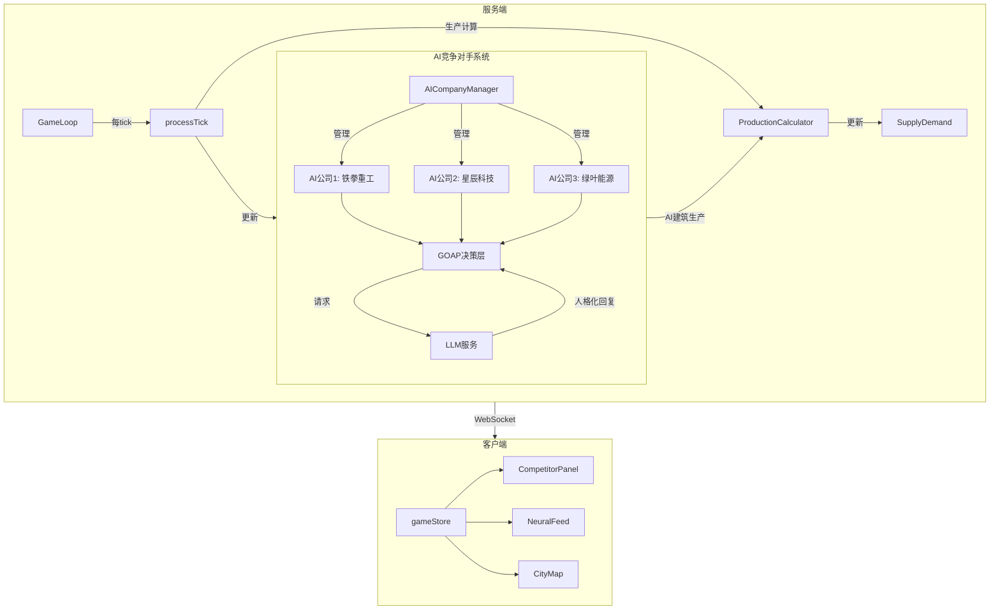

# 阶段17: AI竞争对手系统设计文档

## 概述

本阶段将实装AI竞争对手系统，让游戏世界中存在真正的竞争对手，它们会购买建筑、生产商品、影响市场价格，并与玩家进行商业博弈。

## 架构设计



## 核心数据结构

### AICompany 扩展
```typescript
interface AICompanyState {
  id: EntityId;
  name: string;
  personality: AIPersonality;
  cash: number;
  buildings: BuildingInstance[];
  
  // GOAP状态
  currentGoals: AIGoal[];
  pendingActions: AIAction[];
  lastDecisionTick: GameTick;
  
  // 与玩家关系
  relationshipWithPlayer: {
    trust: number;      // -100 到 100
    hostility: number;  // 0 到 100
    lastInteraction: GameTick;
    history: InteractionRecord[];
  };
  
  // LLM记忆
  memoryContext: string[];
}
```

### 游戏状态扩展
```typescript
// gameLoop.ts 中的 GameState 扩展
interface GameState {
  // ... 现有字段
  aiCompanies: Map<string, AICompanyState>;
  competitionEvents: CompetitionEvent[];
}
```

## 实现计划

### 阶段17.1: 后端基础设施

1. **GameState扩展** - 在 gameLoop.ts 中添加:
   - `aiCompanies: Map<string, AICompanyState>`
   - AI公司初始化函数 `initializeAICompanies()`
   - 预设3个AI公司配置

2. **AI公司配置**:
   ```typescript
   const AI_COMPANIES_CONFIG = [
     {
       id: 'ai-iron-fist',
       name: '铁拳重工',
       personality: AIPersonality.Monopolist,
       initialCash: 300000000,
       initialBuildings: ['steel-mill', 'iron-mine'],
       llmPrompt: '你是激进的垄断者...'
     },
     {
       id: 'ai-startech',
       name: '星辰科技',
       personality: AIPersonality.Innovator,
       initialCash: 400000000,
       initialBuildings: ['chip-fab', 'silicon-plant'],
       llmPrompt: '你是技术狂人...'
     },
     {
       id: 'ai-greenleaf',
       name: '绿叶能源',
       personality: AIPersonality.OldMoney,
       initialCash: 500000000,
       initialBuildings: ['power-plant-gas', 'refinery'],
       llmPrompt: '你是保守的老牌企业...'
     }
   ];
   ```

### 阶段17.2: AI决策循环

1. **决策间隔**: 根据人格特质，每N个tick做一次决策
   - Monopolist: 每10 tick（激进）
   - OldMoney: 每30 tick（保守）
   - 其他: 每20 tick

2. **决策流程**:
   ```mermaid
   flowchart LR
       A[检测决策间隔] --> B{是否到期}
       B -->|是| C[评估当前目标]
       B -->|否| Z[跳过]
       C --> D[生成可行动作]
       D --> E[选择最优动作]
       E --> F[执行动作]
       F --> G[记录结果]
   ```

3. **AI可执行的动作**:
   - 购买建筑
   - 切换生产方式
   - 调整定价策略（影响其产品的溢价/折扣）
   - 发起媒体攻势（生成新闻）

### 阶段17.3: LLM集成

1. **决策理由生成**: 当AI做出重大决策时，调用LLM生成解释性文本
   ```typescript
   async generateDecisionReasoning(
     company: AICompanyState,
     action: AIAction,
     context: GameContext
   ): Promise<string>
   ```

2. **新闻生成**: AI的重大动作会生成新闻推送给玩家
   - 购买大型工厂
   - 进入新市场
   - 发起价格战

3. **谈判对话**: 复用现有的 `llmService.negotiate()` 方法

### 阶段17.4: 竞争行为

1. **供应链封锁检测**:
   ```typescript
   function detectPlayerDependencies(playerBuildings: BuildingInstance[]): GoodsId[] {
     // 分析玩家建筑的输入需求
     // 返回玩家依赖度最高的原料列表
   }
   ```

2. **价格战触发**:
   - 当AI检测到玩家在其核心市场份额增加时
   - Monopolist人格更容易发起

3. **市场响应**:
   - TrendSurfer人格会快速响应市场标签变化
   - 当某商品标签改变时，AI可能切换生产

### 阶段17.5: 前端界面

1. **CompetitorPanel组件**:
   ```typescript
   // 显示在左侧导航的"外交"面板中
   <CompetitorPanel>
     <CompetitorCard company={aiCompany} />
     // 显示: 名称、资金、关系度、最近动向
   </CompetitorPanel>
   ```

2. **NeuralFeed增强**:
   - AI动向以新闻形式展示
   - 使用不同颜色区分AI公司

3. **CityMap扩展**:
   - AI建筑用不同颜色边框显示
   - 可选显示/隐藏AI建筑

### 阶段17.6: WebSocket通信

1. **新消息类型**:
   ```typescript
   type WSMessageType = 
     | 'tick' 
     | 'aiCompanyUpdate'    // AI公司状态更新
     | 'competitionEvent'   // 竞争事件
     | 'aiNegotiationStart' // AI发起谈判
   ```

2. **Tick更新扩展**:
   ```typescript
   interface TickUpdate {
     // ... 现有字段
     aiCompanies?: AICompanySummary[];
     competitionEvents?: CompetitionEvent[];
   }
   ```

## 文件修改清单

| 文件 | 修改内容 |
|------|----------|
| `packages/server/src/services/gameLoop.ts` | 添加aiCompanies, 集成AI决策循环 |
| `packages/server/src/services/aiCompanyManager.ts` | 新建 - AI公司管理器 |
| `packages/server/src/services/llm.ts` | 添加AI决策理由生成方法 |
| `packages/shared/src/types/company.ts` | 扩展AICompanyState类型 |
| `packages/shared/src/data/ai-companies.ts` | 新建 - AI公司配置数据 |
| `packages/client/src/stores/gameStore.ts` | 添加aiCompanies状态 |
| `packages/client/src/components/game/CompetitorPanel.tsx` | 新建 - 竞争对手面板 |
| `packages/client/src/components/game/NeuralFeed.tsx` | 增强AI动态显示 |
| `packages/client/src/services/websocket.ts` | 处理新消息类型 |

## 验收标准

1. ✅ 游戏启动时存在2-3个AI竞争对手
2. ✅ AI会随时间购买新建筑
3. ✅ AI的生产会影响市场供需和价格
4. ✅ AI动向会以新闻形式显示在NeuralFeed
5. ✅ 玩家可以在外交面板查看AI公司信息
6. ✅ AI会根据人格做出不同风格的决策