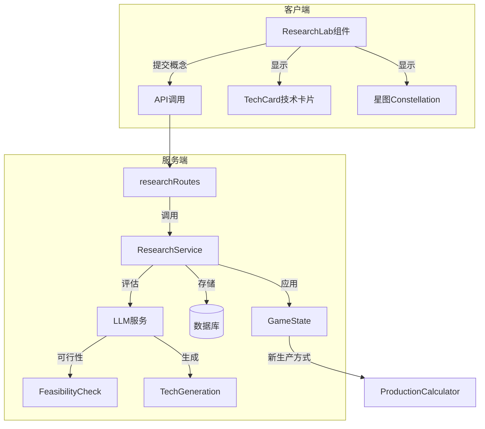

# 阶段18: 科技研发系统设计文档

## 概述

实现LLM驱动的涌现式科技发明系统。玩家通过自然语言描述想要发明的技术，LLM评估可行性并生成完整的技术卡片，包括新生产方式、副作用和专利信息。

## 核心设计理念

根据GDD第七章，本系统的独特之处：
- **没有预设科技树** - 科技由玩家描述创造
- **LLM担任首席科学家** - 评估可行性、生成技术规格
- **灯神诅咒** - 技术可能带有意外的副作用
- **Prompt措辞重要** - 精确描述可降低副作用风险

## 系统架构



## 数据结构

### Technology 类型
```typescript
interface Technology {
  id: EntityId;
  name: string;
  description: string;
  inventorId: EntityId;  // 发明者公司ID
  inventedAt: GameTick;
  
  // 分类
  category: TechCategory;  // energy | materials | automation | biotech | computing
  
  // 效果
  unlockedProductionMethods: ProductionMethodUnlock[];
  unlockedProducts: ProductId[];
  modifiers: TechModifier[];
  
  // 副作用
  sideEffects: SideEffect[];
  
  // 专利
  patent: {
    holder: EntityId;
    expiresAt: GameTick;
    licensees: EntityId[];
    licenseFee: number;  // 每次使用的费用
  };
  
  // 前置条件
  prerequisites: EntityId[];
  
  // LLM生成的元数据
  llmMetadata: {
    originalPrompt: string;
    feasibilityScore: number;
    riskLevel: RiskLevel;
    generatedAt: string;
  };
}

interface SideEffect {
  type: 'health' | 'environment' | 'social' | 'economic';
  description: string;
  severity: 1 | 2 | 3 | 4 | 5;
  triggerCondition: string;  // 触发条件描述
  delay: GameTick;  // 延迟多少tick后生效
  revealed: boolean;  // 是否已显现
}

interface ProductionMethodUnlock {
  buildingType: string;
  slotName: string;
  newOption: ProductionMethod;
}

type RiskLevel = 'minimal' | 'low' | 'moderate' | 'high' | 'extreme';
type TechCategory = 'energy' | 'materials' | 'automation' | 'biotech' | 'computing' | 'other';
```

### ResearchProject 研发项目
```typescript
interface ResearchProject {
  id: EntityId;
  companyId: EntityId;
  
  // 概念描述
  concept: {
    name: string;
    description: string;  // 玩家输入的描述
    targetOutcome: string;
  };
  
  // 评估结果
  feasibility: {
    score: number;  // 0-100
    estimatedCost: number;
    estimatedDuration: GameTick;
    prerequisites: string[];
    risks: string[];
  };
  
  // 进度
  status: 'concept' | 'evaluating' | 'approved' | 'researching' | 'completed' | 'failed' | 'cancelled';
  progress: number;  // 0-100
  investedFunds: number;
  startedAt?: GameTick;
  completedAt?: GameTick;
  
  // 完成后的技术
  resultTechnology?: Technology;
}
```

## 实现计划

### 18.1 基础数据结构与类型定义

**目标**: 定义所有研发系统相关的TypeScript类型

**任务**:
1. 在 `packages/shared/src/types/technology.ts` 扩展Technology接口
2. 添加 ResearchProject 接口
3. 添加 SideEffect、ProductionMethodUnlock 等辅助类型
4. 在 game-state.ts 中添加研发相关状态字段

### 18.2 后端研发服务

**目标**: 创建处理研发逻辑的后端服务

**任务**:
1. 创建 `packages/server/src/services/researchService.ts`
2. 实现 `evaluateConcept()` - 调用LLM评估可行性
3. 实现 `startResearch()` - 启动研发项目
4. 实现 `progressResearch()` - 在gameLoop中推进研发进度
5. 实现 `completeResearch()` - 完成研发，生成技术卡片
6. 实现 `applyTechnology()` - 将新技术应用到游戏状态

### 18.3 LLM科技评估与生成

**目标**: 实现LLM驱动的科技评估和生成

**任务**:
1. 在 `llm.ts` 添加 `evaluateResearchConcept()` 方法
2. 在 `llm.ts` 添加 `generateTechnology()` 方法
3. 设计评估Prompt模板（首席科学家角色）
4. 设计技术生成Prompt模板（包含副作用生成）
5. 实现JSON Schema验证确保输出格式正确
6. 处理措辞模糊导致的副作用增加逻辑

### 18.4 研发API路由

**目标**: 创建研发相关的HTTP端点

**任务**:
1. 创建 `packages/server/src/routes/research.ts`
2. POST `/api/research/evaluate` - 评估研发概念
3. POST `/api/research/start` - 启动研发项目
4. GET `/api/research/projects` - 获取当前研发项目列表
5. POST `/api/research/cancel/:id` - 取消研发项目
6. GET `/api/research/technologies` - 获取已发明技术列表
7. 在routes/index.ts中注册新路由

### 18.5 GameLoop集成

**目标**: 将研发进度推进集成到游戏循环

**任务**:
1. 在gameLoop.ts的processTick中添加研发进度更新
2. 每tick根据投入资金推进研发进度
3. 检测研发完成并触发技术生成
4. 处理副作用的延迟触发
5. 通过WebSocket推送研发进度更新

### 18.6 前端研发实验室组件

**目标**: 创建研发界面UI

**任务**:
1. 创建 `packages/client/src/components/game/ResearchLab.tsx`
2. 实现概念输入表单（项目名称、描述文本框）
3. 实现实时关键词提取和风险预览
4. 实现可行性评估结果显示
5. 实现研发进度条和状态显示
6. 添加到App.tsx的research面板

### 18.7 技术卡片组件

**目标**: 展示已发明的技术详情

**任务**:
1. 创建 `packages/client/src/components/game/TechCard.tsx`
2. 设计蓝图风格的技术卡片UI
3. 显示技术效果（解锁的生产方式）
4. 显示副作用警告（用红色小字）
5. 显示专利信息和授权选项

### 18.8 专利系统

**目标**: 实现技术专利和授权机制

**任务**:
1. 在Technology类型中完善专利字段
2. 实现专利独占期逻辑（5年内只有发明者可用）
3. 实现专利授权API - 允许其他公司付费使用
4. 实现专利出售API
5. AI公司可以请求专利授权

### 18.9 副作用系统

**目标**: 实现技术的副作用触发机制

**任务**:
1. 设计副作用触发条件检测
2. 在gameLoop中检测副作用触发
3. 副作用触发时生成市场事件
4. 副作用可能导致集体诉讼、罚款等
5. 在NeuralFeed中显示副作用警告

### 18.10 Store与状态管理

**目标**: 前端状态管理更新

**任务**:
1. 在gameStore中添加technologies数组
2. 在gameStore中添加researchProjects数组
3. 添加相关actions（startResearch, cancelResearch等）
4. WebSocket处理研发相关消息
5. 添加便捷的selector hooks

### 18.11 科技星图（可选进阶）

**目标**: 可视化展示技术关联

**任务**:
1. 创建 `TechConstellation.tsx` 组件
2. 使用D3.js或类似库渲染星图
3. 已发明技术显示为亮星
4. 未发明但可推断的技术显示为暗星
5. 显示技术之间的关联线

## UI设计

### 研发实验室界面
```
┌─────────────────────────────────────────────────────────────┐
│  🔬 研发实验室                                               │
├─────────────────────────────────────────────────────────────┤
│                                                              │
│  项目名称: [________________________]                        │
│                                                              │
│  ┌─────────────────────────────────────────────────────┐    │
│  │                                                      │    │
│  │  描述你想发明的技术...                               │    │
│  │                                                      │    │
│  │  例如：我想研发一种基于海藻的生物燃料，用来替代      │    │
│  │  石油，成本必须比石油低，但可以接受效率稍低。        │    │
│  │                                                      │    │
│  └─────────────────────────────────────────────────────┘    │
│                                                              │
│  ─────────────────────────────────────────────────────────  │
│  实时分析:                                                   │
│  ┌────────────────────┐ ┌────────────────────┐             │
│  │ 检测到关键词:       │ │ 风险评估:          │             │
│  │ • 海藻（生物质）    │ │ ████░░░░░░ 中等   │             │
│  │ • 石油替代         │ │                    │             │
│  │ • 成本敏感         │ │ 预估成本:          │             │
│  └────────────────────┘ │ ¥5000万 - ¥8000万  │             │
│                         └────────────────────┘             │
│                                                              │
│  [取消] [提交评估]                                           │
└─────────────────────────────────────────────────────────────┘
```

### 技术卡片
```
┌─────────────────────────────────────────────────────────────┐
│  ═══════════════════════════════════════════════════════    │
│                   【蓝藻生物燃油工艺】                        │
│  ═══════════════════════════════════════════════════════    │
│                                                              │
│  类型: 能源 / 生产工艺                                       │
│  发明者: [玩家公司名]                                        │
│  专利有效期: 剩余 4 年 3 个月                                │
│                                                              │
│  ─────────────────────────────────────────────────────────  │
│  解锁生产方式:                                               │
│  ┌───────────────────────────────────────────────────────┐  │
│  │ 【发电厂】新增选项: 生物燃油发电                        │  │
│  │  • 输入: 海藻 ×10, 水 ×5                              │  │
│  │  • 输出: 电力 ×7                                       │  │
│  │  • 副产物: 有机污泥 ×2                                 │  │
│  └───────────────────────────────────────────────────────┘  │
│                                                              │
│  ⚠ 副作用警告:                                               │
│  • 有机污泥如不妥善处理可能造成水体污染                      │
│  • 藻类培养需要大量淡水资源                                  │
│                                                              │
│  [授权给他人] [独占使用]                                     │
└─────────────────────────────────────────────────────────────┘
```

## LLM Prompt模板

### 可行性评估Prompt
```
你是一家科技公司的首席科学家，正在评估一个研发概念的可行性。

## 玩家的研发概念
项目名称: {projectName}
描述: {description}

## 当前游戏世界的技术水平
已有技术: {existingTechnologies}
当前年份: {gameYear}

## 评估任务
请分析这个概念的可行性，并返回JSON格式的评估结果：

{
  "feasibilityScore": 0-100的整数,
  "estimatedCost": 预估成本（美元）,
  "estimatedMonths": 预估研发周期（月）,
  "prerequisites": ["前置技术1", "前置技术2"],
  "risks": ["潜在风险1", "潜在风险2"],
  "scientistComment": "科学家的评语（50-100字）",
  "keywordAnalysis": ["提取的关键技术词汇"]
}

## 评估规则
1. 越模糊的描述，风险越高
2. 与现有技术相差越远，成本越高
3. 涉及生物/化学/核能的项目需要更长周期
4. 如果描述中明确排除了某些问题，风险相应降低
```

### 技术生成Prompt
```
你是一个科技公司的研发部门，刚刚完成了一项技术发明。请生成完整的技术规格。

## 原始研发概念
{originalConcept}

## 研发过程
投入资金: {investedFunds}
研发周期: {duration}

## 生成要求
请返回JSON格式的完整技术规格：

{
  "name": "技术名称（中文）",
  "description": "技术描述（100-200字）",
  "category": "energy|materials|automation|biotech|computing|other",
  
  "productionMethods": [
    {
      "buildingType": "适用的建筑类型ID",
      "slotName": "适用的槽位名",
      "optionName": "新选项名称",
      "inputs": {"资源ID": 数量},
      "outputs": {"资源ID": 数量},
      "modifiers": {"throughput": 1.0, "quality": 1.0}
    }
  ],
  
  "sideEffects": [
    {
      "type": "health|environment|social|economic",
      "description": "副作用描述",
      "severity": 1-5,
      "triggerCondition": "触发条件描述",
      "delayMonths": 延迟月数
    }
  ],
  
  "marketTags": ["标签1", "标签2"]
}

## 副作用生成规则
1. 原始描述越模糊，副作用越多、越严重
2. 涉及生物/化学的技术有健康风险
3. 涉及能源的技术有环境风险
4. 涉及自动化的技术有社会风险（失业）
5. 至少生成1个副作用，最多3个
```

## 文件修改清单

| 文件 | 修改内容 |
|------|----------|
| `packages/shared/src/types/technology.ts` | 扩展Technology类型，添加ResearchProject |
| `packages/shared/src/types/game-state.ts` | 添加technologies和researchProjects字段 |
| `packages/server/src/services/researchService.ts` | 新建 - 研发逻辑服务 |
| `packages/server/src/services/llm.ts` | 添加evaluateResearchConcept和generateTechnology方法 |
| `packages/server/src/routes/research.ts` | 新建 - 研发API路由 |
| `packages/server/src/routes/index.ts` | 注册研发路由 |
| `packages/server/src/services/gameLoop.ts` | 集成研发进度推进 |
| `packages/client/src/components/game/ResearchLab.tsx` | 新建 - 研发实验室UI |
| `packages/client/src/components/game/TechCard.tsx` | 新建 - 技术卡片UI |
| `packages/client/src/components/game/index.ts` | 导出新组件 |
| `packages/client/src/stores/gameStore.ts` | 添加研发相关状态和actions |
| `packages/client/src/App.tsx` | 集成ResearchLab到research面板 |

## 验收标准

1. ✅ 玩家可以在研发实验室输入自然语言描述技术概念
2. ✅ LLM返回可行性评估结果（成本、周期、风险）
3. ✅ 玩家可以启动研发项目并投入资金
4. ✅ 研发进度随时间推进
5. ✅ 研发完成后生成技术卡片，显示新生产方式
6. ✅ 技术可能带有副作用，在一定延迟后触发
7. ✅ 新技术解锁的生产方式可在工厂中选择
8. ✅ 专利系统：5年内独占或可授权

## 后续扩展

- 18.11 科技星图可视化
- AI公司也可以研发技术
- 技术路线竞争（多个技术竞争市场标准）
- 技术组合（多个技术组合产生新效果）