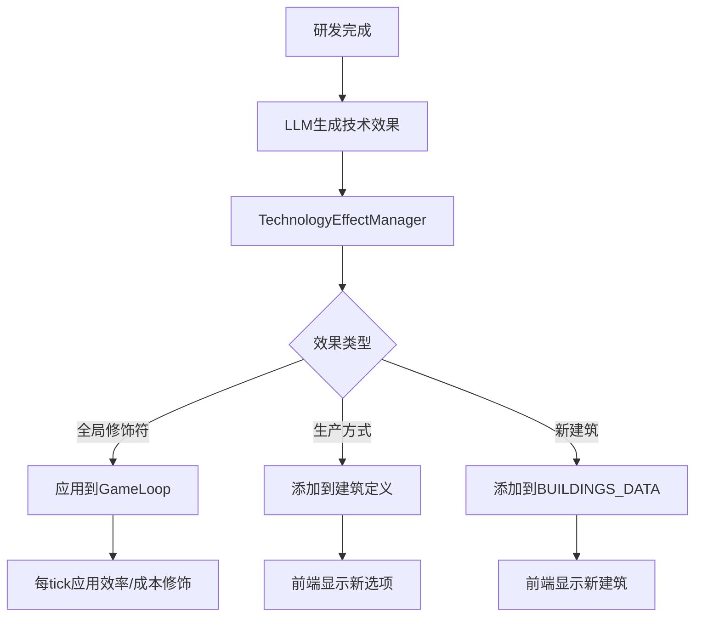

# 阶段 18.12: 技术效果系统

## 目标
让研发完成的技术产生真实的游戏影响，包括：
1. **全局效率加成** - 所有同类建筑效率提升X%
2. **成本降低** - 维护成本、生产成本降低
3. **新生产方式解锁** - 在现有建筑中解锁新的生产方式选项
4. **新建筑/商品解锁** - 解锁全新的建筑类型或商品

## 系统架构



## 实施步骤

### 18.12.1: 扩展LLM技术生成
在 `llm.ts` 中添加 `generateTechnologyEffects` 方法：

```typescript
interface TechEffectGenerationRequest {
  conceptName: string;
  conceptDescription: string;
  category: TechnologyCategory;
  tier: number;
  existingBuildings: string[]; // 可以解锁生产方式的建筑列表
}

interface TechEffectGenerationResponse {
  globalModifiers: Array<{
    type: 'efficiency_boost' | 'cost_reduction' | 'output_increase' | 'input_reduction';
    target: 'all' | string; // 建筑类别或具体建筑ID
    value: number; // 百分比，如0.1表示10%
    description: string;
  }>;
  productionMethodUnlocks: Array<{
    buildingId: string;
    method: {
      id: string;
      name: string;
      nameZh: string;
      description: string;
      recipe: ProductionRecipe;
      efficiency: number;
    };
  }>;
}
```

**LLM Prompt 设计要点：**
- 根据概念描述推断适合的效果类型
- 效果强度与tier等级成正比
- 效果应该与研发概念的领域相关
- 确保生成的数值合理（5%-30%范围内）

### 18.12.2: 修改researchService
调用新的LLM方法生成有意义的效果：

```typescript
private async callLLMForGeneration(request: TechnologyGenerationRequest): Promise<TechnologyGenerationResponse> {
  // 1. 获取现有建筑列表
  const existingBuildings = BUILDINGS_DATA.map(b => b.id);
  
  // 2. 调用LLM生成效果
  const effects = await llmService.generateTechnologyEffects({
    conceptName: request.concept.name,
    conceptDescription: request.concept.description,
    category: this.inferCategory(request.concept.description),
    tier: Math.min(5, Math.ceil(request.feasibility.score / 20)),
    existingBuildings,
  });
  
  // 3. 组装响应
  return {
    ...basicInfo,
    globalModifiers: effects.globalModifiers.map(m => ({
      targetType: m.target === 'all' ? 'global' : 'building',
      targetId: m.target === 'all' ? undefined : m.target,
      modifierType: m.type,
      value: m.value,
      isMultiplier: true,
    })),
    productionMethods: effects.productionMethodUnlocks,
  };
}
```

### 18.12.3: 创建TechnologyEffectManager
新建 `packages/server/src/services/technologyEffectManager.ts`：

```typescript
class TechnologyEffectManager {
  private activeModifiers: Map<string, TechnologyModifier[]> = new Map();
  private unlockedMethods: Map<string, ProductionMethodData[]> = new Map();
  
  // 激活技术效果
  activateTechnology(tech: Technology): void {
    // 存储全局修饰符
    if (tech.globalModifiers?.length > 0) {
      this.activeModifiers.set(tech.id, tech.globalModifiers);
    }
    
    // 存储解锁的生产方式
    if (tech.unlockedMethods?.length > 0) {
      for (const unlock of tech.unlockedMethods) {
        const existing = this.unlockedMethods.get(unlock.buildingType) || [];
        existing.push(unlock.newOption as any);
        this.unlockedMethods.set(unlock.buildingType, existing);
      }
    }
  }
  
  // 获取建筑的效率修饰符
  getBuildingEfficiencyModifier(buildingId: string, category: string): number {
    let modifier = 1.0;
    for (const [, modifiers] of this.activeModifiers) {
      for (const mod of modifiers) {
        if (mod.modifierType === 'efficiency_boost') {
          if (mod.targetType === 'global' || 
              mod.targetId === buildingId ||
              mod.targetId === category) {
            modifier *= (1 + mod.value);
          }
        }
      }
    }
    return modifier;
  }
  
  // 获取建筑的额外生产方式
  getUnlockedMethods(buildingId: string): ProductionMethodData[] {
    return this.unlockedMethods.get(buildingId) || [];
  }
}

export const technologyEffectManager = new TechnologyEffectManager();
```

### 18.12.4: 在GameLoop中应用效果
修改 `gameLoop.ts` 的 `processTick`：

```typescript
// 在计算建筑产出时应用效率修饰符
for (const building of game.buildings) {
  const def = BUILDINGS_DATA.find(b => b.id === building.definitionId);
  if (!def) continue;
  
  // 获取技术效率加成
  const techEfficiencyMod = technologyEffectManager.getBuildingEfficiencyModifier(
    building.definitionId,
    def.category
  );
  
  // 应用到生产计算
  const effectiveEfficiency = building.efficiency * techEfficiencyMod;
  // ... 后续计算
}
```

### 18.12.5: 动态解锁生产方式
修改获取建筑生产方式的逻辑：

```typescript
// 获取建筑可用的生产方式（包括技术解锁的）
function getAvailableMethods(buildingId: string): ProductionMethodData[] {
  const def = BUILDINGS_DATA.find(b => b.id === buildingId);
  if (!def) return [];
  
  const baseMethods = def.productionSlots.flatMap(s => s.methods);
  const unlockedMethods = technologyEffectManager.getUnlockedMethods(buildingId);
  
  return [...baseMethods, ...unlockedMethods];
}
```

### 18.12.6: 前端显示效果
更新 `ResearchLab.tsx` 技术详情弹窗：

```tsx
{/* 全局效果 */}
{tech.globalModifiers?.length > 0 && (
  <div className="mb-4">
    <h4 className="text-sm font-medium text-cyan-400 mb-2">📊 全局效果</h4>
    {tech.globalModifiers.map((mod, idx) => (
      <div key={idx} className="bg-cyan-500/10 p-2 rounded mb-1">
        <span className="text-cyan-300">{mod.modifierType}</span>
        <span className={mod.value > 0 ? 'text-green-400' : 'text-red-400'}>
          {mod.value > 0 ? '+' : ''}{(mod.value * 100).toFixed(0)}%
        </span>
      </div>
    ))}
  </div>
)}

{/* 解锁的生产方式 */}
{tech.unlockedMethods?.length > 0 && (
  <div className="mb-4">
    <h4 className="text-sm font-medium text-green-400 mb-2">🔓 解锁生产方式</h4>
    {tech.unlockedMethods.map((unlock, idx) => (
      <div key={idx} className="bg-green-500/10 p-2 rounded mb-1">
        <span className="text-green-300">{unlock.newOption?.nameZh}</span>
        <span className="text-gray-400 text-xs ml-2">
          适用于: {unlock.buildingType}
        </span>
      </div>
    ))}
  </div>
)}
```

## LLM效果生成Prompt示例

```
你是一个游戏设计师，需要为一个供应链模拟游戏生成技术效果。

研发概念：
- 名称：{conceptName}
- 描述：{conceptDescription}
- 类别：{category}
- 等级：{tier}/5

可以解锁生产方式的建筑：
{existingBuildings}

请生成合理的技术效果，格式如下：
{
  "globalModifiers": [
    {
      "type": "efficiency_boost",
      "target": "all" 或 "建筑类别",
      "value": 0.05-0.30之间的数值,
      "description": "效果描述"
    }
  ],
  "productionMethodUnlocks": [
    {
      "buildingId": "适用的建筑ID",
      "method": {
        "id": "唯一ID",
        "name": "英文名",
        "nameZh": "中文名",
        "description": "方法描述",
        "recipe": { inputs: [...], outputs: [...], ticksRequired: N },
        "efficiency": 1.0-2.0
      }
    }
  ]
}

规则：
1. tier越高，效果越强（tier 1: 5-10%, tier 5: 25-30%）
2. 效果应与概念描述的领域相关
3. 生产方式的recipe要合理（输入输出平衡）
4. 至少生成1个全局修饰符
5. 如果概念与特定建筑相关，生成对应的生产方式解锁
```

## 文件修改清单

| 文件 | 修改内容 |
|------|---------|
| `packages/server/src/services/llm.ts` | 添加generateTechnologyEffects方法 |
| `packages/server/src/services/researchService.ts` | 修改callLLMForGeneration调用新方法 |
| `packages/server/src/services/technologyEffectManager.ts` | 新建：管理技术效果状态 |
| `packages/server/src/services/gameLoop.ts` | 在processTick中应用效率修饰符 |
| `packages/server/src/routes/game.ts` | 添加获取可用生产方式的端点 |
| `packages/client/src/components/game/ResearchLab.tsx` | 显示技术效果详情 |
| `packages/client/src/components/game/ProductionCard.tsx` | 显示解锁的生产方式 |