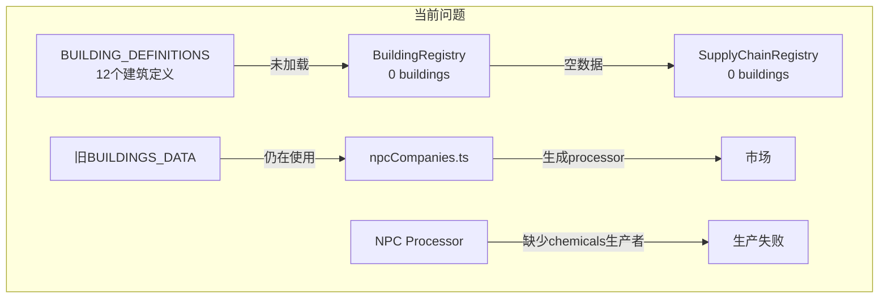

# Phase 19: 市场无买家问题修复计划

## 问题诊断

### 症状
- 日志显示 `[SupplyChainRegistry] Graph built: 51 goods, 0 buildings`
- 消费者（NPC）挂买单购买 `beverages`, `packaged-food`, `household-goods` 但无法成交
- 稀土矿场需要 `chemicals` 但无人生产
- 只有原材料有卖单（由 NPC supplier 生产）

### 根本原因
**`initRegistry.ts` 中的 `initializeBuildingRegistry()` 函数没有实际加载建筑定义！**

```typescript
// 当前代码 (第58-68行)
function initializeBuildingRegistry(): void {
  // 只注册了模板
  registerBuildingTemplates(buildingRegistry);
  
  // TODO: 从 buildingDefinitions.ts 加载建筑配置  ← 这个TODO从未完成！
  console.log('[Registry] 建筑注册表初始化完成 (等待建筑配置迁移)');
}
```

### 数据流断裂图



## 接口兼容性问题

### BuildingRegistry.registerBuilding() 期望的格式 (BuildingConfig)
```typescript
interface BuildingConfig {
  id: string;
  template: string;           // 必须指定模板ID
  nameZh: string;
  primaryInputs?: Array<{ goodsId: string; amount: number }>;
  primaryOutputs: Array<{ goodsId: string; amount: number }>;
  // ...
}
```

### BUILDING_DEFINITIONS 使用的格式 (BuildingDefinition)
```typescript
interface BuildingDefinition {
  nameZh: string;
  category: BuildingCategory;
  templateId?: string;        // 可选
  productionSlots: Array<{    // 完整定义槽位和方法
    type: ProductionSlotType;
    methods: ProductionMethodDefinition[];
    defaultMethodId: string;
  }>;
  // ...
}
```

**关键差异：**
| 字段 | BuildingConfig | BuildingDefinition |
|------|---------------|-------------------|
| 配方位置 | `primaryInputs/Outputs` | `productionSlots[].methods[].recipe` |
| 模板 | `template` (必填) | `templateId` (可选) |
| 槽位 | 从模板自动生成 | 显式定义 |

---

## 修复方案

### 方案 A：添加适配器方法（推荐）

在 `BuildingRegistry` 中添加 `registerFromDefinition()` 方法，将 `BuildingDefinition` 转换为内部格式。

**优点：**
- 保持现有接口不变
- 支持新旧格式共存

### 方案 B：直接修改注册逻辑

修改 `registerBuilding()` 方法使其也能接受 `BuildingDefinition` 格式。

**缺点：**
- 增加方法复杂度
- 可能影响现有调用

---

## 实施步骤

### Step 1: 为 BuildingRegistry 添加 registerFromDefinition 方法

**文件：** `packages/shared/src/registry/BuildingRegistry.ts`

```typescript
/**
 * 从 BuildingDefinition 格式注册建筑
 * 适配新的声明式建筑定义
 */
registerFromDefinition(id: string, def: BuildingDefinition): void {
  // 1. 提取默认配方的输入输出
  const firstSlot = def.productionSlots?.[0];
  const defaultMethod = firstSlot?.methods?.find(m => m.id === firstSlot.defaultMethodId);
  
  // 2. 构建 BuildingData
  const buildingData: BuildingData = {
    id,
    name: def.name || def.nameZh,
    nameZh: def.nameZh,
    icon: def.icon || '🏭',
    description: def.description || def.nameZh,
    category: def.category,
    baseCost: def.baseCost,
    maintenanceCost: def.maintenanceCost,
    maxWorkers: def.maxWorkers,
    productionSlots: def.productionSlots.map(slot => ({
      type: slot.type,
      nameZh: slot.name,
      defaultMethodId: slot.defaultMethodId,
      methods: slot.methods.map(m => ({
        id: m.id,
        nameZh: m.nameZh,
        name: m.name,
        recipe: m.recipe,
      })),
    })),
    tier: this.inferTierFromOutputs(
      defaultMethod?.recipe?.outputs || []
    ),
    templateId: def.templateId || 'CUSTOM',
  };
  
  // 3. 注册并索引
  this.buildings.set(id, buildingData);
  this.indexBuilding(buildingData);
}

/**
 * 批量注册建筑定义
 */
registerAllFromDefinitions(definitions: Record<string, BuildingDefinition>): void {
  for (const [id, def] of Object.entries(definitions)) {
    this.registerFromDefinition(id, def);
  }
  this.initialized = true;
  console.log(`[BuildingRegistry] 已注册 ${Object.keys(definitions).length} 个建筑`);
}
```

### Step 2: 修改 initRegistry.ts 调用新方法

**文件：** `packages/shared/src/registry/initRegistry.ts`

```typescript
import { BUILDING_DEFINITIONS } from '../data/buildingDefinitions.js';

function initializeBuildingRegistry(): void {
  console.log('[Registry] 初始化建筑注册表...');
  const buildingRegistry = getBuildingRegistry();
  
  // 1. 注册建筑模板
  registerBuildingTemplates(buildingRegistry);
  
  // 2. 从 buildingDefinitions.ts 加载建筑配置
  buildingRegistry.registerAllFromDefinitions(BUILDING_DEFINITIONS);
  
  // 3. 输出统计
  const stats = buildingRegistry.getStats();
  console.log(`[Registry] 建筑注册完成: ${stats.buildingCount} 个建筑`);
}
```

### Step 3: 添加缺失的中间商品生产者

**当前 BUILDING_DEFINITIONS 只有12个建筑，缺少关键的加工厂。需要添加：**

| 缺失建筑 | 输入 | 输出 | 优先级 |
|----------|------|------|--------|
| 化工厂 | crude-oil | chemicals | 🔴 高 |
| 饮料工厂 | grain + 包装材料 | beverages | 🔴 高 |
| 食品加工厂 | grain + 肉类 | packaged-food | 🔴 高 |
| 家居用品工厂 | 塑料 + 钢材 | household-goods | 🟡 中 |
| 塑料工厂 | crude-oil | plastic | 🟡 中 |

### Step 4: 确保 NPC 系统使用 BuildingRegistry

**文件：** `packages/server/src/services/npcCompanies.ts`

修改 `generateNPCCompanyConfigs()` 函数：

```typescript
import { getBuildingRegistry } from '@scc/shared';

private generateNPCCompanyConfigs(): NPCCompanyConfig[] {
  const configs: NPCCompanyConfig[] = [];
  const buildingRegistry = getBuildingRegistry();
  
  // ...原材料供应商代码不变...
  
  // 3. 中间加工商（使用BuildingRegistry而非BUILDINGS_DATA）
  const allBuildings = buildingRegistry.getAll();
  
  for (const building of allBuildings) {
    // 跳过采掘类（已有supplier）
    if (building.category === 'extraction') continue;
    
    const firstSlot = building.productionSlots[0];
    if (!firstSlot) continue;
    
    const defaultMethod = firstSlot.methods.find(m => m.id === firstSlot.defaultMethodId);
    if (!defaultMethod?.recipe) continue;
    
    const recipe = defaultMethod.recipe;
    
    // 为每种建筑类型创建3个NPC加工商
    for (let i = 0; i < 3; i++) {
      configs.push({
        id: `npc-processor-${building.id}-${i}`,
        name: `${building.nameZh}工厂#${i + 1}`,
        type: 'processor',
        produces: recipe.outputs.map(o => ({
          goodsId: o.goodsId,
          dailyCapacity: o.amount * 24,
          costMultiplier: 1.0,
        })),
        consumes: recipe.inputs.map(inp => ({
          goodsId: inp.goodsId,
          dailyDemand: inp.amount * 24,
          maxPriceMultiplier: 1.3,
        })),
        initialCash: 100000 + Math.random() * 100000,
        aggressiveness: 0.4 + Math.random() * 0.3,
      });
    }
  }
  
  return configs;
}
```

---

## 验证清单

- [ ] BuildingRegistry 显示正确的建筑数量（≥12）
- [ ] SupplyChainRegistry 显示 `Graph built: 51 goods, 12+ buildings`
- [ ] chemicals 商品有 NPC 生产者挂卖单
- [ ] beverages 商品有 NPC 生产者挂卖单
- [ ] 稀土矿场能成功购买到 chemicals
- [ ] 消费者能买到 beverages 和 packaged-food

---

## 执行顺序

1. ✅ 诊断完成
2. 🔧 修改 `BuildingRegistry.ts` - 添加 `registerFromDefinition()` 方法
3. 🔧 修改 `initRegistry.ts` - 加载 `BUILDING_DEFINITIONS`
4. 🔧 补充 `buildingDefinitions.ts` - 添加化工厂、饮料厂等缺失建筑
5. 🔧 修改 `npcCompanies.ts` - 使用 BuildingRegistry
6. ✅ 测试验证