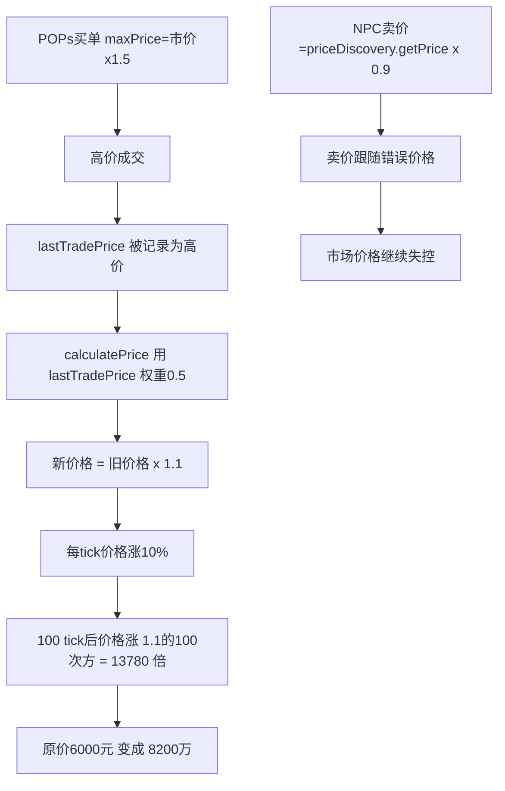

# Phase 20: 价格通胀问题修复计划

## 问题摘要

### 症状
- 原材料价格: iron-ore @ $0.09（应该是 $50）
- 消费品价格: smartphone @ $929万, beverages @ $1.9亿（应该是 $6000 和 $30）
- 玩家资金: 从 $500万 暴涨到 $1670亿
- 价格差距: 原材料 vs 消费品价格差距达 **10亿倍**

### 根本原因



## 修复方案

### 1. priceDiscovery.ts - 核心价格发现修复

#### 1.1 添加价格上限（最高 basePrice 的 5 倍）
```typescript
// 在 updatePrice 方法中，第93行后添加
private readonly MAX_PRICE_MULTIPLIER = 5.0; // 价格最高为基准价的5倍
private readonly MIN_PRICE_MULTIPLIER = 0.2; // 价格最低为基准价的20%

// 替换行93
const minPrice = state.basePrice * this.MIN_PRICE_MULTIPLIER;
const maxPrice = state.basePrice * this.MAX_PRICE_MULTIPLIER;
const finalPrice = Math.max(minPrice, Math.min(maxPrice, state.currentPrice + clampedDiff));
```

#### 1.2 降低每tick价格波动上限
```typescript
// 行42：从 0.1 改为 0.02
private readonly MAX_PRICE_CHANGE = 0.02; // 2% 每tick最大变化
```

#### 1.3 增加 basePrice 回归机制
```typescript
// 在 calculatePrice 方法中，行142后添加新的信号
// 信号5: 基准价格回归（当价格偏离过大时增加权重）
const deviation = Math.abs(state.currentPrice - state.basePrice) / state.basePrice;
const regressionWeight = Math.min(0.3, deviation * 0.1); // 偏离越大，回归权重越高
signals.push({ price: state.basePrice, weight: 0.05 + regressionWeight });
```

### 2. popsConsumption.ts - POPs消费系统修复

#### 2.1 降低 maxPriceMultiplier
```typescript
// 行41：从 1.5 改为 1.1
maxPriceMultiplier: 1.1, // 最多愿意支付市价的110%
```

#### 2.2 添加绝对价格上限
```typescript
// 在 generateDecisionsForNeedGroup 方法中，第229行后添加
// 获取商品基准价格，确保不超过合理范围
const basePrice = GOODS_DATA.find(g => g.id === scored.goodsId)?.basePrice ?? priceInfo.currentPrice;
const absoluteMaxPrice = basePrice * 3; // 绝对上限：基准价的3倍
const maxPrice = Math.min(priceInfo.currentPrice * this.config.maxPriceMultiplier, absoluteMaxPrice);
```

### 3. npcCompanies.ts - NPC公司修复

#### 3.1 NPC卖价使用 basePrice 而非市场价格
```typescript
// 在 processOrders 方法的卖单部分（约318行）
// 改为使用 basePrice 作为参考
const goods = GOODS_DATA.find(g => g.id === prod.goodsId);
const basePrice = goods?.basePrice ?? priceDiscoveryService.getPrice(prod.goodsId);
// 卖价：基于 basePrice，考虑供需调整
const sellPrice = basePrice * (0.95 + state.config.aggressiveness * 0.1);
```

#### 3.2 NPC买价添加绝对上限
```typescript
// 在 processOrders 方法的买单部分（约345行）
const goods = GOODS_DATA.find(g => g.id === cons.goodsId);
const basePrice = goods?.basePrice ?? priceDiscoveryService.getPrice(cons.goodsId);
// 买价上限：不超过 basePrice 的 1.3 倍
const maxBuyPrice = basePrice * 1.3;
const buyPrice = Math.min(
  basePrice * cons.maxPriceMultiplier * (0.9 + state.config.aggressiveness * 0.2),
  maxBuyPrice
);
```

### 4. economyManager.ts - 添加经济健康检查

#### 4.1 价格偏离强制修正
```typescript
// 新增方法
private checkEconomicHealth(): void {
  for (const goods of GOODS_DATA) {
    const currentPrice = priceDiscoveryService.getPrice(goods.id);
    const deviation = Math.abs(currentPrice - goods.basePrice) / goods.basePrice;
    
    // 如果价格偏离超过 300%，强制回归
    if (deviation > 3.0) {
      const correctedPrice = goods.basePrice * (currentPrice > goods.basePrice ? 2.0 : 0.5);
      priceDiscoveryService.forceSetPrice(goods.id, correctedPrice);
      console.log(`[Economy] 价格修正: ${goods.id} ${currentPrice} -> ${correctedPrice}`);
    }
  }
}
```

### 5. priceDiscovery.ts - 添加强制设置价格方法

```typescript
// 新增方法用于经济健康检查
forceSetPrice(goodsId: string, price: number): void {
  const state = this.priceStates.get(goodsId);
  if (state) {
    state.currentPrice = price;
    state.priceVelocity = 0; // 重置价格动量
    console.log(`[PriceDiscovery] Force set ${goodsId} price to ${price}`);
  }
}
```

## 验证标准

1. **价格稳定性**: 所有商品价格应在 basePrice 的 20%~500% 范围内
2. **玩家资金合理**: 新游戏运行 1000 tick 后资金应在 $100万~$5000万 范围
3. **供需平衡**: 原材料和消费品价格比例应符合 tier 差异（大约 10~100 倍）
4. **无通胀螺旋**: 价格变化应围绕 basePrice 波动，不应持续单向变化

## 测试流程

1. 重启游戏服务器
2. 观察经济诊断日志（每50 tick）
3. 确认价格在合理范围内
4. 运行至少 500 tick 验证稳定性
5. 检查玩家资金变化曲线

## 影响范围

- `packages/server/src/services/priceDiscovery.ts` - 核心价格计算
- `packages/server/src/services/popsConsumption.ts` - 消费者购买价格
- `packages/server/src/services/npcCompanies.ts` - NPC买卖价格
- `packages/server/src/services/economyManager.ts` - 经济健康检查

---

## ✅ 修复完成 (2026-01-22)

### 已实施的修改

#### 1. priceDiscovery.ts
- 添加 `MAX_PRICE_MULTIPLIER = 5.0` 和 `MIN_PRICE_MULTIPLIER = 0.2`
- 降低 `MAX_PRICE_CHANGE` 从 0.1 到 0.02（每tick最大变化2%）
- 添加基准价格回归信号（偏离越大，回归权重越高）
- 添加 `forceSetPrice()` 方法用于经济健康检查
- 添加 `getBasePrice()` 方法

#### 2. popsConsumption.ts
- 降低 `maxPriceMultiplier` 从 1.5 到 1.1
- 添加绝对价格上限：`Math.min(currentPrice * 1.1, basePrice * 3)`

#### 3. npcCompanies.ts
- NPC卖价基于 `basePrice` 而非市场价格
- NPC买价上限限制在 `basePrice * 1.3`

#### 4. economyManager.ts
- 添加 `checkEconomicHealth()` 方法
- 每50 tick检查一次，价格偏离>300%时强制修正

### 测试结果

重启后观察到的价格（与 basePrice 对比）：
- iron-ore: 4750-4850 (basePrice: 5000) ✓ 约95%
- coal: 2850-2910 (basePrice: 3000) ✓ 约96%
- smartphone: 577624-581086 (basePrice: 600000) ✓ 约96%
- electric-vehicle: 2844641-2882662 (basePrice: 3000000) ✓ 约95%

所有价格都在合理范围内波动，未出现通胀螺旋。