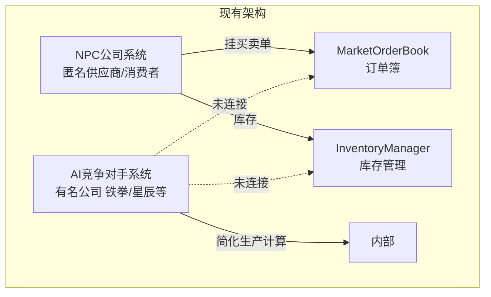
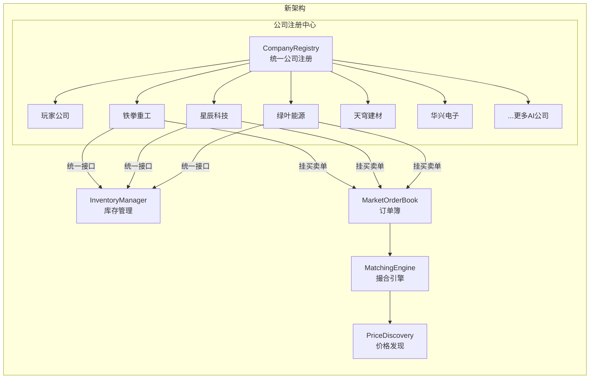

# 阶段21: 商战系统设计文档

## 目标

将匿名的NPC供应商升级为有名字、有人格的AI竞争公司，让它们真实参与市场买卖（挂单、成交），并能智能响应玩家行为，形成真实的商战体验。

## 架构改造

### 当前状态



### 目标架构



## 详细设计

### 1. 新增AI公司配置

扩展 `ai-companies.ts`，为每个行业添加多个竞争者：

| 行业 | 公司名称 | 人格 | 特点 |
|------|----------|------|------|
| 重工业 | 铁拳重工 | Monopolist | 钢铁/金属/机械 |
| 重工业 | 北方钢铁 | OldMoney | 保守稳健的钢铁商 |
| 科技 | 星辰科技 | Innovator | 芯片/电子 |
| 科技 | 华兴电子 | Innovator | 消费电子 |
| 科技 | 芯源半导体 | TrendSurfer | 追逐热点的芯片商 |
| 能源 | 绿叶能源 | OldMoney | 传统能源 |
| 能源 | 极光电力 | Innovator | 新能源激进派 |
| 建材 | 天穹建材 | Monopolist | 玻璃/水泥 |
| 汽车 | 东方汽车 | OldMoney | 传统+电动 |
| 民生 | 丰收集团 | OldMoney | 农业/日用品 |
| 化工 | 长江化工 | Monopolist | 化学品/塑料 |
| 食品 | 四海食品 | TrendSurfer | 食品饮料 |

### 2. AI公司市场参与机制

#### 2.1 库存系统集成

```typescript
// 修改 aiCompanyManager.ts
class AICompanyManager {
  // 初始化时注册到 inventoryManager
  initializeCompanies() {
    for (const config of AI_COMPANIES_CONFIG) {
      // 注册公司库存
      inventoryManager.initializeCompany(
        config.id,
        config.name,
        CompanyType.AI,
        config.initialCash
      );
      
      // 根据初始建筑给予初始库存
      this.grantInitialInventory(config);
    }
  }
}
```

#### 2.2 订单系统集成

```typescript
// AI公司每个决策周期
processMarketOrders(company: AICompanyState, context: GameContext) {
  const inventory = inventoryManager.getInventory(company.id);
  
  // 卖出：根据生产能力和库存决定
  for (const building of company.buildings) {
    const outputs = this.getOutputGoods(building);
    for (const output of outputs) {
      const stock = inventory.stocks[output.goodsId];
      if (stock && stock.quantity > targetStock) {
        // 决定卖价和数量
        const price = this.calculateSellPrice(company, output.goodsId, context);
        marketOrderBook.submitSellOrder(company.id, output.goodsId, quantity, price);
      }
    }
  }
  
  // 买入：根据生产需求和库存决定
  for (const building of company.buildings) {
    const inputs = this.getInputGoods(building);
    for (const input of inputs) {
      const stock = inventory.stocks[input.goodsId] ?? 0;
      if (stock < targetStock) {
        const price = this.calculateBuyPrice(company, input.goodsId, context);
        marketOrderBook.submitBuyOrder(company.id, input.goodsId, quantity, price);
      }
    }
  }
}
```

#### 2.3 智能定价策略

```typescript
calculateSellPrice(company: AICompanyState, goodsId: string, context: GameContext): number {
  const marketPrice = priceDiscoveryService.getPrice(goodsId);
  const basePrice = getGoodsDefinition(goodsId).basePrice;
  
  // 根据人格调整定价
  switch (company.personality) {
    case AIPersonality.Monopolist:
      // 激进：高于市价卖，低于市价买，试图控制市场
      return marketPrice * (1.1 + company.aggressiveness * 0.2);
      
    case AIPersonality.OldMoney:
      // 保守：接近市价，追求稳定
      return marketPrice * 1.02;
      
    case AIPersonality.TrendSurfer:
      // 追逐趋势：根据价格变化方向调整
      const trend = this.getPriceTrend(goodsId);
      return marketPrice * (trend > 0 ? 1.15 : 0.95);
      
    case AIPersonality.Innovator:
      // 差异化：高端产品高溢价
      return marketPrice * 1.08;
  }
}
```

### 3. 玩家行为响应机制

#### 3.1 监控玩家行为

```typescript
interface PlayerBehaviorAnalysis {
  dominantGoods: string[];          // 玩家主导的商品
  marketShareByGoods: Map<string, number>; // 玩家在各商品的市场份额
  recentExpansions: string[];       // 玩家最近扩张的领域
  pricingStrategy: 'aggressive' | 'neutral' | 'passive';
  tradingPattern: 'buyer' | 'seller' | 'balanced';
}

// 每隔一段时间分析玩家行为
analyzePlayerBehavior(context: GameContext): PlayerBehaviorAnalysis {
  // 1. 分析玩家建筑分布
  // 2. 分析玩家订单模式
  // 3. 计算玩家市场份额
  // 4. 判断玩家策略倾向
}
```

#### 3.2 AI反应策略

```typescript
respondToPlayerBehavior(company: AICompanyState, analysis: PlayerBehaviorAnalysis) {
  // 检测威胁
  for (const [goodsId, share] of analysis.marketShareByGoods) {
    if (share > 0.4 && this.isCompetingIn(company, goodsId)) {
      // 玩家在AI的核心市场占优势，触发反击
      this.triggerCompetitiveResponse(company, goodsId, share);
    }
  }
  
  // 根据人格决定反应
  switch (company.personality) {
    case AIPersonality.Monopolist:
      // 激进反击：价格战 + 囤积原料
      if (playerThreat > 0.3) {
        this.initiatePriceWar(company, goodsId);
        this.stockpileUpstreamMaterials(company, goodsId);
      }
      break;
      
    case AIPersonality.OldMoney:
      // 防守：提高质量溢价，寻求差异化
      this.adjustQualityPremium(company, goodsId, 1.2);
      break;
      
    case AIPersonality.TrendSurfer:
      // 逃离：转投其他热门市场
      this.pivotToAlternativeMarket(company);
      break;
  }
}
```

### 4. UI显示增强

#### 4.1 市场占比显示公司名称

修改 `EconomyCenter.tsx` 的市场占比排行榜：

```typescript
// 添加公司信息映射
const companyInfoMap = useMemo(() => {
  const map = new Map<string, { name: string; icon: string; color: string }>();
  
  // 玩家公司
  map.set(playerCompanyId, { name: '我的公司', icon: '🏢', color: 'cyan' });
  
  // AI公司
  for (const config of AI_COMPANIES_CONFIG) {
    map.set(config.id, { name: config.name, icon: config.icon, color: config.color });
  }
  
  return map;
}, [playerCompanyId]);

// 在排行榜中使用
{marketShare.shares.map((share, index) => {
  const info = companyInfoMap.get(share.companyId);
  return (
    <div className="...">
      <span>{info?.icon ?? '🏭'}</span>
      <span style={{ color: info?.color }}>{info?.name ?? share.companyId.slice(0, 12)}</span>
      <span>{share.quantityShare.toFixed(1)}%</span>
    </div>
  );
})}
```

### 5. 实施步骤

1. **扩展AI公司配置** - 添加更多有名公司到 ai-companies.ts
2. **统一初始化流程** - 修改 aiCompanyManager 使用 inventoryManager
3. **实现订单提交** - AI公司调用 marketOrderBook API
4. **智能定价逻辑** - 根据人格和市场情况定价
5. **玩家行为分析** - 监控玩家行动计算威胁度
6. **反应策略系统** - AI公司根据威胁触发反击
7. **UI公司名称映射** - 在市场占比等界面显示公司名称

## 预期效果

- 市场占比排行榜显示真实公司名称和图标
- AI公司的买卖订单真实影响市场价格
- 玩家垄断某商品时会遭到AI反击
- 不同人格的AI有明显不同的市场行为
- 形成动态的商业竞争生态