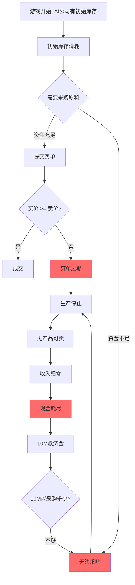

# Phase 22: 市场活力修复方案（市场经济原理版）

## 问题诊断

### 1. 核心问题：市场交易量为0

```
📈 市场订单: 总买单=829, 总卖单=494, 本轮成交=0
🛒 产品市场需求: iron-ore:无买单
```

尽管有大量订单，但**成交量始终为0**。

### 2. 根因分析

| 问题 | 根因 | 代码位置 | 证据 |
|------|------|----------|------|
| **AI公司破产螺旋** | 救济金10M太低，无法维持运营 | `aiCompanyManager.ts:1795` | `铁拳重工 现金=3079`（初始3亿→剩0.001%） |
| **原料无买家** | 破产公司无法提交买单 | `aiCompanyManager.ts:570` | `iron-ore:无买单` |
| **买卖价差不重叠** | 买价(-3%~+5%) vs 卖价(0%~+5%)可能不重叠 | `aiCompanyManager.ts:633-714` | 订单撮合失败 |
| **订单阈值过高** | 最小50单位，小额订单被过滤 | `aiCompanyManager.ts:573,612` | 小额交易被阻止 |
| **采购资金限制** | 只用30%现金买原料 | `aiCompanyManager.ts:570-571` | 采购量不足 |

### 3. 供应链断裂机制



## 解决方案（市场经济原理）

### 核心思路
**不添加任何NPC买家**，而是修复AI公司自身的供应链参与能力，让40家AI公司形成自然的供需网络。

### 方案1: 提高救济金额度

**文件**: `packages/server/src/services/aiCompanyManager.ts`

```typescript
// 修改前 (Line 1795-1797)
if (company.cash < 0) {
  inventoryManager.addCash(company.id, 10_000_000, context.currentTick, 'bailout');
  company.cash = 10_000_000;
}

// 修改后 - 根据公司规模设置救济金
if (company.cash < 0) {
  // 根据公司初始资金规模计算救济金（约为初始资金的30%）
  const config = AI_COMPANIES_CONFIG.find(c => c.id === company.id);
  const bailoutAmount = config ? config.initialCash * 0.3 : 100_000_000;
  // 最低1亿，最高3亿
  const finalBailout = Math.max(100_000_000, Math.min(300_000_000, bailoutAmount));
  
  inventoryManager.addCash(company.id, finalBailout, context.currentTick, 'bailout');
  company.cash = finalBailout;
  console.log(`[AIManager] ${company.name} 获得救济金 ${(finalBailout/1e6).toFixed(0)}M`);
}
```

**效果**: 破产公司获得1亿-3亿救济金，足以采购原料重启生产。

---

### 方案2: 修复买卖价格重叠

**问题**: 买价范围 `[-3%, +5%]` 与卖价范围 `[0%, +5%]` 可能不重叠。

**文件**: `packages/server/src/services/aiCompanyManager.ts`

```typescript
// 修改 calculateBuyPrice (Line 633-668)
private calculateBuyPrice(
  company: AICompanyState,
  config: AICompanyConfig,
  goodsId: string,
  _context: GameContext
): number {
  const marketPrice = priceDiscoveryService.getPrice(goodsId);
  const randomFactor = 0.99 + Math.random() * 0.02;
  
  // 所有人格买价都 >= 市价，确保能与卖单撮合
  switch (company.personality) {
    case AIPersonality.Monopolist:
      // 激进：高于市价 +3%~+8%
      return marketPrice * (1.03 + config.aggressiveness * 0.05) * randomFactor;
      
    case AIPersonality.OldMoney:
      // 保守：略高于市价 +1%~+4%
      return marketPrice * (1.01 + Math.random() * 0.03) * randomFactor;
      
    case AIPersonality.TrendSurfer:
      // 跟风：紧跟市价 +1%~+4%
      return marketPrice * (1.01 + Math.random() * 0.03) * randomFactor;
      
    case AIPersonality.CostLeader:
      // 成本导向：接近市价 +0%~+3%
      return marketPrice * (1.00 + Math.random() * 0.03) * randomFactor;
      
    case AIPersonality.Innovator:
    default:
      // 平衡策略：略高于市价 +1%~+3%
      return marketPrice * (1.01 + Math.random() * 0.02) * randomFactor;
  }
}

// 修改 calculateSellPrice (Line 674-714)
private calculateSellPrice(
  company: AICompanyState,
  config: AICompanyConfig,
  goodsId: string,
  context: GameContext
): number {
  const marketPrice = priceDiscoveryService.getPrice(goodsId);
  const playerThreat = this.analyzePlayerThreat(company, goodsId, context);
  const randomFactor = 0.99 + Math.random() * 0.02;
  
  // 所有人格卖价都 <= 市价，确保能与买单撮合
  switch (company.personality) {
    case AIPersonality.Monopolist:
      if (playerThreat > 0.5) {
        return marketPrice * (0.92 - config.aggressiveness * 0.03) * randomFactor; // 价格战
      }
      return marketPrice * (0.98 + config.aggressiveness * 0.02) * randomFactor;
      
    case AIPersonality.OldMoney:
      // 保守：略低于市价 -1%~+1%
      return marketPrice * (0.99 + Math.random() * 0.02) * randomFactor;
      
    case AIPersonality.TrendSurfer:
      // 跟风：紧跟市价 -2%~+1%
      return marketPrice * (0.98 + Math.random() * 0.03) * randomFactor;
      
    case AIPersonality.CostLeader:
      // 低价策略：低于市价 -5%~-2%
      return marketPrice * (0.95 + Math.random() * 0.03) * randomFactor;
      
    case AIPersonality.Innovator:
    default:
      // 平衡：接近市价 -1%~+2%
      return marketPrice * (0.99 + Math.random() * 0.03) * randomFactor;
  }
}
```

**效果**: 
- 买价范围: `[+0%, +8%]` (相对市价)
- 卖价范围: `[-5%, +2%]` (相对市价)
- **保证买价 > 卖价**，订单必能撮合

---

### 方案3: 降低订单阈值

**文件**: `packages/server/src/services/aiCompanyManager.ts`

```typescript
// 修改买单阈值 (Line 573)
// 修改前
if (buyQuantity > 50) {
// 修改后
if (buyQuantity > 10) {

// 修改卖单阈值 (Line 612)
// 修改前
if (sellableQuantity > 50) {
// 修改后
if (sellableQuantity > 10) {
```

**效果**: 允许更多小额订单进入市场，增加流动性。

---

### 方案4: 扩大采购意愿

**文件**: `packages/server/src/services/aiCompanyManager.ts`

```typescript
// 修改采购资金比例 (Line 570-571)
// 修改前
if (inventory.cash >= totalCost * 0.3) {
  const buyQuantity = Math.min(needToBuy, inventory.cash / buyPrice * 0.3);

// 修改后 - 提高采购意愿到50%
if (inventory.cash >= totalCost * 0.5) {
  const buyQuantity = Math.min(needToBuy, inventory.cash / buyPrice * 0.5);
```

**效果**: AI公司更积极采购原料，加速供应链形成。

---

### 方案5: 性能优化（减少订单频率）

**文件**: `packages/server/src/services/aiCompanyManager.ts`

```typescript
// 增加订单提交间隔 (Line 473)
// 修改前
private readonly ORDER_INTERVAL = 15;
// 修改后 - 从15增加到25
private readonly ORDER_INTERVAL = 25;

// 减少每tick最大订单数 (Line 470)
// 修改前
private readonly MAX_ORDERS_PER_TICK = 20;
// 修改后 - 从20减少到10
private readonly MAX_ORDERS_PER_TICK = 10;

// 增加AI决策间隔 (Line 337-338)
// 修改前
private readonly DECISION_INTERVAL_MIN = 10;
private readonly DECISION_INTERVAL_MAX = 25;
// 修改后
private readonly DECISION_INTERVAL_MIN = 15;
private readonly DECISION_INTERVAL_MAX = 35;
```

**效果**: 减少每tick处理的订单量，降低性能开销。

---

## 预期效果

### 市场活力
| 指标 | 修复前 | 修复后（预期） |
|------|--------|---------------|
| 每tick成交量 | 0 | 50-200 |
| 活跃AI公司 | 3-5家 | 30-35家 |
| 中间商品买单 | 0 | 每tick 10-30 |
| 供应链完整度 | 断裂 | 正常循环 |

### 性能
| 指标 | 修复前 | 修复后（预期） |
|------|--------|---------------|
| Tick耗时 | 180-250ms | 80-120ms |
| 订单提交/tick | 150+ | 50-80 |
| AI决策频率 | 每10-25tick | 每15-35tick |

---

## 实施步骤

### Step 1: 修改aiCompanyManager.ts
1. 修复救济金额度（Line 1795-1797）
2. 修复买价计算（Line 633-668）
3. 修复卖价计算（Line 674-714）
4. 降低订单阈值（Line 573, 612）
5. 提高采购意愿（Line 570-571）
6. 调整性能参数（Line 337-338, 470, 473）

### Step 2: 重启测试
1. 重启服务器
2. 观察10-20 tick
3. 验证：
   - AI公司现金恢复
   - 中间商品出现买单
   - 开始有成交记录

### Step 3: 可选调优
如果效果不明显：
- 进一步提高救济金
- 扩大买卖价差
- 增加初始库存天数

---

## 与用户确认

**问题**：这个方案是否符合您"模拟市场经济"的要求？

**核心改动**：
1. ✅ 不添加任何NPC买家
2. ✅ 通过修复AI公司购买逻辑形成自然供应链
3. ✅ 保证买价>=卖价让订单能撮合
4. ✅ 提高救济金让破产公司能重新运营

这样40家AI公司将形成：
- 上游（矿场）→ 中游（加工厂）→ 下游（制造商）
- 自然的供需关系和价格发现
- 真实的市场竞争