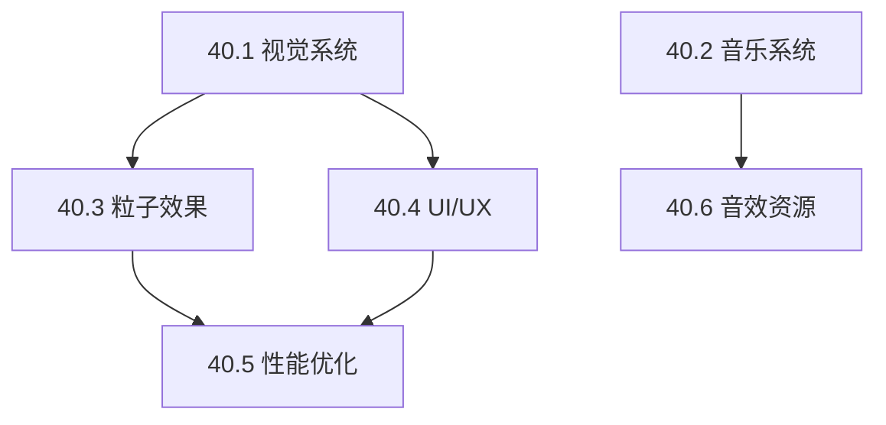

# Phase 40: 大规模美术与音乐系统优化计划

## 📋 文档概述

**项目名称**: Supply Chain Commander: Algo-City  
**版本**: 2.0  
**创建日期**: 2026-01-24  
**作者**: AI Assistant  

---

## 🎯 优化目标

### 核心目标
1. **视觉体验升级**: 增强赛博朋克美学，提升UI/UX沉浸感
2. **音效系统完善**: 实现动态音乐系统和完整音效覆盖
3. **性能优化**: 在保持视觉质量的同时确保60FPS流畅运行
4. **无障碍设计**: 支持色盲模式和可定制化视觉效果

---

## 📊 现有系统分析

### ✅ 已实现的功能

#### 视觉系统 (约2,200行代码)
| 文件 | 行数 | 功能描述 |
|------|------|----------|
| `styles/theme.ts` | 365 | 霓虹配色系统、产业类别颜色、发光效果 |
| `styles/effects.css` | 530 | 扫描线、玻璃态、霓虹动画、状态指示器 |
| `components/ui/GlassPanel.tsx` | 179 | 6种玻璃态面板变体 |
| `components/ui/NeonButton.tsx` | 237 | 6种按钮变体、5种尺寸 |
| `components/ui/AnimatedNumber.tsx` | 348 | 数字动画组件 |
| `components/ui/StatusIndicator.tsx` | 422 | 状态指示器组件 |
| `animations/presets.ts` | 674 | 25+种Framer Motion动画预设 |

#### 音频系统 (约1,550行代码)
| 文件 | 行数 | 功能描述 |
|------|------|----------|
| `audio/AudioManager.ts` | 576 | Howler.js管理器、音量持久化 |
| `audio/audioAssets.ts` | 425 | 6个BGM、35+个SFX、6个环境音配置 |
| `audio/hooks.ts` | 540 | 5个React Hooks |

#### 粒子系统 (约600行代码)
| 文件 | 行数 | 功能描述 |
|------|------|----------|
| `particles/ParticleSystem.ts` | 452 | PixiJS粒子系统、9种粒子类型 |
| `particles/effects.ts` | ~100 | 粒子效果配置 |
| `particles/hooks.ts` | ~50 | 粒子系统Hooks |

### 🔍 待优化的问题

1. **音效资源缺失**: 音效文件尚未放入`/audio`目录
2. **动态BGM切换**: 缺少根据游戏状态自动切换BGM的逻辑
3. **粒子系统集成**: 粒子效果尚未集成到实际游戏组件
4. **建筑图标**: 缺少自定义的建筑SVG图标
5. **地图渲染**: 城市地图缺少等距视角渲染
6. **天气系统**: 缺少天气效果（雨、雾等）

---

## 🎨 Phase 40.1: 视觉系统增强

### 40.1.1 建筑图标系统

#### 目标
为50种建筑类型设计统一风格的SVG图标

#### 实现方案

```typescript
// packages/client/src/assets/icons/buildings/index.ts

export const BUILDING_ICONS: Record<string, React.FC<SVGProps>> = {
  // 采掘类 (extraction)
  'iron-mine': IronMineIcon,
  'coal-mine': CoalMineIcon,
  'copper-mine': CopperMineIcon,
  'oil-well': OilWellIcon,
  'natural-gas-well': NaturalGasWellIcon,
  'lithium-mine': LithiumMineIcon,
  'rare-earth-mine': RareEarthMineIcon,
  
  // 加工类 (processing)
  'steel-mill': SteelMillIcon,
  'refinery': RefineryIcon,
  'chemical-plant': ChemicalPlantIcon,
  'plastics-factory': PlasticsFactoryIcon,
  
  // 制造类 (manufacturing)
  'electronics-factory': ElectronicsFactoryIcon,
  'automotive-plant': AutomotivePlantIcon,
  'chip-foundry': ChipFoundryIcon,
  
  // 服务类 (service)
  'power-plant': PowerPlantIcon,
  'research-lab': ResearchLabIcon,
  
  // 零售类 (retail)
  'shopping-center': ShoppingCenterIcon,
  'auto-dealer': AutoDealerIcon,
};
```

#### 图标设计规范

| 属性 | 规范 |
|------|------|
| 尺寸 | 48x48px 基准，支持 24/32/48/64/96 |
| 线条 | 2px 粗细，圆角 |
| 颜色 | 使用 `currentColor` 继承 |
| 发光 | 通过CSS添加霓虹效果 |
| 动画 | 支持运行/暂停/故障状态 |

#### 图标状态动画

```css
/* 运行中 - 脉冲发光 */
.building-icon--running {
  animation: icon-pulse 2s ease-in-out infinite;
}

/* 缺料 - 警告闪烁 */
.building-icon--shortage {
  animation: icon-warning 1s ease-in-out infinite;
  filter: drop-shadow(0 0 8px rgba(255, 170, 0, 0.6));
}

/* 暂停 - 灰度 */
.building-icon--paused {
  filter: grayscale(1);
  opacity: 0.6;
}

/* 建造中 - 蓝图效果 */
.building-icon--building {
  opacity: 0.5;
  filter: drop-shadow(0 0 4px rgba(0, 245, 255, 0.4));
  animation: icon-blueprint 3s linear infinite;
}
```

### 40.1.2 等距城市地图

#### 目标
实现2.5D等距视角的城市地图渲染

#### 技术方案

```typescript
// packages/client/src/components/game/IsometricMap.tsx

interface IsometricTile {
  x: number;
  y: number;
  type: 'empty' | 'building' | 'road' | 'water';
  building?: Building;
  elevation?: number;
}

interface IsometricMapProps {
  width: number;  // 网格宽度
  height: number; // 网格高度
  tileSize: number; // 瓦片像素大小
  buildings: Building[];
}

const ISOMETRIC_TRANSFORM = {
  // 笛卡尔坐标转等距坐标
  toIsometric: (x: number, y: number) => ({
    isoX: (x - y) * 0.5,
    isoY: (x + y) * 0.25,
  }),
  // 等距坐标转笛卡尔坐标
  fromIsometric: (isoX: number, isoY: number) => ({
    x: isoX + isoY * 2,
    y: isoY * 2 - isoX,
  }),
};
```

#### 渲染层级

| 层级 | 内容 | Z-Index |
|------|------|---------|
| 0 | 地面/水域 | 0 |
| 1 | 道路网络 | 10 |
| 2 | 建筑底座 | 20 |
| 3 | 建筑主体 | 30 |
| 4 | 建筑顶部 | 40 |
| 5 | 粒子效果 | 50 |
| 6 | UI覆盖层 | 100 |

### 40.1.3 天气效果系统

#### 目标
实现动态天气效果，增强沉浸感

#### 天气类型

| 天气 | 视觉效果 | 音效 |
|------|----------|------|
| 晴天 | 无 | 城市环境音 |
| 阴天 | 降低对比度、灰色调 | 风声 |
| 小雨 | 雨滴粒子、水面涟漪 | 雨声 |
| 大雨 | 密集雨滴、雾气 | 暴雨声 |
| 雷暴 | 闪电效果、雨 | 雷声 + 雨声 |
| 雾天 | 高斯模糊遮罩 | 静音/低沉环境音 |

```typescript
// packages/client/src/systems/WeatherSystem.ts

export class WeatherSystem {
  private currentWeather: WeatherType = 'clear';
  private transitionProgress: number = 0;
  
  // 天气转换
  async transitionTo(weather: WeatherType, duration: number = 5000) {
    // 渐变过渡
    await this.fadeOut(duration / 2);
    this.currentWeather = weather;
    await this.fadeIn(duration / 2);
    
    // 更新音效
    this.updateAmbient();
  }
  
  // 随机天气变化（每游戏日）
  randomizeWeather() {
    const weights = {
      clear: 40,
      cloudy: 25,
      rain: 15,
      heavy_rain: 10,
      storm: 5,
      fog: 5,
    };
    this.transitionTo(weightedRandom(weights));
  }
}
```

### 40.1.4 主题系统扩展

#### 新增主题

| 主题名 | 描述 | 主色调 |
|--------|------|--------|
| `cyber-neon` | 默认赛博朋克 | 青色 + 品红 |
| `neo-tokyo` | 东京霓虹风 | 粉红 + 紫色 |
| `matrix` | 黑客帝国风 | 绿色 + 黑色 |
| `synthwave` | 复古合成波 | 紫色 + 橙色 |
| `minimal-dark` | 极简深色 | 灰色 + 白色 |
| `high-contrast` | 高对比度（无障碍） | 黑白 |

```typescript
// packages/client/src/styles/themes/index.ts

export const THEMES = {
  'cyber-neon': {
    primary: '#00f5ff',
    secondary: '#ff00ff',
    background: '#050510',
    surface: '#161b22',
    profit: '#00ff88',
    loss: '#ff4444',
    // ...
  },
  'neo-tokyo': {
    primary: '#ff6b9d',
    secondary: '#c084fc',
    background: '#0a0412',
    surface: '#1a0a22',
    profit: '#4ade80',
    loss: '#ef4444',
    // ...
  },
  // 更多主题...
};
```

---

## 🎵 Phase 40.2: 音乐系统升级

### 40.2.1 动态BGM系统

#### 目标
根据游戏状态自动切换背景音乐

#### 游戏状态与BGM映射

| 游戏状态 | BGM轨道 | 触发条件 |
|----------|---------|----------|
| 菜单 | `bgm-menu` | 在主菜单 |
| 平静经营 | `bgm-gameplay-calm` | 市场波动 < 5% |
| 紧张经营 | `bgm-gameplay-intense` | 市场波动 > 10% |
| 研发界面 | `bgm-research` | 打开研究实验室 |
| 交易界面 | `bgm-trading` | 打开交易中心 |
| 危机 | `bgm-crisis` | 资金 < 10% 或 破产警告 |
| 胜利 | `bgm-victory` | 达成目标 |

```typescript
// packages/client/src/audio/DynamicBGMController.ts

export class DynamicBGMController {
  private currentTrack: string = 'bgm-menu';
  private marketVolatility: number = 0;
  private isInCrisis: boolean = false;
  
  update(gameState: GameState) {
    const newTrack = this.determineTrack(gameState);
    if (newTrack !== this.currentTrack) {
      this.crossfadeTo(newTrack, 2000); // 2秒淡入淡出
    }
  }
  
  private determineTrack(state: GameState): string {
    // 优先级判断
    if (state.isBankrupt) return 'bgm-crisis';
    if (state.activePanel === 'research') return 'bgm-research';
    if (state.activePanel === 'trading') return 'bgm-trading';
    if (this.marketVolatility > 0.1) return 'bgm-gameplay-intense';
    return 'bgm-gameplay-calm';
  }
  
  private crossfadeTo(track: string, duration: number) {
    const audioManager = AudioManager.getInstance();
    audioManager.fadeOut(this.currentTrack, duration / 2);
    setTimeout(() => {
      audioManager.fadeIn(track, duration / 2);
      this.currentTrack = track;
    }, duration / 2);
  }
}
```

### 40.2.2 音效优先级系统

#### 目标
管理同时播放的音效，避免声音混乱

#### 优先级定义

| 优先级 | 类别 | 示例 |
|--------|------|------|
| 1 (最高) | 警报 | 破产警告、紧急通知 |
| 2 | 重大事件 | 科技解锁、建筑完成 |
| 3 | 交易 | 买入/卖出成功 |
| 4 | UI反馈 | 点击、悬停 |
| 5 (最低) | 环境音 | 工厂机器声 |

```typescript
// packages/client/src/audio/SoundPriorityManager.ts

interface QueuedSound {
  id: string;
  priority: number;
  timestamp: number;
}

export class SoundPriorityManager {
  private maxConcurrent = 8; // 最大同时播放数
  private activeSounds: Map<string, Howl> = new Map();
  private queue: QueuedSound[] = [];
  
  play(soundId: string, priority: number) {
    if (this.activeSounds.size >= this.maxConcurrent) {
      // 检查是否有更低优先级的声音可以停止
      const lowestPriority = this.getLowestPrioritySound();
      if (lowestPriority && lowestPriority.priority > priority) {
        this.stopSound(lowestPriority.id);
      } else {
        // 加入队列
        this.queue.push({ id: soundId, priority, timestamp: Date.now() });
        return;
      }
    }
    
    this.playImmediately(soundId);
  }
}
```

### 40.2.3 3D空间音效

#### 目标
根据地图位置实现空间化音效

```typescript
// packages/client/src/audio/SpatialAudio.ts

export class SpatialAudioManager {
  private listenerPosition = { x: 0, y: 0 };
  
  setListenerPosition(x: number, y: number) {
    this.listenerPosition = { x, y };
    this.updateAllSpatialSounds();
  }
  
  playAt(soundId: string, x: number, y: number) {
    const distance = this.calculateDistance(x, y);
    const pan = this.calculatePan(x, y);
    const volume = this.calculateVolumeByDistance(distance);
    
    AudioManager.getInstance().play(soundId, {
      volume: volume * this.getMasterVolume('sfx'),
      stereo: pan, // -1 (左) 到 1 (右)
    });
  }
  
  private calculateDistance(x: number, y: number): number {
    return Math.sqrt(
      Math.pow(x - this.listenerPosition.x, 2) +
      Math.pow(y - this.listenerPosition.y, 2)
    );
  }
  
  private calculateVolumeByDistance(distance: number): number {
    const maxDistance = 1000;
    return Math.max(0, 1 - distance / maxDistance);
  }
}
```

---

## ✨ Phase 40.3: 粒子效果集成

### 40.3.1 建筑粒子效果

#### 目标
为不同建筑状态添加粒子效果

| 建筑类型 | 运行效果 | 特殊效果 |
|----------|----------|----------|
| 采矿场 | 灰尘飞扬 | 采掘闪光 |
| 钢铁厂 | 火花飞溅 | 熔炉火焰 |
| 化工厂 | 烟雾 | 化学反应泡沫 |
| 发电厂 | 电弧 | 能量脉冲 |
| 研究所 | 数据流 | 突破闪光 |
| 商场 | 无 | 交易成功金币 |

```typescript
// packages/client/src/particles/BuildingParticles.ts

export const BUILDING_PARTICLE_CONFIGS: Record<string, ParticleConfig> = {
  'steel-mill': {
    emitter: {
      type: 'continuous',
      rate: 5,
      lifetime: { min: 1, max: 2 },
    },
    particles: [
      {
        type: 'spark',
        color: ['#ff6b00', '#ffaa00'],
        size: { min: 2, max: 4 },
        velocity: { x: [-50, 50], y: [-100, -50] },
        gravity: 100,
      },
    ],
  },
  
  'power-plant': {
    emitter: {
      type: 'continuous',
      rate: 10,
    },
    particles: [
      {
        type: 'electricity',
        color: ['#00f5ff', '#00b8c4'],
        size: { min: 1, max: 3 },
        velocity: { x: [-20, 20], y: [-30, -10] },
        fade: true,
      },
    ],
  },
  
  'research-lab': {
    emitter: {
      type: 'continuous',
      rate: 3,
    },
    particles: [
      {
        type: 'data',
        color: ['#00ff88', '#00f5ff'],
        size: { min: 1, max: 2 },
        shape: 'square',
        velocity: { x: [-5, 5], y: [-20, -10] },
      },
    ],
  },
};
```

### 40.3.2 交易粒子效果

#### 目标
交易成功时显示金币/货物飞行效果

```typescript
// packages/client/src/particles/TradeParticles.ts

export function createTradeSuccessEffect(
  fromPos: { x: number; y: number },
  toPos: { x: number; y: number },
  tradeType: 'buy' | 'sell',
  amount: number
) {
  const particleCount = Math.min(20, Math.ceil(amount / 1000));
  
  const particles = Array.from({ length: particleCount }, (_, i) => ({
    startPos: { ...fromPos },
    endPos: { ...toPos },
    delay: i * 50,
    duration: 500 + i * 50,
    icon: tradeType === 'buy' ? '📦' : '💰',
    trail: true,
    trailColor: tradeType === 'buy' ? '#00f5ff' : '#00ff88',
  }));
  
  return particles;
}
```

### 40.3.3 市场波动可视化

#### 目标
用粒子效果可视化价格变动

```typescript
// packages/client/src/particles/MarketParticles.ts

export function createPriceChangeEffect(
  goodId: string,
  priceChange: number, // 百分比
  position: { x: number; y: number }
) {
  const isPositive = priceChange > 0;
  const intensity = Math.abs(priceChange);
  
  return {
    type: isPositive ? 'price-up' : 'price-down',
    position,
    config: {
      count: Math.ceil(intensity * 10),
      color: isPositive ? '#00ff88' : '#ff4444',
      direction: isPositive ? 'up' : 'down',
      text: `${isPositive ? '+' : ''}${(priceChange * 100).toFixed(1)}%`,
      duration: 1500,
    },
  };
}
```

---

## 🖼️ Phase 40.4: UI/UX增强

### 40.4.1 过渡动画优化

#### 目标
优化页面切换和面板动画

```typescript
// 增强的页面过渡
export const ENHANCED_PAGE_VARIANTS: Variants = {
  initial: {
    opacity: 0,
    y: 30,
    scale: 0.95,
    filter: 'blur(10px)',
  },
  animate: {
    opacity: 1,
    y: 0,
    scale: 1,
    filter: 'blur(0px)',
    transition: {
      type: 'spring',
      stiffness: 200,
      damping: 25,
      staggerChildren: 0.05,
    },
  },
  exit: {
    opacity: 0,
    y: -20,
    scale: 0.98,
    filter: 'blur(5px)',
    transition: { duration: 0.2 },
  },
};
```

### 40.4.2 微交互设计

#### 按钮微交互

```typescript
// packages/client/src/components/ui/MicroInteractions.tsx

export const ButtonMicroInteraction: React.FC = ({ children, onClick }) => {
  const controls = useAnimationControls();
  
  const handleClick = async (e: React.MouseEvent) => {
    // 点击反馈
    await controls.start({
      scale: [1, 0.95, 1],
      transition: { duration: 0.15 },
    });
    
    // 发出涟漪效果
    createRipple(e);
    
    onClick?.(e);
  };
  
  return (
    <motion.button
      animate={controls}
      whileHover={{ scale: 1.02 }}
      whileTap={{ scale: 0.98 }}
      onClick={handleClick}
    >
      {children}
    </motion.button>
  );
};
```

#### 输入框微交互

```typescript
// 聚焦发光效果
export const GlowInput: React.FC = (props) => {
  const [isFocused, setIsFocused] = useState(false);
  
  return (
    <motion.div
      animate={{
        boxShadow: isFocused 
          ? '0 0 20px rgba(0, 245, 255, 0.4)' 
          : '0 0 0 rgba(0, 245, 255, 0)',
      }}
      className="relative"
    >
      <input
        {...props}
        onFocus={() => setIsFocused(true)}
        onBlur={() => setIsFocused(false)}
        className="glass-panel-inset ..."
      />
      {isFocused && (
        <motion.div
          className="absolute inset-0 pointer-events-none"
          animate={{ opacity: [0.3, 0.6, 0.3] }}
          transition={{ duration: 2, repeat: Infinity }}
          style={{
            background: 'linear-gradient(90deg, transparent, rgba(0,245,255,0.1), transparent)',
          }}
        />
      )}
    </motion.div>
  );
};
```

### 40.4.3 数据可视化增强

#### 图表动画

```typescript
// 增强的K线图动画
export const CandlestickAnimation = {
  initial: { scaleY: 0, opacity: 0 },
  animate: (i: number) => ({
    scaleY: 1,
    opacity: 1,
    transition: {
      delay: i * 0.02,
      type: 'spring',
      stiffness: 300,
      damping: 20,
    },
  }),
};

// 价格线动画
export const PriceLineAnimation = {
  initial: { pathLength: 0 },
  animate: {
    pathLength: 1,
    transition: { duration: 1.5, ease: 'easeOut' },
  },
};
```

---

## ⚡ Phase 40.5: 性能优化

### 40.5.1 渲染优化

#### 虚拟化列表
```typescript
// 已实现: packages/client/src/components/common/VirtualizedList.tsx

// 增强: 支持水平虚拟化
export const VirtualizedGrid: React.FC<VirtualizedGridProps> = ({
  items,
  rowHeight,
  columnWidth,
  containerWidth,
  containerHeight,
  renderItem,
}) => {
  const columnsPerRow = Math.floor(containerWidth / columnWidth);
  const visibleRows = Math.ceil(containerHeight / rowHeight) + 2;
  
  // 只渲染可见区域的项目
  // ...
};
```

#### Canvas批量渲染
```typescript
// 图表批量渲染优化
export class CanvasBatchRenderer {
  private pendingOperations: (() => void)[] = [];
  private rafId: number | null = null;
  
  queue(operation: () => void) {
    this.pendingOperations.push(operation);
    if (!this.rafId) {
      this.rafId = requestAnimationFrame(() => this.flush());
    }
  }
  
  flush() {
    this.ctx.save();
    this.pendingOperations.forEach(op => op());
    this.ctx.restore();
    this.pendingOperations = [];
    this.rafId = null;
  }
}
```

### 40.5.2 内存优化

#### 对象池
```typescript
// packages/client/src/utils/ObjectPool.ts

export class ObjectPool<T> {
  private pool: T[] = [];
  private factory: () => T;
  private reset: (obj: T) => void;
  
  constructor(factory: () => T, reset: (obj: T) => void, initialSize = 100) {
    this.factory = factory;
    this.reset = reset;
    
    // 预分配
    for (let i = 0; i < initialSize; i++) {
      this.pool.push(factory());
    }
  }
  
  acquire(): T {
    return this.pool.length > 0 ? this.pool.pop()! : this.factory();
  }
  
  release(obj: T) {
    this.reset(obj);
    this.pool.push(obj);
  }
}

// 粒子对象池
const particlePool = new ObjectPool(
  () => ({ x: 0, y: 0, vx: 0, vy: 0, life: 0, color: '', size: 0 }),
  (p) => { p.life = 0; }
);
```

### 40.5.3 资源加载优化

#### 音效预加载
```typescript
// packages/client/src/audio/preloader.ts

export async function preloadCriticalAudio() {
  const criticalSounds = [
    'ui-click',
    'ui-panel-open',
    'trade-buy',
    'trade-sell',
    'notification-new',
  ];
  
  const audioManager = AudioManager.getInstance();
  
  await Promise.all(
    criticalSounds.map(id => audioManager.preload(id))
  );
}

// 懒加载非关键音效
export function lazyLoadAudio(soundId: string) {
  return new Promise((resolve) => {
    const audioManager = AudioManager.getInstance();
    
    // 检查是否已加载
    if (audioManager.isLoaded(soundId)) {
      resolve(true);
      return;
    }
    
    // 在空闲时加载
    requestIdleCallback(() => {
      audioManager.preload(soundId).then(resolve);
    });
  });
}
```

#### 图片资源优化
```typescript
// 使用WebP格式和响应式图片
export function getOptimizedImageUrl(
  baseUrl: string,
  width: number,
  format: 'webp' | 'png' = 'webp'
) {
  const dpr = window.devicePixelRatio || 1;
  const actualWidth = Math.ceil(width * dpr);
  
  return `${baseUrl}?w=${actualWidth}&fmt=${format}`;
}
```

---

## 📁 Phase 40.6: 音效资源规划

### 40.6.1 音效目录结构

```
packages/client/public/audio/
├── bgm/
│   ├── menu-theme.mp3
│   ├── gameplay-calm.mp3
│   ├── gameplay-intense.mp3
│   ├── research-lab.mp3
│   ├── trading-floor.mp3
│   ├── crisis.mp3
│   └── victory.mp3
├── sfx/
│   ├── ui/
│   │   ├── click.mp3
│   │   ├── hover.mp3
│   │   ├── panel-open.mp3
│   │   ├── panel-close.mp3
│   │   ├── tab-switch.mp3
│   │   ├── toggle.mp3
│   │   ├── confirm.mp3
│   │   ├── cancel.mp3
│   │   ├── error.mp3
│   │   ├── success.mp3
│   │   └── warning.mp3
│   └── game/
│       ├── trade-buy.mp3
│       ├── trade-sell.mp3
│       ├── trade-big.mp3
│       ├── trade-fail.mp3
│       ├── production-complete.mp3
│       ├── building-construct.mp3
│       ├── building-upgrade.mp3
│       ├── building-demolish.mp3
│       ├── research-start.mp3
│       ├── research-complete.mp3
│       ├── tech-unlock.mp3
│       ├── money-gain.mp3
│       ├── money-jackpot.mp3
│       ├── bankruptcy-warning.mp3
│       ├── price-up.mp3
│       ├── price-down.mp3
│       ├── market-alert.mp3
│       ├── notification.mp3
│       ├── achievement.mp3
│       └── turn-end.mp3
└── ambient/
    ├── city-traffic.mp3
    ├── datacenter-hum.mp3
    ├── factory-machinery.mp3
    ├── stock-exchange.mp3
    ├── rain.mp3
    └── electronic-atmosphere.mp3
```

### 40.6.2 音效规格要求

| 类别 | 格式 | 采样率 | 比特率 | 时长 |
|------|------|--------|--------|------|
| BGM | MP3/OGG | 44.1kHz | 192kbps | 2-4分钟 (循环) |
| UI SFX | MP3/OGG | 44.1kHz | 128kbps | 0.1-0.5秒 |
| 游戏 SFX | MP3/OGG | 44.1kHz | 160kbps | 0.3-2秒 |
| 环境音 | MP3/OGG | 44.1kHz | 128kbps | 30秒+ (循环) |

### 40.6.3 占位音效生成

```typescript
// 开发阶段使用Web Audio API生成占位音效
export function generatePlaceholderSound(type: 'click' | 'beep' | 'success' | 'error') {
  const ctx = new AudioContext();
  const oscillator = ctx.createOscillator();
  const gain = ctx.createGain();
  
  const configs = {
    click: { freq: 800, duration: 0.05, type: 'square' as OscillatorType },
    beep: { freq: 440, duration: 0.2, type: 'sine' as OscillatorType },
    success: { freq: 880, duration: 0.3, type: 'triangle' as OscillatorType },
    error: { freq: 220, duration: 0.4, type: 'sawtooth' as OscillatorType },
  };
  
  const config = configs[type];
  oscillator.type = config.type;
  oscillator.frequency.value = config.freq;
  
  oscillator.connect(gain);
  gain.connect(ctx.destination);
  
  gain.gain.setValueAtTime(0.3, ctx.currentTime);
  gain.gain.exponentialRampToValueAtTime(0.01, ctx.currentTime + config.duration);
  
  oscillator.start();
  oscillator.stop(ctx.currentTime + config.duration);
}
```

---

## 📅 实施时间线

### 阶段划分

| 阶段 | 内容 | 预估时间 | 优先级 |
|------|------|----------|--------|
| 40.1 | 视觉系统增强 | 3天 | P1 |
| 40.2 | 音乐系统升级 | 2天 | P1 |
| 40.3 | 粒子效果集成 | 2天 | P2 |
| 40.4 | UI/UX增强 | 2天 | P2 |
| 40.5 | 性能优化 | 1天 | P1 |
| 40.6 | 音效资源创建 | 持续 | P3 |

### 依赖关系



---

## ✅ 验收标准

### 视觉系统
- [ ] 所有50种建筑有对应图标
- [ ] 等距地图可正常渲染500+建筑
- [ ] 天气效果平滑过渡
- [ ] 主题切换无闪烁

### 音频系统
- [ ] BGM根据游戏状态自动切换
- [ ] 所有UI操作有音效反馈
- [ ] 音量控制正常工作
- [ ] 空间音效正确定位

### 性能
- [ ] 60FPS稳定运行
- [ ] 内存使用 < 500MB
- [ ] 音频加载时间 < 2秒
- [ ] 首次渲染时间 < 1秒

---

## 📝 备注

1. 音效资源可使用免费音效库（如Freesound.org）或AI生成工具
2. 建筑图标可考虑使用AI生成后人工调整
3. 性能测试应在低端设备上进行验证
4. 无障碍设计需符合WCAG 2.1标准