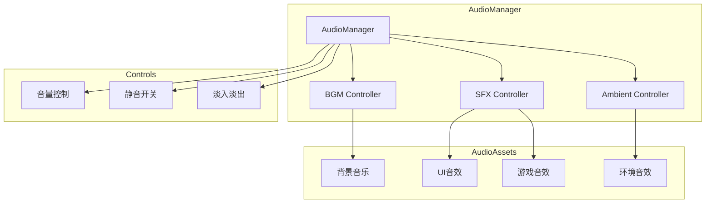
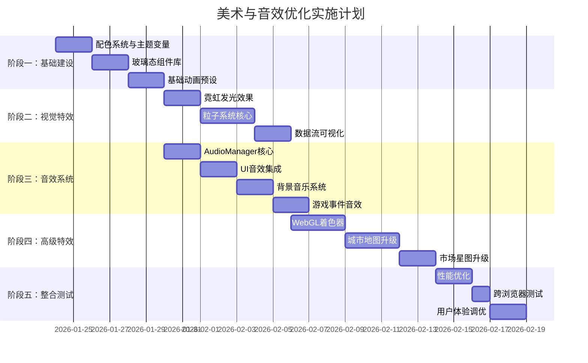

# Phase 50: 美术与音效大规模优化计划

## 项目概述

本计划旨在全面提升《供应链指挥官：算法都市》的视觉美术效果和音效体验，将游戏打造成一款视听效果出众的赛博朋克风格经济模拟游戏。

**优化目标：**
- 🎨 视觉：建立统一的霓虹赛博朋克视觉语言
- 🎵 音效：构建完整的音效与背景音乐系统
- ✨ 动画：添加流畅的过渡与反馈动画
- 🌟 粒子：实现数据流、能量粒子等特效
- 🖥️ UI/UX：升级玻璃态设计与全息投影元素

---

## 第一部分：项目现状分析

### 1.1 现有技术栈

| 技术 | 用途 | 状态 |
|------|------|------|
| PixiJS 8 | 城市地图2D渲染 | ✅ 已实现基础版 |
| D3.js | 市场力导向图 | ✅ 已实现 |
| TailwindCSS | UI样式 | ✅ 使用中 |
| Framer Motion | UI动画 | ⚠️ 已引入但使用较少 |
| Web Audio API | 音效系统 | ❌ 未实现 |
| WebGL Shaders | 特效着色器 | ❌ 未实现 |

### 1.2 现有美术效果

**已实现：**
- 深色背景主题 `#0d1117`
- 基础霓虹配色（青色 `#00f5ff`、蓝色 `#007bff`）
- 简单的CSS渐变按钮
- 节点发光效果（SVG filter）
- 基础hover状态变化
- 脉冲动画（打字指示器）

**缺失：**
- ❌ 完整的粒子系统
- ❌ 着色器特效（shader）
- ❌ 环境光照效果
- ❌ 数据流动画
- ❌ 全息投影UI元素
- ❌ 玻璃态模糊效果优化

### 1.3 音效系统现状

**完全未实现：**
- ❌ 背景音乐
- ❌ UI交互音效
- ❌ 事件音效
- ❌ 环境音效
- ❌ 音量控制系统

---

## 第二部分：视觉效果优化计划

### 2.1 配色系统升级

#### 2.1.1 主色板定义

```typescript
// packages/client/src/styles/theme.ts
export const NEON_PALETTE = {
  // 主色调
  primary: {
    cyan: '#00f5ff',
    cyanGlow: 'rgba(0, 245, 255, 0.6)',
    blue: '#007bff',
    blueGlow: 'rgba(0, 123, 255, 0.6)',
  },
  
  // 霓虹强调色
  accent: {
    magenta: '#ff00ff',
    magentaGlow: 'rgba(255, 0, 255, 0.5)',
    amber: '#ffa500',
    amberGlow: 'rgba(255, 165, 0, 0.5)',
    lime: '#00ff00',
    limeGlow: 'rgba(0, 255, 0, 0.5)',
  },
  
  // 状态色
  status: {
    profit: '#00ff88',
    profitGlow: 'rgba(0, 255, 136, 0.5)',
    loss: '#ff4444',
    lossGlow: 'rgba(255, 68, 68, 0.5)',
    warning: '#ffaa00',
    warningGlow: 'rgba(255, 170, 0, 0.5)',
    neutral: '#888888',
  },
  
  // 背景层级
  background: {
    deep: '#050510',
    base: '#0d1117',
    elevated: '#161b22',
    surface: '#21262d',
    overlay: 'rgba(13, 17, 23, 0.95)',
  },
  
  // 文字层级
  text: {
    primary: '#ffffff',
    secondary: '#e2e8f0',
    muted: '#64748b',
    disabled: '#475569',
  },
};
```

#### 2.1.2 产业类别渐变色

```typescript
export const CATEGORY_GRADIENTS = {
  extraction: {
    from: '#f59e0b',
    to: '#d97706',
    glow: 'radial-gradient(ellipse at center, rgba(245, 158, 11, 0.4) 0%, transparent 70%)',
  },
  processing: {
    from: '#3b82f6',
    to: '#2563eb',
    glow: 'radial-gradient(ellipse at center, rgba(59, 130, 246, 0.4) 0%, transparent 70%)',
  },
  manufacturing: {
    from: '#8b5cf6',
    to: '#7c3aed',
    glow: 'radial-gradient(ellipse at center, rgba(139, 92, 246, 0.4) 0%, transparent 70%)',
  },
  service: {
    from: '#10b981',
    to: '#059669',
    glow: 'radial-gradient(ellipse at center, rgba(16, 185, 129, 0.4) 0%, transparent 70%)',
  },
  retail: {
    from: '#ec4899',
    to: '#db2777',
    glow: 'radial-gradient(ellipse at center, rgba(236, 72, 153, 0.4) 0%, transparent 70%)',
  },
  agriculture: {
    from: '#84cc16',
    to: '#65a30d',
    glow: 'radial-gradient(ellipse at center, rgba(132, 204, 22, 0.4) 0%, transparent 70%)',
  },
};
```

### 2.2 玻璃态组件系统

#### 2.2.1 基础玻璃态面板

```typescript
// packages/client/src/components/ui/GlassPanel.tsx
interface GlassPanelProps {
  children: React.ReactNode;
  variant?: 'default' | 'elevated' | 'inset' | 'holographic';
  borderColor?: 'cyan' | 'magenta' | 'amber' | 'none';
  blur?: 'sm' | 'md' | 'lg' | 'xl';
  className?: string;
}

// CSS 实现
const glassStyles = {
  default: `
    background: linear-gradient(
      135deg,
      rgba(13, 17, 23, 0.8) 0%,
      rgba(22, 27, 34, 0.6) 100%
    );
    backdrop-filter: blur(12px);
    border: 1px solid rgba(255, 255, 255, 0.1);
    box-shadow: 
      0 8px 32px rgba(0, 0, 0, 0.4),
      inset 0 1px 0 rgba(255, 255, 255, 0.05);
  `,
  holographic: `
    background: linear-gradient(
      135deg,
      rgba(0, 245, 255, 0.05) 0%,
      rgba(255, 0, 255, 0.03) 50%,
      rgba(0, 123, 255, 0.05) 100%
    );
    backdrop-filter: blur(16px) saturate(180%);
    border: 1px solid rgba(0, 245, 255, 0.2);
    box-shadow:
      0 0 40px rgba(0, 245, 255, 0.1),
      0 8px 32px rgba(0, 0, 0, 0.4),
      inset 0 1px 0 rgba(255, 255, 255, 0.1);
  `,
};
```

#### 2.2.2 扫描线特效

```css
/* packages/client/src/styles/effects.css */
.scanline-effect {
  position: relative;
  overflow: hidden;
}

.scanline-effect::after {
  content: '';
  position: absolute;
  top: 0;
  left: 0;
  right: 0;
  bottom: 0;
  background: repeating-linear-gradient(
    0deg,
    transparent,
    transparent 2px,
    rgba(0, 245, 255, 0.03) 2px,
    rgba(0, 245, 255, 0.03) 4px
  );
  pointer-events: none;
  animation: scanline 8s linear infinite;
}

@keyframes scanline {
  0% { transform: translateY(0); }
  100% { transform: translateY(100%); }
}
```

### 2.3 霓虹发光效果

#### 2.3.1 CSS 霓虹文字

```css
/* 霓虹文字效果 */
.neon-text-cyan {
  color: #00f5ff;
  text-shadow:
    0 0 5px rgba(0, 245, 255, 0.5),
    0 0 10px rgba(0, 245, 255, 0.4),
    0 0 20px rgba(0, 245, 255, 0.3),
    0 0 40px rgba(0, 245, 255, 0.2);
  animation: neon-flicker 3s ease-in-out infinite;
}

.neon-text-magenta {
  color: #ff00ff;
  text-shadow:
    0 0 5px rgba(255, 0, 255, 0.5),
    0 0 10px rgba(255, 0, 255, 0.4),
    0 0 20px rgba(255, 0, 255, 0.3),
    0 0 40px rgba(255, 0, 255, 0.2);
}

@keyframes neon-flicker {
  0%, 100% { opacity: 1; }
  50% { opacity: 0.85; }
  52% { opacity: 1; }
  54% { opacity: 0.9; }
  56% { opacity: 1; }
}
```

#### 2.3.2 SVG 发光滤镜

```typescript
// packages/client/src/components/effects/NeonGlowFilter.tsx
export const NEON_FILTERS_SVG = `
<svg xmlns="http://www.w3.org/2000/svg" style="display: none;">
  <defs>
    <!-- 青色霓虹发光 -->
    <filter id="neon-cyan" x="-50%" y="-50%" width="200%" height="200%">
      <feGaussianBlur in="SourceGraphic" stdDeviation="4" result="blur" />
      <feColorMatrix in="blur" type="matrix" values="
        0 0 0 0 0
        0 1 0 0 0.96
        0 0 1 0 1
        0 0 0 1 0
      " result="coloredBlur"/>
      <feMerge>
        <feMergeNode in="coloredBlur" />
        <feMergeNode in="coloredBlur" />
        <feMergeNode in="SourceGraphic" />
      </feMerge>
    </filter>
    
    <!-- 品红霓虹发光 -->
    <filter id="neon-magenta" x="-50%" y="-50%" width="200%" height="200%">
      <feGaussianBlur in="SourceGraphic" stdDeviation="4" result="blur" />
      <feColorMatrix in="blur" type="matrix" values="
        1 0 0 0 1
        0 0 0 0 0
        0 0 1 0 1
        0 0 0 1 0
      " result="coloredBlur"/>
      <feMerge>
        <feMergeNode in="coloredBlur" />
        <feMergeNode in="SourceGraphic" />
      </feMerge>
    </filter>
    
    <!-- 利润/亏损双色渐变发光 -->
    <linearGradient id="profit-gradient" x1="0%" y1="0%" x2="100%" y2="0%">
      <stop offset="0%" style="stop-color:#00ff88" />
      <stop offset="100%" style="stop-color:#00f5ff" />
    </linearGradient>
    
    <linearGradient id="loss-gradient" x1="0%" y1="0%" x2="100%" y2="0%">
      <stop offset="0%" style="stop-color:#ff4444" />
      <stop offset="100%" style="stop-color:#ff00ff" />
    </linearGradient>
  </defs>
</svg>
`;
```

### 2.4 粒子效果系统

#### 2.4.1 粒子引擎设计

```typescript
// packages/client/src/effects/particles/ParticleSystem.ts
import * as PIXI from 'pixi.js';

interface ParticleConfig {
  maxParticles: number;
  emitRate: number;
  lifetime: { min: number; max: number };
  speed: { min: number; max: number };
  size: { start: number; end: number };
  color: { start: number; end: number };
  alpha: { start: number; end: number };
  blendMode: PIXI.BLEND_MODES;
}

export class ParticleSystem {
  private container: PIXI.Container;
  private particles: Particle[] = [];
  private config: ParticleConfig;
  private emitter: ParticleEmitter;
  
  constructor(container: PIXI.Container, config: ParticleConfig) {
    this.container = container;
    this.config = config;
    this.emitter = new ParticleEmitter(this);
  }
  
  emit(x: number, y: number, count?: number): void;
  update(delta: number): void;
  destroy(): void;
}

// 预设粒子效果
export const PARTICLE_PRESETS = {
  // 数据流粒子 - 沿供应链连接线流动
  dataFlow: {
    maxParticles: 100,
    emitRate: 20,
    lifetime: { min: 1, max: 2 },
    speed: { min: 50, max: 100 },
    size: { start: 3, end: 1 },
    color: { start: 0x00f5ff, end: 0x0066ff },
    alpha: { start: 1, end: 0 },
    blendMode: PIXI.BLEND_MODES.ADD,
  },
  
  // 利润金币
  profitSparkle: {
    maxParticles: 30,
    emitRate: 5,
    lifetime: { min: 0.5, max: 1 },
    speed: { min: 30, max: 60 },
    size: { start: 6, end: 2 },
    color: { start: 0x00ff88, end: 0xffd700 },
    alpha: { start: 1, end: 0 },
    blendMode: PIXI.BLEND_MODES.ADD,
  },
  
  // 警告火花
  warningEmber: {
    maxParticles: 50,
    emitRate: 15,
    lifetime: { min: 0.3, max: 0.8 },
    speed: { min: 20, max: 50 },
    size: { start: 4, end: 1 },
    color: { start: 0xff4444, end: 0xff8800 },
    alpha: { start: 1, end: 0 },
    blendMode: PIXI.BLEND_MODES.ADD,
  },
  
  // 电能脉冲
  energyPulse: {
    maxParticles: 200,
    emitRate: 50,
    lifetime: { min: 0.2, max: 0.5 },
    speed: { min: 100, max: 200 },
    size: { start: 2, end: 0.5 },
    color: { start: 0xffffff, end: 0x00f5ff },
    alpha: { start: 1, end: 0 },
    blendMode: PIXI.BLEND_MODES.ADD,
  },
  
  // 背景星尘
  starDust: {
    maxParticles: 100,
    emitRate: 2,
    lifetime: { min: 3, max: 6 },
    speed: { min: 5, max: 15 },
    size: { start: 1, end: 0.5 },
    color: { start: 0xffffff, end: 0x8888ff },
    alpha: { start: 0.5, end: 0 },
    blendMode: PIXI.BLEND_MODES.ADD,
  },
};
```

#### 2.4.2 数据流可视化

```typescript
// packages/client/src/effects/DataFlowEffect.ts
export class DataFlowEffect {
  // 沿贝塞尔曲线流动的粒子
  private particles: FlowParticle[] = [];
  private path: PIXI.Point[];
  
  // 创建沿供应链路径的数据流
  createFlow(source: PIXI.Point, target: PIXI.Point, profitMargin: number) {
    // 利润高时粒子更多、更亮
    const intensity = Math.max(0.3, Math.min(1, profitMargin + 0.5));
    const color = profitMargin > 0 ? 0x00ff88 : 0xff4444;
    
    this.spawnParticle({
      color,
      size: 3 * intensity,
      speed: 80 + intensity * 40,
      trailLength: Math.floor(5 * intensity),
    });
  }
}
```

### 2.5 WebGL 着色器特效

#### 2.5.1 全息网格着色器

```glsl
// packages/client/src/shaders/holographicGrid.frag
precision mediump float;

uniform float u_time;
uniform vec2 u_resolution;
uniform vec3 u_baseColor; // 0.0, 0.96, 1.0 for cyan

varying vec2 v_texCoord;

void main() {
    vec2 uv = v_texCoord;
    
    // 网格
    float gridSize = 40.0;
    vec2 grid = fract(uv * u_resolution / gridSize);
    float gridLine = step(0.95, max(grid.x, grid.y));
    
    // 扫描线
    float scanLine = sin(uv.y * u_resolution.y * 2.0 + u_time * 3.0) * 0.5 + 0.5;
    scanLine = pow(scanLine, 8.0) * 0.1;
    
    // 光晕
    float glow = sin(u_time * 2.0) * 0.1 + 0.9;
    
    // 边缘渐变
    float edge = 1.0 - length(uv - 0.5) * 1.5;
    edge = clamp(edge, 0.0, 1.0);
    
    vec3 color = u_baseColor * (gridLine * 0.3 + scanLine + glow * 0.1);
    color *= edge;
    
    gl_FragColor = vec4(color, gridLine * 0.5 + scanLine * 0.3);
}
```

#### 2.5.2 能量场着色器

```glsl
// packages/client/src/shaders/energyField.frag
precision mediump float;

uniform float u_time;
uniform vec2 u_resolution;
uniform float u_intensity; // 0.0 - 1.0

varying vec2 v_texCoord;

float noise(vec2 p) {
    return fract(sin(dot(p, vec2(12.9898, 78.233))) * 43758.5453);
}

void main() {
    vec2 uv = v_texCoord;
    vec2 center = vec2(0.5, 0.5);
    float dist = length(uv - center);
    
    // 能量波纹
    float wave = sin(dist * 20.0 - u_time * 5.0) * 0.5 + 0.5;
    wave *= 1.0 - dist * 2.0;
    wave = max(0.0, wave);
    
    // 噪声扰动
    float n = noise(uv * 10.0 + u_time);
    
    // 颜色混合
    vec3 cyan = vec3(0.0, 0.96, 1.0);
    vec3 magenta = vec3(1.0, 0.0, 1.0);
    vec3 color = mix(cyan, magenta, wave * 0.5 + n * 0.2);
    
    float alpha = wave * u_intensity * (1.0 - dist);
    
    gl_FragColor = vec4(color, alpha * 0.6);
}
```

### 2.6 城市地图视觉升级

#### 2.6.1 建筑节点增强

```typescript
// packages/client/src/game/engine/EnhancedBuildingNode.ts
export class EnhancedBuildingNode extends PIXI.Container {
  // 多层视觉结构
  private layers = {
    outerGlow: null as PIXI.Graphics | null,    // 外发光
    energyField: null as PIXI.Sprite | null,     // 能量场
    baseShape: null as PIXI.Graphics | null,     // 基础形状
    innerRing: null as PIXI.Graphics | null,     // 内环
    icon: null as PIXI.Text | null,              // 图标
    statusIndicator: null as PIXI.Graphics | null, // 状态指示
    productionBar: null as PIXI.Graphics | null, // 产能进度条
  };
  
  // 动画参数
  private pulsePhase = Math.random() * Math.PI * 2;
  private rotationSpeed = 0.5;
  
  update(delta: number) {
    this.pulsePhase += delta * 0.002;
    
    // 呼吸发光效果
    const pulse = Math.sin(this.pulsePhase) * 0.2 + 0.8;
    this.layers.outerGlow?.scale.set(pulse);
    
    // 能量场旋转
    if (this.layers.energyField) {
      this.layers.energyField.rotation += delta * 0.001 * this.rotationSpeed;
    }
    
    // 状态指示器闪烁（仅警告/亏损状态）
    if (this.status === 'warning' || this.status === 'loss') {
      const blink = Math.sin(this.pulsePhase * 3) > 0 ? 1 : 0.5;
      this.layers.statusIndicator?.alpha = blink;
    }
  }
}
```

#### 2.6.2 供应链连接线升级

```typescript
// packages/client/src/game/engine/SupplyChainLine.ts
export class SupplyChainLine {
  // 动态贝塞尔曲线
  private controlPoints: PIXI.Point[];
  
  // 流动效果参数
  private flowOffset = 0;
  private flowSpeed = 1;
  private flowDirection = 1; // 1: 正向, -1: 反向
  
  draw(graphics: PIXI.Graphics, profitMargin: number) {
    // 根据利润率选择颜色
    const colors = this.getProfitColors(profitMargin);
    
    // 绘制发光底层
    graphics.lineStyle({
      width: 6,
      color: colors.glow,
      alpha: 0.3,
    });
    this.drawCurve(graphics);
    
    // 绘制主线条
    graphics.lineStyle({
      width: 2,
      color: colors.main,
      alpha: 0.8,
    });
    this.drawCurve(graphics);
    
    // 绘制流动虚线效果
    this.drawFlowingDash(graphics, colors);
  }
  
  private drawFlowingDash(graphics: PIXI.Graphics, colors: any) {
    const dashLength = 8;
    const gapLength = 4;
    const totalLength = this.getPathLength();
    
    let pos = this.flowOffset % (dashLength + gapLength);
    
    while (pos < totalLength) {
      const start = this.getPointAtLength(pos);
      const end = this.getPointAtLength(Math.min(pos + dashLength, totalLength));
      
      graphics.lineStyle({
        width: 3,
        color: 0xffffff,
        alpha: 0.9,
      });
      graphics.moveTo(start.x, start.y);
      graphics.lineTo(end.x, end.y);
      
      pos += dashLength + gapLength;
    }
  }
  
  update(delta: number) {
    this.flowOffset += delta * 0.05 * this.flowSpeed * this.flowDirection;
  }
}
```

---

## 第三部分：音效与音乐系统

### 3.1 音效系统架构



### 3.2 AudioManager 核心实现

```typescript
// packages/client/src/audio/AudioManager.ts
import { Howl, Howler } from 'howler';

interface AudioConfig {
  masterVolume: number;
  bgmVolume: number;
  sfxVolume: number;
  ambientVolume: number;
  muted: boolean;
}

interface MusicTrack {
  id: string;
  src: string;
  loop: boolean;
  volume: number;
  fadeIn?: number;
  fadeOut?: number;
}

export class AudioManager {
  private static instance: AudioManager;
  
  private config: AudioConfig;
  private currentBGM: Howl | null = null;
  private ambientSounds: Map<string, Howl> = new Map();
  private sfxCache: Map<string, Howl> = new Map();
  
  // 单例模式
  static getInstance(): AudioManager {
    if (!AudioManager.instance) {
      AudioManager.instance = new AudioManager();
    }
    return AudioManager.instance;
  }
  
  constructor() {
    // 从localStorage加载配置
    this.config = this.loadConfig();
    this.initializeHowler();
  }
  
  private initializeHowler() {
    Howler.volume(this.config.masterVolume);
    Howler.mute(this.config.muted);
  }
  
  // =============== 背景音乐 ===============
  
  playBGM(trackId: string, fadeIn: number = 2000) {
    const track = MUSIC_TRACKS[trackId];
    if (!track) return;
    
    // 淡出当前BGM
    if (this.currentBGM) {
      this.currentBGM.fade(this.currentBGM.volume(), 0, 1000);
      setTimeout(() => this.currentBGM?.stop(), 1000);
    }
    
    // 播放新BGM
    this.currentBGM = new Howl({
      src: [track.src],
      loop: true,
      volume: 0,
    });
    
    this.currentBGM.play();
    this.currentBGM.fade(0, this.config.bgmVolume * track.volume, fadeIn);
  }
  
  // =============== 音效 ===============
  
  playSFX(soundId: string, options?: { volume?: number; rate?: number }) {
    let sound = this.sfxCache.get(soundId);
    
    if (!sound) {
      const config = SFX_CONFIG[soundId];
      if (!config) return;
      
      sound = new Howl({
        src: [config.src],
        volume: this.config.sfxVolume * (config.volume || 1),
        sprite: config.sprite,
      });
      
      this.sfxCache.set(soundId, sound);
    }
    
    const id = sound.play();
    
    if (options?.volume) {
      sound.volume(this.config.sfxVolume * options.volume, id);
    }
    if (options?.rate) {
      sound.rate(options.rate, id);
    }
    
    return id;
  }
  
  // =============== 环境音效 ===============
  
  startAmbient(ambientId: string) {
    if (this.ambientSounds.has(ambientId)) return;
    
    const config = AMBIENT_CONFIG[ambientId];
    if (!config) return;
    
    const sound = new Howl({
      src: [config.src],
      loop: true,
      volume: this.config.ambientVolume * config.volume,
    });
    
    sound.play();
    this.ambientSounds.set(ambientId, sound);
  }
  
  stopAmbient(ambientId: string, fadeOut: number = 1000) {
    const sound = this.ambientSounds.get(ambientId);
    if (!sound) return;
    
    sound.fade(sound.volume(), 0, fadeOut);
    setTimeout(() => {
      sound.stop();
      this.ambientSounds.delete(ambientId);
    }, fadeOut);
  }
  
  // =============== 音量控制 ===============
  
  setMasterVolume(volume: number) {
    this.config.masterVolume = volume;
    Howler.volume(volume);
    this.saveConfig();
  }
  
  setBGMVolume(volume: number) {
    this.config.bgmVolume = volume;
    if (this.currentBGM) {
      this.currentBGM.volume(volume);
    }
    this.saveConfig();
  }
  
  setSFXVolume(volume: number) {
    this.config.sfxVolume = volume;
    this.saveConfig();
  }
  
  setAmbientVolume(volume: number) {
    this.config.ambientVolume = volume;
    this.ambientSounds.forEach(sound => {
      sound.volume(volume);
    });
    this.saveConfig();
  }
  
  toggleMute() {
    this.config.muted = !this.config.muted;
    Howler.mute(this.config.muted);
    this.saveConfig();
  }
  
  // =============== 配置持久化 ===============
  
  private loadConfig(): AudioConfig {
    const saved = localStorage.getItem('scc-audio-config');
    if (saved) {
      return JSON.parse(saved);
    }
    return {
      masterVolume: 0.7,
      bgmVolume: 0.5,
      sfxVolume: 0.8,
      ambientVolume: 0.3,
      muted: false,
    };
  }
  
  private saveConfig() {
    localStorage.setItem('scc-audio-config', JSON.stringify(this.config));
  }
}
```

### 3.3 音效资源定义

```typescript
// packages/client/src/audio/audioAssets.ts

// =============== 背景音乐曲目 ===============
export const MUSIC_TRACKS: Record<string, MusicTrack> = {
  // 主界面 - 科技感氛围
  'main-menu': {
    id: 'main-menu',
    src: '/audio/bgm/main-menu-ambient.mp3',
    loop: true,
    volume: 0.6,
    fadeIn: 3000,
  },
  
  // 游戏进行中 - 轻快的电子节拍
  'gameplay-normal': {
    id: 'gameplay-normal',
    src: '/audio/bgm/gameplay-chill.mp3',
    loop: true,
    volume: 0.4,
    fadeIn: 2000,
  },
  
  // 市场紧张 - 节奏加快
  'gameplay-tense': {
    id: 'gameplay-tense',
    src: '/audio/bgm/gameplay-tension.mp3',
    loop: true,
    volume: 0.5,
    fadeIn: 1500,
  },
  
  // 谈判场景 - 低沉悬疑
  'negotiation': {
    id: 'negotiation',
    src: '/audio/bgm/negotiation-atmosphere.mp3',
    loop: true,
    volume: 0.4,
    fadeIn: 2000,
  },
  
  // 胜利/达成目标
  'victory': {
    id: 'victory',
    src: '/audio/bgm/victory-fanfare.mp3',
    loop: false,
    volume: 0.7,
  },
  
  // 危机/破产边缘
  'crisis': {
    id: 'crisis',
    src: '/audio/bgm/crisis-alarm.mp3',
    loop: true,
    volume: 0.5,
  },
};

// =============== UI音效 ===============
export const SFX_CONFIG: Record<string, SFXConfig> = {
  // 按钮点击
  'ui-click': {
    src: '/audio/sfx/ui-click.mp3',
    volume: 0.5,
  },
  
  // 按钮悬停
  'ui-hover': {
    src: '/audio/sfx/ui-hover.mp3',
    volume: 0.3,
  },
  
  // 面板打开
  'ui-panel-open': {
    src: '/audio/sfx/panel-slide-open.mp3',
    volume: 0.4,
  },
  
  // 面板关闭
  'ui-panel-close': {
    src: '/audio/sfx/panel-slide-close.mp3',
    volume: 0.4,
  },
  
  // 标签切换
  'ui-tab-switch': {
    src: '/audio/sfx/tab-switch.mp3',
    volume: 0.3,
  },
  
  // 下拉菜单
  'ui-dropdown': {
    src: '/audio/sfx/dropdown-open.mp3',
    volume: 0.3,
  },
  
  // 成功提示
  'ui-success': {
    src: '/audio/sfx/success-chime.mp3',
    volume: 0.6,
  },
  
  // 错误提示
  'ui-error': {
    src: '/audio/sfx/error-buzz.mp3',
    volume: 0.5,
  },
  
  // 警告提示
  'ui-warning': {
    src: '/audio/sfx/warning-beep.mp3',
    volume: 0.5,
  },
  
  // 通知弹出
  'ui-notification': {
    src: '/audio/sfx/notification-pop.mp3',
    volume: 0.4,
  },
};

// =============== 游戏音效 ===============
export const GAME_SFX: Record<string, SFXConfig> = {
  // 建筑建造
  'building-construct': {
    src: '/audio/sfx/construction-complete.mp3',
    volume: 0.6,
  },
  
  // 建筑升级
  'building-upgrade': {
    src: '/audio/sfx/upgrade-powerup.mp3',
    volume: 0.6,
  },
  
  // 交易完成
  'trade-complete': {
    src: '/audio/sfx/trade-cha-ching.mp3',
    volume: 0.5,
  },
  
  // 合同签订
  'contract-sign': {
    src: '/audio/sfx/contract-stamp.mp3',
    volume: 0.5,
  },
  
  // 研发完成
  'research-complete': {
    src: '/audio/sfx/discovery-reveal.mp3',
    volume: 0.7,
  },
  
  // 研发失败
  'research-fail': {
    src: '/audio/sfx/failure-descend.mp3',
    volume: 0.5,
  },
  
  // 市场事件
  'market-event': {
    src: '/audio/sfx/news-alert.mp3',
    volume: 0.5,
  },
  
  // 价格上涨
  'price-up': {
    src: '/audio/sfx/price-rise.mp3',
    volume: 0.4,
  },
  
  // 价格下跌
  'price-down': {
    src: '/audio/sfx/price-fall.mp3',
    volume: 0.4,
  },
  
  // 资金收入
  'money-gain': {
    src: '/audio/sfx/coin-collect.mp3',
    volume: 0.4,
  },
  
  // 资金支出
  'money-spend': {
    src: '/audio/sfx/coin-spend.mp3',
    volume: 0.3,
  },
  
  // 生产完成
  'production-complete': {
    src: '/audio/sfx/production-ding.mp3',
    volume: 0.4,
  },
  
  // 原料不足警告
  'shortage-warning': {
    src: '/audio/sfx/shortage-alarm.mp3',
    volume: 0.5,
  },
  
  // 竞争对手行动
  'competitor-action': {
    src: '/audio/sfx/competitor-alert.mp3',
    volume: 0.5,
  },
  
  // 时间加速
  'time-speed-up': {
    src: '/audio/sfx/time-accelerate.mp3',
    volume: 0.4,
  },
  
  // 时间暂停
  'time-pause': {
    src: '/audio/sfx/time-pause.mp3',
    volume: 0.4,
  },
};

// =============== 环境音效 ===============
export const AMBIENT_CONFIG: Record<string, AmbientConfig> = {
  // 城市背景
  'city-ambience': {
    src: '/audio/ambient/city-hum.mp3',
    volume: 0.2,
  },
  
  // 工厂运转
  'factory-ambience': {
    src: '/audio/ambient/factory-machinery.mp3',
    volume: 0.15,
  },
  
  // 数据中心
  'datacenter-ambience': {
    src: '/audio/ambient/server-room.mp3',
    volume: 0.15,
  },
  
  // 市场交易厅
  'market-ambience': {
    src: '/audio/ambient/trading-floor.mp3',
    volume: 0.2,
  },
};
```

### 3.4 React 音效 Hook

```typescript
// packages/client/src/hooks/useAudio.ts
import { useCallback, useEffect } from 'react';
import { AudioManager } from '../audio/AudioManager';

export function useAudio() {
  const audioManager = AudioManager.getInstance();
  
  // UI 音效封装
  const playClick = useCallback(() => {
    audioManager.playSFX('ui-click');
  }, [audioManager]);
  
  const playHover = useCallback(() => {
    audioManager.playSFX('ui-hover', { volume: 0.3 });
  }, [audioManager]);
  
  const playSuccess = useCallback(() => {
    audioManager.playSFX('ui-success');
  }, [audioManager]);
  
  const playError = useCallback(() => {
    audioManager.playSFX('ui-error');
  }, [audioManager]);
  
  const playNotification = useCallback(() => {
    audioManager.playSFX('ui-notification');
  }, [audioManager]);
  
  return {
    audioManager,
    playClick,
    playHover,
    playSuccess,
    playError,
    playNotification,
  };
}

// 游戏事件音效 Hook
export function useGameAudio() {
  const audioManager = AudioManager.getInstance();
  
  const playTradeComplete = useCallback(() => {
    audioManager.playSFX('trade-complete');
  }, [audioManager]);
  
  const playBuildingConstruct = useCallback(() => {
    audioManager.playSFX('building-construct');
  }, [audioManager]);
  
  const playMarketEvent = useCallback(() => {
    audioManager.playSFX('market-event');
  }, [audioManager]);
  
  const playPriceChange = useCallback((isUp: boolean) => {
    audioManager.playSFX(isUp ? 'price-up' : 'price-down');
  }, [audioManager]);
  
  return {
    playTradeComplete,
    playBuildingConstruct,
    playMarketEvent,
    playPriceChange,
  };
}

// BGM 管理 Hook
export function useBGM(sceneId: string) {
  const audioManager = AudioManager.getInstance();
  
  useEffect(() => {
    audioManager.playBGM(sceneId);
    
    return () => {
      // 场景切换时不停止BGM，让AudioManager处理过渡
    };
  }, [sceneId, audioManager]);
  
  return {
    changeBGM: (newSceneId: string) => audioManager.playBGM(newSceneId),
  };
}
```

### 3.5 音效设置面板

```typescript
// packages/client/src/components/game/AudioSettingsPanel.tsx
import { useAudioSettings } from '../../hooks/useAudioSettings';

export function AudioSettingsPanel() {
  const {
    masterVolume,
    bgmVolume,
    sfxVolume,
    ambientVolume,
    muted,
    setMasterVolume,
    setBGMVolume,
    setSFXVolume,
    setAmbientVolume,
    toggleMute,
  } = useAudioSettings();
  
  return (
    <div className="bg-slate-800 rounded-lg p-4 space-y-4">
      <h3 className="text-white font-bold flex items-center gap-2">
        🔊 音效设置
      </h3>
      
      {/* 静音开关 */}
      <div className="flex items-center justify-between">
        <span className="text-gray-300">静音</span>
        <button
          onClick={toggleMute}
          className={`w-12 h-6 rounded-full transition-colors ${
            muted ? 'bg-gray-600' : 'bg-cyan-600'
          }`}
        >
          <div className={`w-5 h-5 rounded-full bg-white transform transition-transform ${
            muted ? 'translate-x-1' : 'translate-x-6'
          }`} />
        </button>
      </div>
      
      {/* 主音量 */}
      <VolumeSlider
        label="主音量"
        icon="🔊"
        value={masterVolume}
        onChange={setMasterVolume}
        disabled={muted}
      />
      
      {/* 背景音乐 */}
      <VolumeSlider
        label="背景音乐"
        icon="🎵"
        value={bgmVolume}
        onChange={setBGMVolume}
        disabled={muted}
      />
      
      {/* 音效 */}
      <VolumeSlider
        label="音效"
        icon="🔔"
        value={sfxVolume}
        onChange={setSFXVolume}
        disabled={muted}
      />
      
      {/* 环境音 */}
      <VolumeSlider
        label="环境音"
        icon="🌆"
        value={ambientVolume}
        onChange={setAmbientVolume}
        disabled={muted}
      />
    </div>
  );
}

function VolumeSlider({ label, icon, value, onChange, disabled }: {
  label: string;
  icon: string;
  value: number;
  onChange: (value: number) => void;
  disabled?: boolean;
}) {
  return (
    <div className={`space-y-1 ${disabled ? 'opacity-50' : ''}`}>
      <div className="flex items-center justify-between text-sm">
        <span className="text-gray-400">
          {icon} {label}
        </span>
        <span className="text-cyan-400">{Math.round(value * 100)}%</span>
      </div>
      <input
        type="range"
        min="0"
        max="1"
        step="0.01"
        value={value}
        onChange={(e) => onChange(parseFloat(e.target.value))}
        disabled={disabled}
        className="w-full h-2 bg-slate-700 rounded-lg appearance-none cursor-pointer slider-thumb-cyan"
      />
    </div>
  );
}
```

---

## 第四部分：动画效果系统

### 4.1 Framer Motion 动画预设

```typescript
// packages/client/src/animations/presets.ts
import { Variants, Transition } from 'framer-motion';

// =============== 过渡配置 ===============
export const TRANSITION_PRESETS = {
  // 弹性效果
  spring: {
    type: 'spring',
    stiffness: 300,
    damping: 25,
  } as Transition,
  
  // 平滑淡入
  smooth: {
    type: 'tween',
    duration: 0.3,
    ease: [0.4, 0, 0.2, 1],
  } as Transition,
  
  // 快速响应
  snappy: {
    type: 'spring',
    stiffness: 500,
    damping: 30,
  } as Transition,
  
  // 缓慢渐变
  slow: {
    type: 'tween',
    duration: 0.6,
    ease: 'easeInOut',
  } as Transition,
};

// =============== 页面/面板切换 ===============
export const PAGE_VARIANTS: Variants = {
  initial: {
    opacity: 0,
    y: 20,
    scale: 0.98,
  },
  animate: {
    opacity: 1,
    y: 0,
    scale: 1,
    transition: TRANSITION_PRESETS.smooth,
  },
  exit: {
    opacity: 0,
    y: -10,
    scale: 0.98,
    transition: { duration: 0.2 },
  },
};

// =============== 模态框 ===============
export const MODAL_VARIANTS: Variants = {
  initial: {
    opacity: 0,
    scale: 0.9,
    y: 40,
  },
  animate: {
    opacity: 1,
    scale: 1,
    y: 0,
    transition: TRANSITION_PRESETS.spring,
  },
  exit: {
    opacity: 0,
    scale: 0.95,
    y: 20,
    transition: { duration: 0.2 },
  },
};

export const MODAL_OVERLAY_VARIANTS: Variants = {
  initial: { opacity: 0 },
  animate: { opacity: 1, transition: { duration: 0.2 } },
  exit: { opacity: 0, transition: { duration: 0.15 } },
};

// =============== 列表项 ===============
export const LIST_ITEM_VARIANTS: Variants = {
  initial: {
    opacity: 0,
    x: -20,
  },
  animate: (i: number) => ({
    opacity: 1,
    x: 0,
    transition: {
      delay: i * 0.05,
      ...TRANSITION_PRESETS.snappy,
    },
  }),
  exit: {
    opacity: 0,
    x: 20,
    transition: { duration: 0.15 },
  },
};

// =============== 卡片 ===============
export const CARD_HOVER_VARIANTS: Variants = {
  initial: {
    scale: 1,
    boxShadow: '0 4px 12px rgba(0, 0, 0, 0.3)',
  },
  hover: {
    scale: 1.02,
    boxShadow: '0 8px 24px rgba(0, 245, 255, 0.2)',
    transition: TRANSITION_PRESETS.snappy,
  },
  tap: {
    scale: 0.98,
  },
};

// =============== 按钮 ===============
export const BUTTON_VARIANTS: Variants = {
  initial: { scale: 1 },
  hover: {
    scale: 1.05,
    transition: { duration: 0.15 },
  },
  tap: {
    scale: 0.95,
    transition: { duration: 0.1 },
  },
};

// =============== 通知/Toast ===============
export const TOAST_VARIANTS: Variants = {
  initial: {
    opacity: 0,
    x: 100,
    scale: 0.9,
  },
  animate: {
    opacity: 1,
    x: 0,
    scale: 1,
    transition: TRANSITION_PRESETS.spring,
  },
  exit: {
    opacity: 0,
    x: 50,
    scale: 0.9,
    transition: { duration: 0.2 },
  },
};

// =============== 数字变化 ===============
export const NUMBER_CHANGE_VARIANTS: Variants = {
  initial: { opacity: 0, y: -10 },
  animate: { opacity: 1, y: 0 },
  exit: { opacity: 0, y: 10 },
};

// =============== 霓虹闪烁 ===============
export const NEON_FLICKER_VARIANTS: Variants = {
  animate: {
    opacity: [1, 0.8, 1, 0.9, 1],
    textShadow: [
      '0 0 10px rgba(0, 245, 255, 0.8)',
      '0 0 20px rgba(0, 245, 255, 0.4)',
      '0 0 10px rgba(0, 245, 255, 0.8)',
    ],
    transition: {
      duration: 2,
      repeat: Infinity,
      repeatType: 'mirror',
    },
  },
};

// =============== 脉冲发光 ===============
export const PULSE_GLOW_VARIANTS: Variants = {
  animate: {
    boxShadow: [
      '0 0 20px rgba(0, 245, 255, 0.3)',
      '0 0 40px rgba(0, 245, 255, 0.6)',
      '0 0 20px rgba(0, 245, 255, 0.3)',
    ],
    transition: {
      duration: 2,
      repeat: Infinity,
      ease: 'easeInOut',
    },
  },
};
```

### 4.2 动画组件库

```typescript
// packages/client/src/components/animated/AnimatedNumber.tsx
import { motion, AnimatePresence } from 'framer-motion';
import { useEffect, useState } from 'react';

interface AnimatedNumberProps {
  value: number;
  format?: (n: number) => string;
  className?: string;
  highlightChange?: boolean;
}

export function AnimatedNumber({
  value,
  format = (n) => n.toLocaleString(),
  className = '',
  highlightChange = true,
}: AnimatedNumberProps) {
  const [prevValue, setPrevValue] = useState(value);
  const [isIncreasing, setIsIncreasing] = useState<boolean | null>(null);
  
  useEffect(() => {
    if (value !== prevValue) {
      setIsIncreasing(value > prevValue);
      setPrevValue(value);
      
      // 短暂高亮后恢复
      const timer = setTimeout(() => setIsIncreasing(null), 1000);
      return () => clearTimeout(timer);
    }
  }, [value, prevValue]);
  
  const highlightColor = isIncreasing === true
    ? 'text-green-400'
    : isIncreasing === false
    ? 'text-red-400'
    : '';
  
  return (
    <motion.span
      key={value}
      initial={{ opacity: 0, y: isIncreasing ? 10 : -10 }}
      animate={{ opacity: 1, y: 0 }}
      className={`${className} ${highlightChange ? highlightColor : ''} transition-colors duration-300`}
    >
      {format(value)}
    </motion.span>
  );
}

// 利润/损失专用
export function ProfitNumber({ value, className = '' }: { value: number; className?: string }) {
  const isPositive = value >= 0;
  const color = isPositive ? 'text-green-400' : 'text-red-400';
  const prefix = isPositive ? '+' : '';
  
  return (
    <motion.span
      initial={{ scale: 0.8, opacity: 0 }}
      animate={{ scale: 1, opacity: 1 }}
      className={`${className} ${color} font-medium`}
    >
      {prefix}¥{Math.abs(value / 100).toLocaleString()}
    </motion.span>
  );
}
```

```typescript
// packages/client/src/components/animated/AnimatedProgress.tsx
import { motion } from 'framer-motion';

interface AnimatedProgressProps {
  value: number; // 0-100
  color?: 'cyan' | 'green' | 'red' | 'yellow' | 'purple';
  height?: number;
  showLabel?: boolean;
  animated?: boolean;
}

const colorClasses = {
  cyan: 'from-cyan-400 to-blue-500',
  green: 'from-green-400 to-emerald-500',
  red: 'from-red-400 to-rose-500',
  yellow: 'from-yellow-400 to-amber-500',
  purple: 'from-purple-400 to-pink-500',
};

export function AnimatedProgress({
  value,
  color = 'cyan',
  height = 8,
  showLabel = false,
  animated = true,
}: AnimatedProgressProps) {
  return (
    <div className="relative w-full">
      {/* 背景轨道 */}
      <div
        className="w-full bg-slate-700 rounded-full overflow-hidden"
        style={{ height }}
      >
        {/* 进度条 */}
        <motion.div
          className={`h-full bg-gradient-to-r ${colorClasses[color]} rounded-full relative`}
          initial={{ width: 0 }}
          animate={{ width: `${Math.min(100, Math.max(0, value))}%` }}
          transition={{ duration: 0.5, ease: 'easeOut' }}
        >
          {/* 发光效果 */}
          {animated && (
            <motion.div
              className="absolute inset-0 bg-white/30"
              animate={{
                x: ['-100%', '200%'],
              }}
              transition={{
                duration: 2,
                repeat: Infinity,
                repeatDelay: 1,
              }}
              style={{
                width: '30%',
                background: 'linear-gradient(90deg, transparent, rgba(255,255,255,0.4), transparent)',
              }}
            />
          )}
        </motion.div>
      </div>
      
      {/* 标签 */}
      {showLabel && (
        <span className="absolute right-0 top-1/2 -translate-y-1/2 text-xs text-gray-400 ml-2">
          {Math.round(value)}%
        </span>
      )}
    </div>
  );
}
```

### 4.3 页面过渡动画

```typescript
// packages/client/src/components/layout/AnimatedPage.tsx
import { motion, AnimatePresence } from 'framer-motion';
import { PAGE_VARIANTS } from '../../animations/presets';

interface AnimatedPageProps {
  children: React.ReactNode;
  pageKey: string;
}

export function AnimatedPage({ children, pageKey }: AnimatedPageProps) {
  return (
    <AnimatePresence mode="wait">
      <motion.div
        key={pageKey}
        variants={PAGE_VARIANTS}
        initial="initial"
        animate="animate"
        exit="exit"
        className="w-full h-full"
      >
        {children}
      </motion.div>
    </AnimatePresence>
  );
}
```

---

## 第五部分：UI/UX 增强

### 5.1 全息投影按钮

```typescript
// packages/client/src/components/ui/HolographicButton.tsx
import { motion } from 'framer-motion';
import { useAudio } from '../../hooks/useAudio';

interface HolographicButtonProps {
  children: React.ReactNode;
  onClick?: () => void;
  variant?: 'primary' | 'secondary' | 'danger' | 'success';
  size?: 'sm' | 'md' | 'lg';
  disabled?: boolean;
  className?: string;
}

export function HolographicButton({
  children,
  onClick,
  variant = 'primary',
  size = 'md',
  disabled = false,
  className = '',
}: HolographicButtonProps) {
  const { playClick, playHover } = useAudio();
  
  const variantStyles = {
    primary: 'border-cyan-400 text-cyan-400 hover:bg-cyan-400/10 hover:shadow-cyan-400/30',
    secondary: 'border-gray-400 text-gray-300 hover:bg-gray-400/10 hover:shadow-gray-400/30',
    danger: 'border-red-400 text-red-400 hover:bg-red-400/10 hover:shadow-red-400/30',
    success: 'border-green-400 text-green-400 hover:bg-green-400/10 hover:shadow-green-400/30',
  };
  
  const sizeStyles = {
    sm: 'px-3 py-1.5 text-xs',
    md: 'px-4 py-2 text-sm',
    lg: 'px-6 py-3 text-base',
  };
  
  const handleClick = () => {
    if (!disabled) {
      playClick();
      onClick?.();
    }
  };
  
  return (
    <motion.button
      onClick={handleClick}
      onMouseEnter={playHover}
      disabled={disabled}
      whileHover={disabled ? {} : { scale: 1.02 }}
      whileTap={disabled ? {} : { scale: 0.98 }}
      className={`
        relative overflow-hidden
        border rounded-lg
        font-medium
        transition-all duration-300
        ${variantStyles[variant]}
        ${sizeStyles[size]}
        ${disabled ? 'opacity-50 cursor-not-allowed' : 'cursor-pointer'}
        ${className}
        hover:shadow-lg
      `}
      style={{
        background: 'linear-gradient(135deg, rgba(0,0,0,0.6) 0%, rgba(0,0,0,0.3) 100%)',
        backdropFilter: 'blur(8px)',
      }}
    >
      {/* 扫描线效果 */}
      <motion.div
        className="absolute inset-0 pointer-events-none"
        animate={{
          background: [
            'linear-gradient(180deg, transparent 0%, rgba(255,255,255,0.05) 50%, transparent 100%)',
          ],
          y: ['-100%', '100%'],
        }}
        transition={{
          duration: 3,
          repeat: Infinity,
          ease: 'linear',
        }}
      />
      
      {/* 内容 */}
      <span className="relative z-10">{children}</span>
    </motion.button>
  );
}
```

### 5.2 增强通知系统

```typescript
// packages/client/src/components/notifications/ToastContainer.tsx
import { motion, AnimatePresence } from 'framer-motion';
import { useNotifications } from '../../stores/notificationStore';
import { TOAST_VARIANTS } from '../../animations/presets';

export function ToastContainer() {
  const notifications = useNotifications();
  
  return (
    <div className="fixed top-4 right-4 z-50 space-y-2 max-w-sm">
      <AnimatePresence>
        {notifications.map((notification) => (
          <Toast key={notification.id} notification={notification} />
        ))}
      </AnimatePresence>
    </div>
  );
}

function Toast({ notification }: { notification: Notification }) {
  const { removeNotification } = useNotifications();
  
  const typeStyles = {
    success: 'border-green-500/50 bg-green-900/30',
    error: 'border-red-500/50 bg-red-900/30',
    warning: 'border-yellow-500/50 bg-yellow-900/30',
    info: 'border-cyan-500/50 bg-cyan-900/30',
  };
  
  const typeIcons = {
    success: '✓',
    error: '✕',
    warning: '⚠',
    info: 'ℹ',
  };
  
  return (
    <motion.div
      variants={TOAST_VARIANTS}
      initial="initial"
      animate="animate"
      exit="exit"
      className={`
        relative p-4 rounded-lg border backdrop-blur-sm
        ${typeStyles[notification.type]}
        shadow-lg
      `}
    >
      <div className="flex items-start gap-3">
        <span className="text-lg">{typeIcons[notification.type]}</span>
        <div className="flex-1">
          {notification.title && (
            <div className="font-medium text-white mb-1">{notification.title}</div>
          )}
          <div className="text-sm text-gray-300">{notification.message}</div>
        </div>
        <button
          onClick={() => removeNotification(notification.id)}
          className="text-gray-400 hover:text-white"
        >
          ✕
        </button>
      </div>
      
      {/* 自动关闭进度条 */}
      {notification.duration && (
        <motion.div
          className="absolute bottom-0 left-0 h-0.5 bg-white/30"
          initial={{ width: '100%' }}
          animate={{ width: '0%' }}
          transition={{ duration: notification.duration / 1000, ease: 'linear' }}
        />
      )}
    </motion.div>
  );
}
```

### 5.3 增强工具提示

```typescript
// packages/client/src/components/ui/EnhancedTooltip.tsx
import { motion, AnimatePresence } from 'framer-motion';
import { useState } from 'react';

interface TooltipProps {
  content: React.ReactNode;
  children: React.ReactNode;
  position?: 'top' | 'bottom' | 'left' | 'right';
  delay?: number;
}

export function EnhancedTooltip({
  content,
  children,
  position = 'top',
  delay = 300,
}: TooltipProps) {
  const [isVisible, setIsVisible] = useState(false);
  const [timeoutId, setTimeoutId] = useState<NodeJS.Timeout | null>(null);
  
  const show = () => {
    const id = setTimeout(() => setIsVisible(true), delay);
    setTimeoutId(id);
  };
  
  const hide = () => {
    if (timeoutId) clearTimeout(timeoutId);
    setIsVisible(false);
  };
  
  const positionStyles = {
    top: { bottom: '100%', left: '50%', x: '-50%', y: -8 },
    bottom: { top: '100%', left: '50%', x: '-50%', y: 8 },
    left: { right: '100%', top: '50%', x: -8, y: '-50%' },
    right: { left: '100%', top: '50%', x: 8, y: '-50%' },
  };
  
  return (
    <div className="relative inline-block" onMouseEnter={show} onMouseLeave={hide}>
      {children}
      
      <AnimatePresence>
        {isVisible && (
          <motion.div
            initial={{ opacity: 0, scale: 0.9 }}
            animate={{ opacity: 1, scale: 1 }}
            exit={{ opacity: 0, scale: 0.9 }}
            transition={{ duration: 0.15 }}
            className="absolute z-50 pointer-events-none"
            style={positionStyles[position]}
          >
            <div className="bg-slate-800/95 backdrop-blur-sm border border-slate-600 rounded-lg px-3 py-2 text-sm text-white shadow-xl whitespace-nowrap">
              {content}
              {/* 箭头 */}
              <div
                className={`absolute w-2 h-2 bg-slate-800 border-slate-600 rotate-45 ${
                  position === 'top' ? 'bottom-[-4px] left-1/2 -translate-x-1/2 border-r border-b' :
                  position === 'bottom' ? 'top-[-4px] left-1/2 -translate-x-1/2 border-l border-t' :
                  position === 'left' ? 'right-[-4px] top-1/2 -translate-y-1/2 border-t border-r' :
                  'left-[-4px] top-1/2 -translate-y-1/2 border-b border-l'
                }`}
              />
            </div>
          </motion.div>
        )}
      </AnimatePresence>
    </div>
  );
}
```

---

## 第六部分：实施计划

### 6.1 阶段划分



### 6.2 任务清单

#### 阶段一：基础建设（4-6天）

| 任务 | 优先级 | 预计工作量 |
|------|--------|------------|
| 创建统一配色系统 `theme.ts` | 高 | 0.5天 |
| 实现 GlassPanel 组件 | 高 | 1天 |
| 创建 Framer Motion 动画预设 | 高 | 1天 |
| 集成扫描线效果 | 中 | 0.5天 |
| 更新 Tailwind 配置 | 中 | 0.5天 |

#### 阶段二：视觉特效（5-7天）

| 任务 | 优先级 | 预计工作量 |
|------|--------|------------|
| 实现 SVG 霓虹滤镜 | 高 | 1天 |
| 创建粒子系统基类 | 高 | 2天 |
| 实现数据流粒子效果 | 高 | 1天 |
| 实现利润/亏损粒子效果 | 中 | 1天 |
| 背景星尘效果 | 低 | 0.5天 |

#### 阶段三：音效系统（6-8天）

| 任务 | 优先级 | 预计工作量 |
|------|--------|------------|
| 创建 AudioManager 核心 | 高 | 1天 |
| 集成 Howler.js | 高 | 0.5天 |
| 实现 UI 音效 Hooks | 高 | 1天 |
| 创建音效设置面板 | 高 | 1天 |
| 集成 UI 交互音效 | 中 | 1天 |
| 实现背景音乐切换 | 中 | 1天 |
| 集成游戏事件音效 | 中 | 1天 |
| 环境音效系统 | 低 | 1天 |

#### 阶段四：高级特效（6-8天）

| 任务 | 优先级 | 预计工作量 |
|------|--------|------------|
| 实现全息网格着色器 | 高 | 2天 |
| 能量场着色器 | 中 | 1天 |
| 增强建筑节点渲染 | 高 | 2天 |
| 升级供应链连接线 | 高 | 1天 |
| 市场星图视觉增强 | 中 | 2天 |

#### 阶段五：整合测试（3-5天）

| 任务 | 优先级 | 预计工作量 |
|------|--------|------------|
| GPU 性能优化 | 高 | 1天 |
| 内存泄漏检查 | 高 | 0.5天 |
| Chrome/Firefox/Safari 测试 | 高 | 1天 |
| 移动设备适配 | 中 | 1天 |
| 动画流畅度调优 | 中 | 1天 |

### 6.3 所需资源

#### 音效资源清单

| 类别 | 数量 | 来源建议 |
|------|------|----------|
| 背景音乐 | 6首 | 定制作曲/授权音乐库 |
| UI音效 | 12个 | 定制音效/免费音效库 |
| 游戏音效 | 20个 | 定制音效 |
| 环境音效 | 4个 | 音效库 |

**推荐音效库：**
- Freesound (免费)
- Sonniss GameAudioGDC (免费)
- Epidemic Sound (授权)
- Artlist (授权)

#### 技术依赖

```json
{
  "dependencies": {
    "howler": "^2.2.4",
    "framer-motion": "^11.0.0",
    "pixi.js": "^8.0.0",
    "@pixi/particle-emitter": "^5.0.0"
  },
  "devDependencies": {
    "glslify": "^7.1.1",
    "glslify-loader": "^2.0.0"
  }
}
```

---

## 第七部分：风险与对策

### 7.1 技术风险

| 风险 | 影响 | 对策 |
|------|------|------|
| WebGL 兼容性问题 | 部分用户无法体验着色器效果 | 提供回退方案（CSS效果） |
| 音频自动播放限制 | 用户需手动交互才能播放 | 首次交互后初始化音频 |
| 性能下降 | 低端设备卡顿 | 提供画质设置选项 |
| 内存占用过高 | 长时间运行崩溃 | 实现资源池和自动清理 |

### 7.2 设计风险

| 风险 | 影响 | 对策 |
|------|------|------|
| 视觉效果过于炫目 | 影响可读性和操作 | 用户测试，提供精简模式 |
| 音效干扰 | 用户觉得烦躁 | 细粒度音量控制 |
| 动画延迟操作 | 影响响应速度感知 | 控制动画时长 < 300ms |

### 7.3 性能预算

| 指标 | 目标值 |
|------|--------|
| 首屏加载时间 | < 3秒 |
| 60FPS帧率占比 | > 95% |
| 内存占用峰值 | < 512MB |
| 音频延迟 | < 50ms |
| GPU占用 | < 50% |

---

## 附录

### A. 参考资料

**视觉设计：**
- Cyberpunk 2077 UI设计
- Deus Ex系列界面
- 《银翼杀手2049》视觉风格
- Neo-Tokyo霓虹美学

**音效参考：**
- Civilization VI 界面音效
- Anno系列环境音效
- Blade Runner音乐风格
- Synthwave电子乐

### B. 相关文件

- [`plans/GDD_Supply_Chain_Commander.md`](./GDD_Supply_Chain_Commander.md) - 游戏设计文档
- [`plans/Technical_Architecture_Document.md`](./Technical_Architecture_Document.md) - 技术架构文档
- [`packages/client/src/styles/index.css`](../packages/client/src/styles/index.css) - 现有样式表
- [`packages/client/tailwind.config.js`](../packages/client/tailwind.config.js) - Tailwind配置

---

## 实施进度

### ✅ 已完成

#### 1. 音效系统（2026-01-24）

1. **安装依赖**
   - `howler@^2.2.4` - 音效播放库
   - `@types/howler@^2.2.12` - TypeScript类型定义

2. **创建核心模块**
   - `packages/client/src/audio/AudioManager.ts` - 单例音效管理器
   - `packages/client/src/audio/audioAssets.ts` - 音效资源配置（46个音效定义）
   - `packages/client/src/audio/hooks.ts` - React Hooks（8个导出Hook）
   - `packages/client/src/audio/index.ts` - 模块导出索引

3. **创建UI组件**
   - `packages/client/src/components/game/AudioSettingsPanel.tsx` - 音效设置面板
     - 主音量/背景音乐/游戏音效/环境音效/界面音效 独立控制
     - 静音开关
     - 音效测试按钮

4. **集成到应用**
   - 更新 `SettingsModal.tsx` - 添加"音效设置"标签页
   - 更新 `App.tsx` - 集成音效初始化和UI音效触发
   - 导出组件到 `components/game/index.ts`

5. **创建资源目录**
   - `packages/client/public/audio/` - 音效资源目录结构
   - `packages/client/public/audio/README.md` - 资源规格说明

#### 2. 视觉效果系统（2026-01-24）

1. **配色主题系统**
   - `packages/client/src/styles/theme.ts` - 统一配色系统
     - `NEON_PALETTE` - 霓虹色板（主色、强调色、状态色、背景、文字）
     - `CATEGORY_COLORS` - 产业类别颜色
     - `NEON_GLOW` - 霓虹发光效果
     - `GLASS_EFFECTS` - 玻璃态效果
     - `GRADIENTS` - 渐变效果
     - `TIMING` - 动画时间常量

2. **CSS视觉效果**
   - `packages/client/src/styles/effects.css` - 霓虹特效样式
     - 霓虹文字效果（cyan/magenta/profit/loss）
     - 霓虹边框发光
     - 扫描线动画
     - 玻璃态面板样式
     - 全息网格背景
     - 数据流动画
     - 按钮发光效果
     - 脉冲/闪烁动画
     - 加载动画（旋转器/骨架屏）
     - 状态指示器样式

3. **Framer Motion动画预设**
   - `packages/client/src/animations/presets.ts`
     - 过渡配置（spring/snappy/smooth/fast/slow）
     - 页面切换动画
     - 模态框动画
     - 列表项动画
     - 卡片动画
     - 按钮动画
     - Toast通知动画
     - 霓虹闪烁效果
     - 脉冲发光效果
     - 边框发光效果
   - `packages/client/src/animations/index.ts` - 模块导出

#### 3. UI组件库（2026-01-24）

1. **玻璃态面板组件**
   - `packages/client/src/components/ui/GlassPanel.tsx`
     - `GlassPanel` - 基础玻璃态面板
     - `HolographicPanel` - 全息投影面板
     - `CardPanel` - 卡片面板
     - `InsetPanel` - 内嵌面板
     - `StatusPanel` - 状态面板（带颜色边框）
     - `PopupPanel` - 弹出面板

2. **霓虹按钮组件**
   - `packages/client/src/components/ui/NeonButton.tsx`
     - `NeonButton` - 霓虹发光按钮（6种变体、5种尺寸）
     - `IconButton` - 圆形图标按钮
     - `LinkButton` - 链接样式按钮
     - 音效集成（点击时播放）

3. **动画数字组件**
   - `packages/client/src/components/ui/AnimatedNumber.tsx`
     - `AnimatedNumber` - 动画数字显示（缓动动画、变化指示）
     - `CurrencyDisplay` - 货币显示（支持USD/CNY/EUR/GBP）
     - `PercentageDisplay` - 百分比显示（带正负号）
     - `Counter` - 计数器（弹性动画）
     - `Countdown` - 倒计时（支持多种格式）

4. **状态指示器组件**
   - `packages/client/src/components/ui/StatusIndicator.tsx`
     - `StatusIndicator` - 状态点指示器（6种状态、4种尺寸）
     - `StatusBadge` - 状态徽章
     - `ProgressBar` - 进度条（动画、条纹效果）
     - `CircularProgress` - 环形进度
     - `LoadingSpinner` - 加载旋转器
     - `Skeleton` / `TextSkeleton` - 骨架屏

5. **组件索引**
   - `packages/client/src/components/ui/index.ts` - 统一导出

#### 4. 粒子系统（2026-01-24）

1. **粒子系统核心**
   - `packages/client/src/particles/ParticleSystem.ts`
     - `ParticleSystem` 类 - 高性能粒子管理
     - 粒子类型：data-flow/profit-sparkle/loss-spark/energy-pulse/circuit-trace/money-float/warning-flash/explosion/trail
     - 发射器配置系统
     - 纹理缓存（circle/square/diamond/star/glow）
     - 对象池管理（最大1000粒子）

2. **粒子特效预设**
   - `packages/client/src/particles/effects.ts`
     - `profitSparkle()` - 利润闪光（绿色上升）
     - `lossSpark()` - 亏损火花（红色下落）
     - `dataFlow()` - 数据流粒子
     - `energyPulse()` - 能量脉冲
     - `moneyFloat()` - 金钱飘浮
     - `warningFlash()` - 警告闪烁
     - `explosion()` - 爆炸效果
     - `circuitTrace()` - 电路轨迹
     - `purchaseSuccess()` - 购买成功
     - `researchComplete()` - 研究完成
     - `buildingConstruct()` - 建筑建造
     - `productionComplete()` - 生产完成
     - 环境发射器管理

3. **React Hooks**
   - `packages/client/src/particles/hooks.ts`
     - `useParticleSystem()` - 粒子系统初始化
     - `useParticleEmit()` - 粒子发射
     - `useParticleEffects()` - 预定义特效
     - `useAmbientEmitter()` - 环境粒子
     - `useElementParticles()` - DOM元素位置粒子
     - `useMouseTrailParticles()` - 鼠标跟随粒子
     - `useTradeParticles()` - 交易粒子效果
     - `usePriceChangeParticles()` - 价格变化粒子

4. **模块导出**
   - `packages/client/src/particles/index.ts`

#### 5. 样式集成（2026-01-24）

- 更新 `packages/client/src/styles/index.css`
  - 导入 `effects.css` 视觉效果样式

### 🔲 待实施

- **安装framer-motion依赖** - 需要执行 `pnpm add framer-motion`
- **WebGL着色器** - 全息网格、能量场效果
- **城市地图增强** - EnhancedBuildingNode、SupplyChainLine
- **集成测试** - 跨浏览器测试、性能验证
- **音效资源** - 添加实际的音频文件

### 📁 新增文件清单

```
packages/client/src/
├── audio/
│   ├── AudioManager.ts
│   ├── audioAssets.ts
│   ├── hooks.ts
│   └── index.ts
├── animations/
│   ├── presets.ts
│   └── index.ts
├── particles/
│   ├── ParticleSystem.ts
│   ├── effects.ts
│   ├── hooks.ts
│   └── index.ts
├── styles/
│   ├── theme.ts
│   └── effects.css
└── components/
    ├── ui/
    │   ├── GlassPanel.tsx
    │   ├── NeonButton.tsx
    │   ├── AnimatedNumber.tsx
    │   ├── StatusIndicator.tsx
    │   └── index.ts
    └── game/
        └── AudioSettingsPanel.tsx

packages/client/public/audio/
├── bgm/
├── sfx/
├── ambient/
└── README.md
```

---

**文档版本:** 1.2
**创建日期:** 2026-01-24
**最后更新:** 2026-01-24
**作者:** Kilo Code