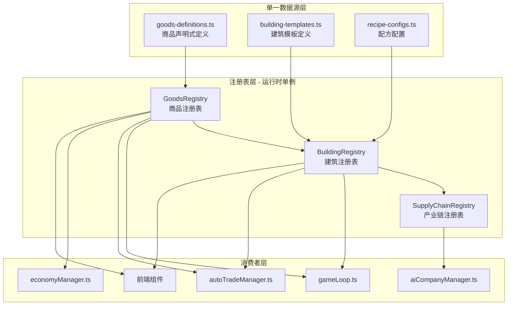

# 统一数据架构重构计划

## 一、核心目标

将 **商品定义**、**建筑定义**、**产业链关系**、**自动交易配置** 统一为 **单一数据源 (Single Source of Truth)**，实现：

1. **添加商品只需改一处** - 其他系统自动派生
2. **建筑模板快速生成** - 定义一次矿场模板，自动生成多种矿场
3. **产业链自动构建** - 从配方自动推断上下游关系
4. **运行时一致性校验** - 启动时验证所有数据完整性

---

## 二、新架构概览



---

## 三、商品定义重构

### 3.1 当前结构 vs 新结构

**当前 (goods.ts):**
```typescript
export const GOODS_DATA: GoodsData[] = [
  {
    id: 'iron-ore',
    name: 'Iron Ore',
    nameZh: '铁矿石',
    category: 'raw_material',
    subcategory: 'metal_ore',
    basePrice: 150,
    icon: '⛏️',
    tags: ['mineral', 'metal', 'basic'],
    description: '...',
  },
  // ... 50+ 手动定义
];
```

**新结构 (goods-definitions.ts):**
```typescript
// 声明式定义，只需核心属性
export const GOODS_DEFINITIONS = {
  // ===== 原材料类 =====
  'iron-ore': {
    nameZh: '铁矿石',
    category: 'raw_material',
    tier: 0,                    // 产业链层级
    basePrice: 150,
    icon: '⛏️',
    tags: ['mineral', 'metal'],
    // 自动派生属性
    consumerDemand: 'medium',   // 'none' | 'low' | 'medium' | 'high'
    priceVolatility: 'low',     // 价格波动性
  },
  
  'steel': {
    nameZh: '钢材',
    category: 'basic_processed',
    tier: 1,
    basePrice: 800,
    icon: '🔩',
    tags: ['metal', 'construction'],
    // 自动从配方推断来源
    consumerDemand: 'high',
  },
} as const;

// 类型安全的商品ID
export type GoodsId = keyof typeof GOODS_DEFINITIONS;
```

### 3.2 GoodsRegistry 设计

```typescript
// packages/shared/src/registry/GoodsRegistry.ts

class GoodsRegistry {
  private static instance: GoodsRegistry;
  private goods: Map<GoodsId, GoodsData> = new Map();
  private byCategory: Map<GoodsCategory, GoodsId[]> = new Map();
  private byTier: Map<number, GoodsId[]> = new Map();
  
  private constructor() {
    this.initialize();
  }
  
  static getInstance(): GoodsRegistry {
    if (!GoodsRegistry.instance) {
      GoodsRegistry.instance = new GoodsRegistry();
    }
    return GoodsRegistry.instance;
  }
  
  private initialize(): void {
    for (const [id, def] of Object.entries(GOODS_DEFINITIONS)) {
      // 自动派生完整数据
      const goods: GoodsData = {
        id: id as GoodsId,
        name: this.generateEnglishName(def.nameZh),
        nameZh: def.nameZh,
        category: def.category,
        subcategory: this.inferSubcategory(def),
        basePrice: def.basePrice,
        icon: def.icon,
        tags: def.tags,
        description: this.generateDescription(def),
        // 派生属性
        tier: def.tier,
        consumerDemandRate: this.calculateDemandRate(def.consumerDemand),
        priceVolatilityFactor: this.getVolatilityFactor(def.priceVolatility),
      };
      
      this.goods.set(id as GoodsId, goods);
      this.indexByCategory(goods);
      this.indexByTier(goods);
    }
  }
  
  // 获取基础消费需求（替代 gameLoop.ts 硬编码）
  getBasicConsumerDemand(): Map<GoodsId, number> {
    const demand = new Map<GoodsId, number>();
    for (const [id, goods] of this.goods) {
      if (goods.consumerDemandRate > 0) {
        demand.set(id, goods.consumerDemandRate);
      }
    }
    return demand;
  }
  
  // 获取商品的所有生产来源（建筑ID列表）
  getProducers(goodsId: GoodsId): string[] {
    return SupplyChainRegistry.getInstance().getProducers(goodsId);
  }
  
  // 获取商品的所有消费去向（建筑ID列表）
  getConsumers(goodsId: GoodsId): string[] {
    return SupplyChainRegistry.getInstance().getConsumers(goodsId);
  }
}
```

---

## 四、建筑模板系统设计

### 4.1 模板定义

```typescript
// packages/shared/src/data/building-templates.ts

// 矿场模板 - 所有矿场共享的结构
export const EXTRACTION_TEMPLATE: BuildingTemplate = {
  category: 'extraction',
  baseWorkers: 50,
  baseCost: 2_000_000,
  baseMaintenance: 5000,
  
  // 通用槽位结构
  slots: [
    {
      type: 'process',
      methodTemplate: {
        // 占位符，由具体矿场填充
        inputs: [],  
        outputs: ['${OUTPUT}'],  // 模板变量
        ticksRequired: 10,
        laborRequired: 20,
        powerRequired: 100,
      }
    },
    {
      type: 'automation',
      methods: [
        { id: 'manual', nameZh: '人工开采', efficiency: 0.8, laborMultiplier: 1.0 },
        { id: 'semi-auto', nameZh: '半自动化', efficiency: 1.0, laborMultiplier: 0.7 },
        { id: 'full-auto', nameZh: '全自动化', efficiency: 1.2, laborMultiplier: 0.3 },
      ]
    }
  ]
};

// 工厂模板
export const PROCESSING_TEMPLATE: BuildingTemplate = {
  category: 'processing',
  baseWorkers: 100,
  baseCost: 5_000_000,
  baseMaintenance: 15000,
  
  slots: [
    {
      type: 'process',
      // 由具体工厂定义输入/输出
    },
    {
      type: 'automation',
      methods: [
        { id: 'manual', nameZh: '手工生产', efficiency: 0.7 },
        { id: 'assembly-line', nameZh: '流水线', efficiency: 1.0 },
        { id: 'ai-assisted', nameZh: 'AI辅助', efficiency: 1.5, requiresTech: 'ai-manufacturing' },
      ]
    },
    {
      type: 'energy',
      methods: [
        { id: 'grid-power', nameZh: '电网供电', input: 'electricity' },
        { id: 'self-generation', nameZh: '自备发电', input: 'natural-gas' },
      ]
    }
  ]
};
```

### 4.2 具体建筑定义（使用模板）

```typescript
// packages/shared/src/data/building-configs.ts

export const BUILDING_CONFIGS: BuildingConfig[] = [
  // ===== 矿场类 - 使用 EXTRACTION_TEMPLATE =====
  {
    id: 'iron-mine',
    template: 'EXTRACTION',
    nameZh: '铁矿场',
    // 只需定义特殊属性
    outputs: [{ goodsId: 'iron-ore', amount: 100 }],
    costMultiplier: 1.0,
  },
  {
    id: 'copper-mine',
    template: 'EXTRACTION',
    nameZh: '铜矿场',
    outputs: [{ goodsId: 'copper-ore', amount: 80 }],
    costMultiplier: 1.2,  // 铜矿成本稍高
  },
  {
    id: 'coal-mine',
    template: 'EXTRACTION',
    nameZh: '煤矿',
    outputs: [{ goodsId: 'coal', amount: 150 }],
    costMultiplier: 0.8,  // 煤矿成本较低
  },
  
  // ===== 加工类 - 使用 PROCESSING_TEMPLATE =====
  {
    id: 'steel-mill',
    template: 'PROCESSING',
    nameZh: '钢铁厂',
    inputs: [
      { goodsId: 'iron-ore', amount: 100 },
      { goodsId: 'coal', amount: 50 },
    ],
    outputs: [{ goodsId: 'steel', amount: 80 }],
    costMultiplier: 1.5,
  },
];
```

### 4.3 BuildingRegistry 设计

```typescript
// packages/shared/src/registry/BuildingRegistry.ts

class BuildingRegistry {
  private static instance: BuildingRegistry;
  private buildings: Map<string, BuildingData> = new Map();
  private templates: Map<string, BuildingTemplate> = new Map();
  
  private constructor() {
    this.registerTemplates();
    this.generateBuildings();
  }
  
  private generateBuildings(): void {
    for (const config of BUILDING_CONFIGS) {
      const template = this.templates.get(config.template);
      if (!template) {
        throw new Error(`Unknown template: ${config.template}`);
      }
      
      // 从模板 + 配置生成完整建筑数据
      const building = this.mergeTemplateWithConfig(template, config);
      
      // 验证配方中的商品ID都存在
      this.validateRecipeGoods(building);
      
      this.buildings.set(config.id, building);
    }
  }
  
  // 获取建筑的所有输入商品
  getInputGoods(buildingId: string): GoodsId[] {
    const building = this.buildings.get(buildingId);
    if (!building) return [];
    
    const inputs = new Set<GoodsId>();
    for (const slot of building.productionSlots) {
      for (const method of slot.methods) {
        for (const input of method.recipe.inputs) {
          inputs.add(input.goodsId as GoodsId);
        }
      }
    }
    return Array.from(inputs);
  }
  
  // 获取建筑的所有输出商品
  getOutputGoods(buildingId: string): GoodsId[] {
    // 类似实现
  }
  
  // 为 autoTradeManager 提供：根据建筑列表生成推荐的交易配置
  generateAutoTradeConfig(buildingIds: string[]): AutoTradeConfig {
    const consumptionRates = new Map<GoodsId, number>();
    const productionRates = new Map<GoodsId, number>();
    
    for (const id of buildingIds) {
      const building = this.buildings.get(id);
      if (!building) continue;
      
      // 分析配方，计算每日消耗/产出
      // ... (复用 autoTradeManager 现有逻辑)
    }
    
    return this.createTradeConfig(consumptionRates, productionRates);
  }
}
```

---

## 五、产业链注册表设计

```typescript
// packages/shared/src/registry/SupplyChainRegistry.ts

interface SupplyChainNode {
  goodsId: GoodsId;
  tier: number;
  producers: string[];   // 建筑ID列表
  consumers: string[];   // 建筑ID列表
}

interface SupplyChainEdge {
  from: GoodsId;
  to: GoodsId;
  viaBuilding: string;
  conversionRate: number;  // 输入/输出比例
}

class SupplyChainRegistry {
  private static instance: SupplyChainRegistry;
  private nodes: Map<GoodsId, SupplyChainNode> = new Map();
  private edges: SupplyChainEdge[] = [];
  
  private constructor() {
    this.buildFromBuildingRegistry();
  }
  
  private buildFromBuildingRegistry(): void {
    const br = BuildingRegistry.getInstance();
    
    // 遍历所有建筑，构建产业链图
    for (const [buildingId, building] of br.getAllBuildings()) {
      for (const slot of building.productionSlots) {
        for (const method of slot.methods) {
          const recipe = method.recipe;
          
          // 记录生产者关系
          for (const output of recipe.outputs) {
            this.addProducer(output.goodsId as GoodsId, buildingId);
          }
          
          // 记录消费者关系
          for (const input of recipe.inputs) {
            this.addConsumer(input.goodsId as GoodsId, buildingId);
          }
          
          // 记录边（转换关系）
          for (const input of recipe.inputs) {
            for (const output of recipe.outputs) {
              this.edges.push({
                from: input.goodsId as GoodsId,
                to: output.goodsId as GoodsId,
                viaBuilding: buildingId,
                conversionRate: output.amount / input.amount,
              });
            }
          }
        }
      }
    }
  }
  
  // 获取完整的产业链路径（用于AI分析）
  getSupplyChainPath(targetGoodsId: GoodsId): SupplyChainPath {
    // BFS/DFS 找到从原材料到目标商品的所有路径
  }
  
  // 分析瓶颈：哪个商品最容易成为供应链瓶颈
  analyzeBottlenecks(): GoodsId[] {
    // 计算每个节点的入度/出度比
  }
}
```

---

## 六、gameLoop.ts 重构

### 6.1 移除硬编码消费需求

**当前 (第 1126-1188 行):**
```typescript
const BASE_CONSUMER_DEMAND: Record<string, number> = {
  'iron-ore': 20,
  'coal': 15,
  // ... 50+ 硬编码
};
```

**重构后:**
```typescript
private processBasicConsumerDemand(game: GameState): void {
  // 从注册表获取消费需求
  const demandMap = GoodsRegistry.getInstance().getBasicConsumerDemand();
  
  for (const [goodsId, baseDemand] of demandMap) {
    // 计算周期性波动
    const phase = (game.currentTick + this.getPhaseOffset(goodsId)) / cycleLength * Math.PI * 2;
    const cyclicMultiplier = 1 + Math.sin(phase) * amplitude;
    const noise = 0.9 + Math.random() * 0.2;
    
    const demand = baseDemand * cyclicMultiplier * noise;
    this.addDemand(game, goodsId, demand);
  }
}
```

### 6.2 移除 BUILDINGS_DATA 直接引用

```typescript
// 替换所有 BUILDINGS_DATA.find(...)
const def = BuildingRegistry.getInstance().get(building.definitionId);
```

---

## 七、自动交易管理器重构

```typescript
// autoTradeManager.ts

autoConfigureFromBuildings(
  companyId: string,
  buildings: BuildingInstance[],
  game: GameState
): void {
  // 使用 BuildingRegistry 的辅助方法
  const buildingIds = buildings
    .filter(b => b.ownerId === companyId)
    .map(b => b.definitionId);
  
  const recommendedConfig = BuildingRegistry.getInstance()
    .generateAutoTradeConfig(buildingIds);
  
  this.configs.set(companyId, recommendedConfig);
}
```

---

## 八、数据验证系统

```typescript
// packages/shared/src/registry/DataValidator.ts

class DataValidator {
  static validateAll(): ValidationResult {
    const errors: string[] = [];
    const warnings: string[] = [];
    
    // 1. 验证所有配方中的商品ID存在
    for (const [buildingId, building] of BuildingRegistry.getInstance().getAllBuildings()) {
      for (const slot of building.productionSlots) {
        for (const method of slot.methods) {
          for (const input of method.recipe.inputs) {
            if (!GoodsRegistry.getInstance().has(input.goodsId)) {
              errors.push(`Building ${buildingId}: Unknown input goods "${input.goodsId}"`);
            }
          }
        }
      }
    }
    
    // 2. 验证产业链完整性（没有孤岛）
    const orphanGoods = SupplyChainRegistry.getInstance().findOrphanGoods();
    for (const id of orphanGoods) {
      warnings.push(`Goods "${id}" has no producers or consumers`);
    }
    
    // 3. 验证价格合理性
    for (const [id, goods] of GoodsRegistry.getInstance().getAll()) {
      if (goods.basePrice <= 0) {
        errors.push(`Goods "${id}" has invalid basePrice: ${goods.basePrice}`);
      }
    }
    
    return { errors, warnings, valid: errors.length === 0 };
  }
}

// 在服务器启动时调用
const validation = DataValidator.validateAll();
if (!validation.valid) {
  console.error('Data validation failed:', validation.errors);
  process.exit(1);
}
```

---

## 九、迁移计划

### Phase 1: 创建新基础设施
1. 创建 `packages/shared/src/registry/` 目录
2. 实现 GoodsRegistry、BuildingRegistry、SupplyChainRegistry
3. 添加数据验证系统

### Phase 2: 数据迁移
4. 将现有 goods.ts 转换为 goods-definitions.ts 格式
5. 创建 building-templates.ts 和 building-configs.ts
6. 运行验证确保数据一致

### Phase 3: 消费者迁移
7. 重构 gameLoop.ts 使用注册表
8. 重构 autoTradeManager.ts 使用注册表
9. 重构 economyManager.ts 使用注册表
10. 重构前端组件使用注册表

### Phase 4: 清理与增强
11. 删除旧的 GOODS_DATA、BUILDINGS_DATA 导出
12. 添加热重载支持
13. 创建 CLI 工具辅助添加新商品/建筑
14. 更新文档

---

## 十、添加新商品的工作流（重构后）

**重构前（需改5处）:**
1. goods.ts - 添加商品定义
2. buildings.ts - 添加使用该商品的建筑
3. gameLoop.ts - 添加消费需求（如果是消费品）
4. autoTradeManager.ts - 可能需要调整
5. 前端 - 可能需要添加图标

**重构后（只需改1处）:**
1. goods-definitions.ts - 添加商品定义
   - 消费需求自动派生
   - 产业链关系自动构建
   - 价格/图标自动处理

如果需要新建筑：
2. building-configs.ts - 添加建筑配置（使用模板）
   - 或在 building-templates.ts 创建新模板

---

## 十一、预期效果

| 指标 | 重构前 | 重构后 |
|------|--------|--------|
| 添加商品需修改文件数 | 3-5 | 1 |
| 添加建筑需修改文件数 | 1-2 | 1 |
| 数据一致性检查 | 手动 | 自动 |
| 产业链关系维护 | 分散 | 集中自动 |
| 消费需求配置 | 硬编码 | 声明式 |
| 类型安全 | 部分 | 完整 |
